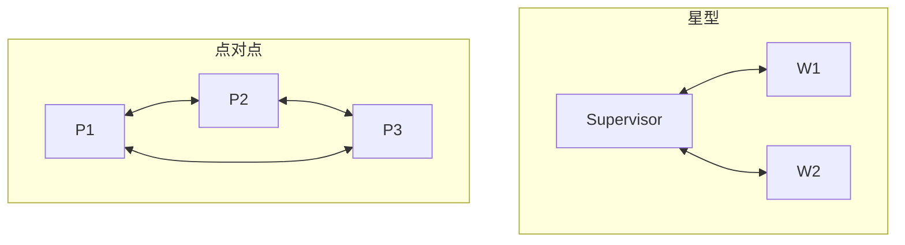

# 👥 通信协议

> **一句话**：Agent 之间说什么、怎么说、谁在什么时候说——通信协议决定多 Agent 系统是「协作」还是「吵架」。
> **难度**：⭐️⭐️ 进阶
> **标签**：`#multi-agent` `#engineering`

## 📌 先看结论

- 通信内容三原则：结论先行、结构化（JSON/固定模板）、带溯源（谁说的、基于什么）
- 通信拓扑三种：点对点（快但边多）、星型（经协调者，主流）、广播（慎用，token 爆炸）
- 共享内存（黑板模式）常常优于消息轰炸：把中间产物放共享存储，消息里只传引用
- 跨信任域的 Agent 通信 → 标准协议（[A2A](../05-tool-protocol/a2a.md)）；同进程内 → 函数/事件流即可

## 🖼️ 三种拓扑



## 🧩 消息模板示例

```json
{
  "from": "researcher-1",
  "to": "lead",
  "type": "task_result",
  "task_id": "t-42",
  "status": "done",
  "findings": [{"claim": "X 市占率 38%", "source": "report-2026.pdf#p12"}],
  "artifacts": ["s3://bucket/findings-t42.json"]
}
```

## 📦 源码案例

- **DeepSeek Harness：通信即事件**（[仓库](https://github.com/deepseek-ai/deepseek-harness)）：子 Agent 调度全部走同一条 append-only 事件流（agent/* 事件）——「协议」被简化为「事件类型 + 投影规则」：Lead 读取子 Agent 的完成事件与产出引用，而非完整对话，天然防上下文爆炸
- **Anthropic 研究系统的教训**（[工程博客](https://www.anthropic.com/engineering/built-multi-agent-research-system)）：Lead Agent 描述任务含糊时，子 Agent 各自理解跑偏、产出无法合并——他们的修正是在任务描述里强制「目标 + 输出格式 + 工具指引 + 边界」四要素，即**通信契约前置**
- **AutoGen 的消息类**（[GitHub](https://github.com/microsoft/autogen)）：TextMessage / ToolCallMessage / HandoffMessage 等显式消息类型——类型化消息让「谁可以发什么」可校验，比自由文本通信可靠得多
- **Claude Code 的极简通信**（逆向分析）：子 Agent 只通过「任务描述 in / 最终报告 out」两点通信，中间过程完全隔离——最激进的通信最小化，代价是协作深度有限但可靠性极高

## ✅ 最佳实践

- 消息带 `type` 与 `schema`，接收方校验后处理
- 大产物走存储引用，消息传摘要 + 指针（引用传递）
- 每轮通信设 token 预算；超限的消息先摘要再入网

## ⚠️ 常见误区

- ❌ 把完整对话历史广播给所有人：上下文爆炸 + 互相污染，只传相关结论
- ❌ 自由文本协议：没有 schema 的消息无法程序化处理，只能靠 LLM 猜——错误率随 Agent 数放大
- ❌ 忽略时序：并发消息乱序到达是常态，关键状态以事件流的序为准（DSH 的 seq 设计）

## 🧪 小练习

三个 Agent（爬虫、分析、写报告）协作：设计消息类型与字段；哪些走引用传递？画消息时序图。

## 📚 相关知识点

- [A2A](../05-tool-protocol/a2a.md)
- [多 Agent 编排](multi-agent-orchestration.md)
