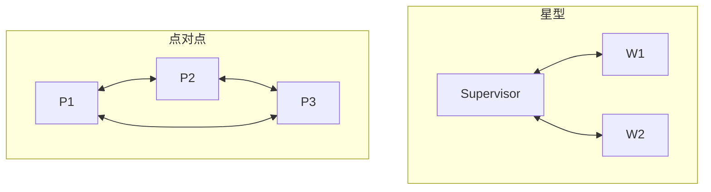

# 通信协议

> **一句话**：Agent 之间说什么、怎么说、谁在什么时候说——通信协议决定多 Agent 系统是「协作」还是「吵架」。

## 先看结论

- 通信内容三原则：结论先行、结构化（JSON/固定模板）、带溯源（谁说的、基于什么）
- 通信拓扑三种：点对点（快但边多）、星型（经协调者，主流）、广播（慎用，token 爆炸）
- 共享内存（黑板模式）常常优于消息轰炸：把中间产物放共享存储，消息里只传引用
- 跨信任域的 Agent 通信 → 标准协议（[A2A](../05-tool-protocol/a2a.md)）；同进程内 → 函数/事件流即可

## 核心机制

### 1. 拓扑决定成本与可靠性的形状

| 拓扑 | 边数 | 优点 | 缺点 |
|---|---|---|---|
| 点对点 | $\binom{n}{2}=O(n^2)$ | 延迟低、无中心瓶颈 | 边数平方增长、时序难保证 |
| 星型 | $O(n)$ | 中心可统筹、边数线性 | 中心是瓶颈与单点故障 |
| 广播 | $O(n)$ 但每条消息到达所有节点 | 信息同步快 | 上下文爆炸、互相污染 |

$$
\text{点对点边数}=\frac{n(n-1)}{2}
\qquad\Longrightarrow\qquad
\text{$n$ 一大就不可维护}
$$

这就是为什么**生产系统的主流是星型**：边数线性、中心可做校验与汇总，代价是中心需要处理所有消息。

### 2. 消息要类型化

自由文本通信无法程序化处理，接收方只能靠 LLM「猜」——错误率随 Agent 数量放大。可靠的做法是**类型化消息 + schema 校验**：

```json
{
  "from": "researcher-1",
  "to": "lead",
  "type": "task_result",
  "task_id": "t-42",
  "status": "done",
  "findings": [{"claim": "X 市占率 38%", "source": "report-2026.pdf#p12"}],
  "artifacts": ["s3://bucket/findings-t42.json"]
}
```

三个字段承担关键职责：`type` 让接收方知道怎么解析；`source` 让结论可溯源（对抗幻觉传播）；`artifacts` 用**引用传递**避免把大产物塞进消息。

### 3. 引用传递优于内容传递

大产物（长文档、大表、代码仓库）不应在消息里传内容，而应放共享存储、消息里只传指针 + 摘要：

$$
\text{消息大小}\;\ll\;\text{产物大小},\qquad
\text{接收方按需拉取}
$$

这与 [上下文工程](../06-memory-rag/context-engineering.md) 的「渐进披露」是同一思想：先给摘要，需要细节再取。它把消息成本从 $O(\text{产物})$ 降到 $O(\text{摘要})$。

### 4. 时序：以事件序为准

并发 Agent 的消息到达顺序是不确定的。若用「到达顺序」当因果顺序，会出现「先收到结果、后收到任务」的错乱。可靠做法是给每条消息一个**单调递增序号**，接收方按序号而非到达时间重建顺序：

$$
\text{因果顺序}=\mathrm{sort}\big(\text{messages},\;\text{key}=\text{seq}\big)
$$

事件溯源架构（append-only 日志 + 序号）天然满足这一点（见 [状态机与事件驱动](../11-engineering/state-machine-event-driven.md)）。

### 5. 黑板模式：共享状态替代消息轰炸

不要求 Agent 互相发消息，而是共享一块存储（黑板）：谁有产出就写进去，谁需要就读出来。好处是**通信复杂度从 $O(n^2)$ 降到 $O(n)$**（每人只与黑板交互），且天然异步。代价是需要设计好黑板的结构与并发控制。

## 三种拓扑



## 源码案例

- **DeepSeek Harness：通信即事件**（[仓库](https://github.com/deepseek-ai/deepseek-harness)）：子 Agent 调度全部走同一条 append-only 事件流——「协议」被简化为「事件类型 + 投影规则」：Lead 读取子 Agent 的完成事件与产出引用，而非完整对话，天然防上下文爆炸
- **Anthropic 研究系统的教训**（[工程博客](https://www.anthropic.com/engineering/built-multi-agent-research-system)）：Lead 的任务描述含糊时，子 Agent 各自理解跑偏、产出无法合并——修正方式是在任务描述里强制「目标 + 输出格式 + 工具指引 + 边界」四要素，即**通信契约前置**
- **AutoGen 的消息类**（[GitHub](https://github.com/microsoft/autogen) / [论文](https://arxiv.org/abs/2308.08155)）：TextMessage / ToolCallMessage / HandoffMessage 等显式消息类型——类型化让「谁可以发什么」可校验，比自由文本可靠得多
- **Claude Code 的极简通信**（逆向分析）：子 Agent 只通过「任务描述进 / 最终报告出」两点通信，中间过程完全隔离——最激进的通信最小化，可靠性高但协作深度有限

## 工程含义

- **消息带 `type` 与 schema，接收方校验后处理**：让非法消息在入口被拦截。
- **大产物走存储引用**：消息传摘要 + 指针（引用传递），降低消息体积。
- **设通信预算**：每轮通信限 token；超限的消息先摘要再入网。
- **给消息编号**：并发下以事件序而非到达序为准，避免因果错乱。
- **优先星型/黑板**：$O(n)$ 的通信拓扑比 $O(n^2)$ 更可维护。

## 常见误区

- ❌ 把完整对话历史广播给所有人：上下文爆炸 + 互相污染，只传相关结论
- ❌ 自由文本协议：没有 schema 的消息无法程序化处理，错误率随 Agent 数放大
- ❌ 忽略时序：并发消息乱序到达是常态，关键状态以事件流的序为准
- ❌ 大产物直接塞消息：一次传个大表就把上下文预算打满
- ❌ 用点对点撑大规模：$O(n^2)$ 的边数增长很快不可维护

## 小练习

三个 Agent（爬虫、分析、写报告）协作：设计消息类型与字段；指出哪些走引用传递；画出消息时序并标出你会如何编号防止乱序。

## 参考资料

- [AutoGen: Enabling Next-Gen LLM Applications via Multi-Agent Conversation](https://arxiv.org/abs/2308.08155)（Wu et al., 2023）
- [How we built our multi-agent research system](https://www.anthropic.com/engineering/built-multi-agent-research-system)（Anthropic Engineering）
- [A2A 规范](https://a2a-protocol.org/latest/specification/)（跨信任域通信）

## 相关知识点

- [A2A](../05-tool-protocol/a2a.md)
- [多 Agent 编排](multi-agent-orchestration.md)
- [状态机与事件驱动](../11-engineering/state-machine-event-driven.md)
