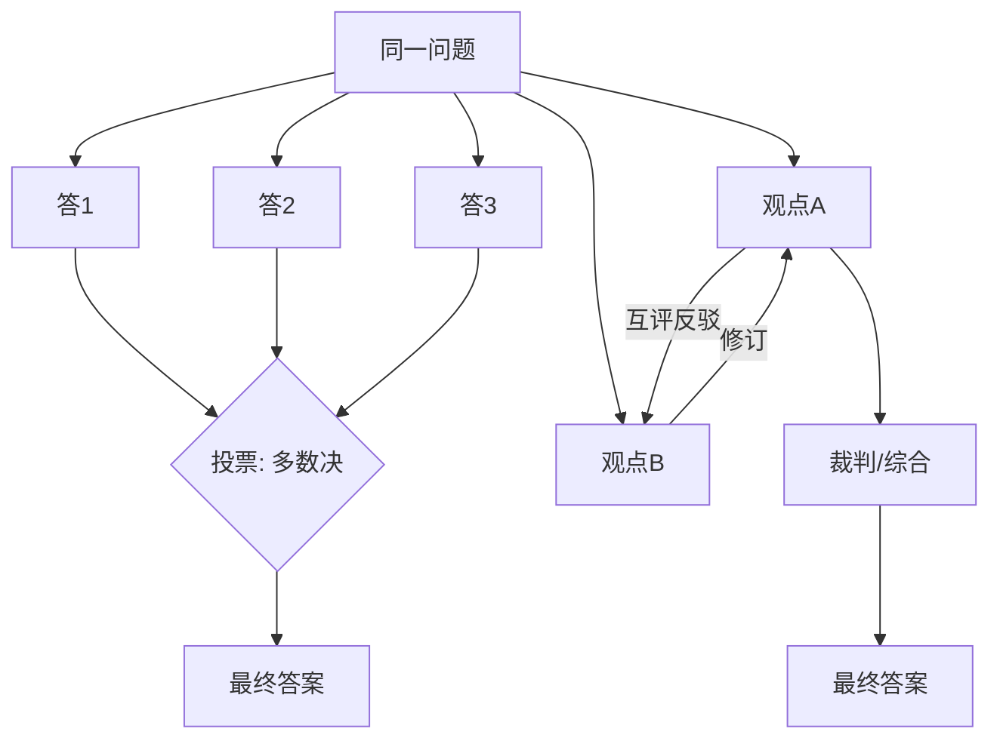

# 辩论、共识与投票

> **一句话**：用「多个独立视角 + 显式汇聚机制」对冲单次生成的随机性与盲区——分歧是资产，汇聚机制决定分歧能不能变成质量。
> **难度**：进阶
> **标签**：`#multi-agent` `#evaluation`

## 先看结论

- 三种机制按成本排序：投票（各自独立作答 → 多数决）< 辩论（多轮互评 → 修订）< 共识（迭代到全体认同）
- 关键前提是**独立性**：串行互相污染的「投票」只是复读
- 投票换可靠性（Self-Consistency），辩论换深度（发现单视角盲区），共识换一致性（标准对齐）
- 不是越多越好：3–5 个视角通常覆盖 90% 收益

## 三机制对比

## 源码案例

- **Self-Consistency 是投票的鼻祖**（[论文](https://arxiv.org/abs/2203.05659)）：同一 CoT prompt 采样 N 次 + 多数决，GSM8K 数学题准确率 +17%——不需要多 Agent，同一模型多次采样即可，是性价比最高的「伪共识」
- **LLM Debate**（[论文](https://arxiv.org/abs/2305.14325)）：两 Agent 多轮辩论 + 人类裁判，事实类问答准确率显著提升；开源实现参考 AutoGen 的 group chat 或 LangGraph 的双节点互评模板
- **DeepSeek Harness 的创造模式**（[InfoQ 解读](https://www.sohu.com/a/1062640652_122014422)）：Agent 检查运行时、试验插件、组合新运行模式——「提议 → 验证 → 采纳」本身是一种与环境的辩论；社区里的 Pi 生态也有「council」实践：用 `pi-ai` 把 GPT/Claude/Grok 挂成多个「评委」互相校对（见 [Pi 文档](https://github.com/earendil-works/pi)）
- **评估器-优化器模式**（[Anthropic: Building Effective Agents](https://www.anthropic.com/engineering/building-effective-agents)）：生成 Agent 与评估 Agent 的持续循环——单辩友的「辩论」，工程中最常用

## 最佳实践

- 投票用不同采样温度/不同模型，保独立性；提示词别暗示「标准答案」
- 辩论轮数设上限（2–3 轮），轮次多了立场极化反而固化
- 汇聚角色（裁判）的 prompt 要写明裁决标准，且不给它「和稀泥」选项

## 常见误区

- ❌ 多数 = 正确：模型有共同盲区（同源数据），一致性高不代表事实正确，重要决策仍需外部验证
- ❌ 辩论会让观点更客观：研究显示多轮辩论可能放大执念，模型会为辩护而辩护
- ❌ 共识 = 价值和稀泥：迭代到「都同意」常收敛到最平庸的答案

## 小练习

「判断一段医学建议是否安全」：设计投票方案（几个评委？什么模型组合？平票怎么办？），再说明什么情况下该升级为辩论。

## 相关资源

- [Self-Consistency 论文](https://arxiv.org/abs/2203.05659)

## 相关知识点

- [角色分配](role-assignment.md)
- [Graph of Thoughts](../04-prompt-reasoning/graph-of-thoughts.md)
