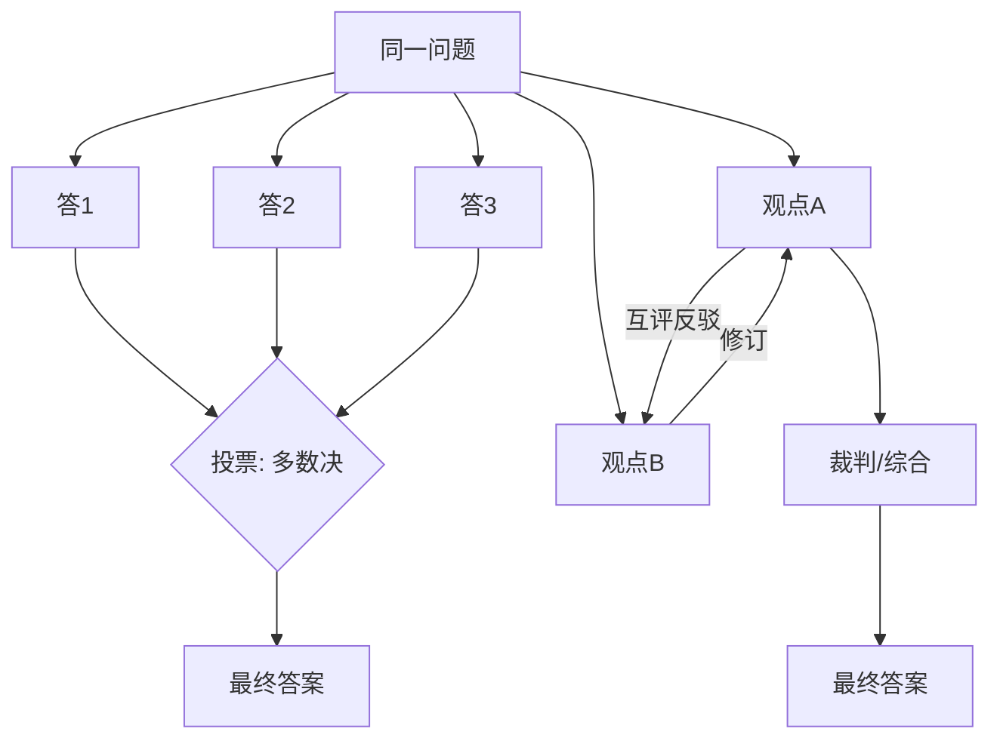

# 辩论、共识与投票

> **一句话**：用「多个独立视角 + 显式汇聚机制」对冲单次生成的随机性与盲区——分歧是资产，汇聚机制决定分歧能不能变成质量。

## 先看结论

- 三种机制按成本排序：投票（各自独立作答 → 多数决）< 辩论（多轮互评 → 修订）< 共识（迭代到全体认同）
- 关键前提是**独立性**：串行互相污染的「投票」只是复读
- 投票换可靠性，辩论换深度（发现单视角盲区），共识换一致性（标准对齐）
- 不是越多越好：3–5 个视角通常覆盖大部分收益

## 核心机制

### 1. 投票为什么有效：Condorcet 陪审团定理

设有 $n$ 个各自独立作答、单次正确率为 $p$ 的答题者，多数决的错误概率是：

$$
P(\text{多数错误})=\sum_{k>n/2}\binom{n}{k}(1-p)^{k}p^{\,n-k}
$$

定理的结论是：当 $p>0.5$ 且彼此**独立**时，$n$ 增大，多数决正确率趋向 1。这条式子把两个前提钉死了：

- **$p>0.5$**：答题者得比瞎猜强，否则投票只会放大错误
- **独立性**：这是最容易违反的一条。若几个 Agent 共享同一份有偏的上下文/模型，它们的错误高度相关，投票不会提升正确率

这就是为什么「同一个模型采样 N 次」也有价值（Self-Consistency）——只要采样有随机性，错误就不完全相关；而「串行传递、后一个看到前一个答案」的所谓投票，则几乎无效。

### 2. 三种汇聚机制

| 机制 | 结构 | 换到什么 | 主要风险 |
|---|---|---|---|
| 投票 | 独立作答 → 多数决 | 可靠性（降方差） | 共同盲区导致一致地错 |
| 辩论 | 多轮互评 → 修订 | 深度（暴露盲区） | 立场极化、为辩而辩 |
| 共识 | 迭代到全体认同 | 一致性（标准对齐） | 收敛到最平庸答案 |

成本大致是 $1\times$（单次）→ $N\times$（投票）→ $N\times R$（辩论 $R$ 轮）。

### 3. 为什么辩论会「越辩越执念」

辩论的假设是「多轮互评能逼近真相」，但它有两个反向效应：一是模型倾向于**为已表达的立场辩护**（一致性压力）；二是辩论的胜负可能取决于**说服力而非正确性**。因此辩论轮数要设上限（通常 2–3 轮），并尽量引入**外部裁判标准**（工具结果、可验证事实），而不是让模型互相说服。

### 4. 汇聚时的独立性保障

可操作的独立性手段：

$$
\text{独立性}\;\uparrow\;\Longleftarrow\;
\begin{cases}
\text{不同采样温度 / 不同模型}\\
\text{提示词不暗示「标准答案」}\\
\text{各自先独立作答，再互看}\\
\text{混合不同信息来源}
\end{cases}
$$

## 三机制对比

## 源码案例

- **Self-Consistency 是投票的鼻祖**（[论文](https://arxiv.org/abs/2203.11171)）：同一 CoT prompt 采样多次 + 多数决，GSM8K 数学题准确率显著提升——不需要多 Agent，同一模型多次采样即可，是性价比最高的「伪共识」
- **LLM Debate**（[论文](https://arxiv.org/abs/2305.14325)）：多个 Agent 多轮辩论 + 裁判，事实类问答准确率提升；开源实现可参考 AutoGen 的 group chat 或 LangGraph 的双节点互评模板
- **评委组合的自建实践**：用统一的模型适配层（如 Pi 的 `pi-ai`）把不同厂商模型挂成多个「评委」互相校对——跨模型组合比同模型多采样更能降低错误相关性
- **评估器-优化器模式**（[Anthropic: Building Effective Agents](https://www.anthropic.com/engineering/building-effective-agents)）：生成 Agent 与评估 Agent 的持续循环——单辩友的「辩论」，工程中最常用

## 工程含义

- **投票用不同采样温度/不同模型**保独立性；提示词别暗示「标准答案」。
- **辩论轮数设上限**（2–3 轮），轮次多了立场极化反而固化。
- **裁判的 prompt 要写明裁决标准**，且不给它「和稀泥」选项——否则会收敛到无关痛痒的综合。
- **重要决策仍需外部验证**：多数一致不等于事实正确，同源模型有共同盲区。

## 常见误区

- ❌ 多数 = 正确：模型有共同盲区（同源数据），一致性高不代表事实正确，重要决策仍需外部验证
- ❌ 辩论会让观点更客观：研究显示多轮辩论可能放大执念，模型会为辩护而辩护
- ❌ 共识 = 价值和稀泥：迭代到「都同意」常收敛到最平庸的答案
- ❌ 把串行传递当投票：后手能看到前手答案时，独立性消失，投票失效
- ❌ 忽略答题者水平：$p<0.5$ 时投票只会放大错误

## 小练习

「判断一段医学建议是否安全」：设计投票方案（几个评委？什么模型组合？平票怎么办？），用 Condorcet 公式说明为什么独立性比数量更重要，再说明什么情况下该升级为辩论。

## 参考资料

- [Self-Consistency Improves Chain of Thought Reasoning in Language Models](https://arxiv.org/abs/2203.11171)（Wang et al., 2022）
- [Improving Factuality and Reasoning in Language Models through Multiagent Debate](https://arxiv.org/abs/2305.14325)（Du et al., 2023）
- [Debating with More Persuasive LLMs Leads to More Truthful Answers](https://arxiv.org/abs/2402.06782)（Khan et al., 2024）
- [Anthropic: Building Effective Agents](https://www.anthropic.com/engineering/building-effective-agents)

## 相关知识点

- [角色分配](role-assignment.md)
- [多 Agent 协作](multi-agent-collaboration.md)
- [Chain of Thought](../04-prompt-reasoning/chain-of-thought.md)
