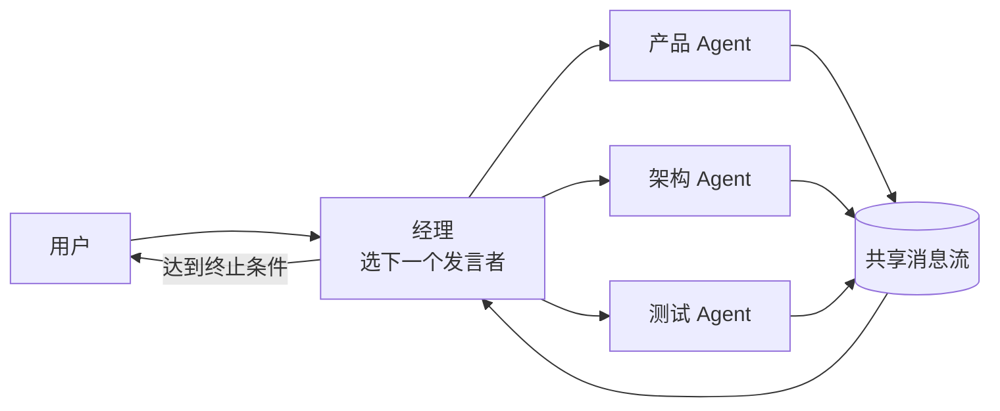

# 群聊模式

> **一句话**：群聊（Group Chat）= 多个 Agent 在一个共享对话流里发言，靠一个「经理」决定谁说话、说到几轮为止——AutoGen 带火的多 Agent 形态。
> **难度**：进阶
> **标签**：`#multi-agent`

## 先看结论

- 结构：共享消息流 + 发言选择器（谁下一个说话）+ 终止条件（轮数/达成标志）
- 优点：信息共享自然、能碰撞出计划外的好点子；缺点：上下文共享爆炸、发言质量参差
- 关键组件是「经理（GroupChatManager）」：不发言，只决定发言顺序与终止
- 适用：头脑风暴、需求评审、多方制衡的决策；不适合：流水线式执行任务

## 结构图

## 源码案例

- **AutoGen 的 GroupChat**（[GitHub](https://github.com/microsoft/autogen)）：该模式的代表实现——GroupChat 管消息流，GroupChatManager 用 LLM 或规则选「下一个发言者」；注意 2025 年起 AutoGen 与 Semantic Kernel 合流为 **Microsoft Agent Framework**（[仓库](https://github.com/microsoft/agent-framework)），GroupChat 思想被吸收进工作流 API，老仓库仍可学习
- **CrewAI 的顺序流程对照**（[GitHub](https://github.com/crewAIInc/crewAI)）：`process="sequential"`（按角色顺序传递）vs `hierarchical`（经理制）——实战中顺序流程常比群聊稳定：群聊的自由度是把双刃剑
- **LangGraph 的群聊模板**（[langchain-ai/langgraph 官方示例](https://github.com/langchain-ai/langgraph)）：`multi-agent-chat` 模板用条件边实现发言路由，状态显式可控——比隐式消息流更适合生产

## 最佳实践

- 发言选择器写清各角色「何时该我说话」的规则（"架构 Agent 在讨论技术风险时发言"）
- 上下文治理：每 N 轮做一次阶段总结，替换旧消息（→ [记忆压缩](../06-memory-rag/memory-compression-forgetting.md)）
- 设置硬终止：最大轮数 + 无人提出新观点即收敛

## 常见误区

- ❌ 全员看全量历史：8 个 Agent × 50 轮 = 上下文核爆，要用摘要与定向消息
- ❌ 无终止条件的头脑风暴：模型会礼貌地互相夸到天荒地老
- ❌ 把群聊当执行引擎：执行类任务用监督者模式，群聊只用于意见生成与收敛

## 小练习

用 4 个角色（需求/设计/开发/测试）开一场「功能评审群聊」：发言规则怎么定？几轮收敛？终止信号是什么？

## 相关知识点

- [监督者模式](supervisor-pattern.md)
- [辩论、共识与投票](debate-consensus-voting.md)
