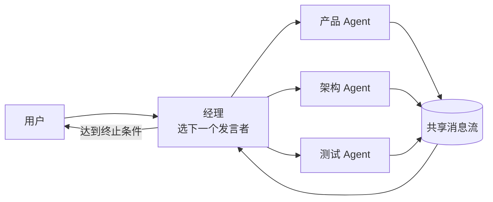

# 群聊模式

> **一句话**：群聊（Group Chat）= 多个 Agent 在一个共享对话流里发言，靠一个「经理」决定谁说话、说到几轮为止——AutoGen 带火的多 Agent 形态。

## 先看结论

- 结构：共享消息流 + 发言选择器（谁下一个说话）+ 终止条件（轮数/达成标志）
- 优点：信息共享自然、能碰撞出计划外的好点子；缺点：上下文共享爆炸、发言质量参差
- 关键组件是「经理」：不参与内容，只决定发言顺序与终止
- 适用：头脑风暴、需求评审、多方制衡的决策；不适合：流水线式执行任务

## 核心机制

### 1. 上下文增长的代价

群聊把所有人的发言堆在同一条消息流里，长度随轮数线性增长，而每个发言者每轮都要读全量：

$$
\text{上下文长度}\;\approx\;\underbrace{R}_{\text{轮数}}\times\underbrace{n}_{\text{Agent 数}}\times\overline{\text{单条长度}}
$$

**这是群聊最大的隐患**：$n$ 个 Agent × $R$ 轮，成本是乘法关系。因此群聊必须配上下文治理——每 $N$ 轮做一次阶段总结并替换旧消息（见 [记忆压缩](../06-memory-rag/memory-compression-forgetting.md)）。

### 2. 发言选择器是一个策略

经理做的事形式化就是选下一个发言者：

$$
\text{speaker}_{t+1}\sim \sigma\big(\text{state}_t,\;\text{role descriptions}\big)
$$

$\sigma$ 可以是规则（轮流、优先级）、可以是 LLM（读消息流判断「该谁说话」），也可以是二者的混合。**选择器质量决定群聊效率**：选错顺序会让讨论反复绕圈。

设计要点：每个角色的「何时该我说话」要写进描述——例如「架构 Agent 在讨论技术风险与可扩展性时发言」，否则选择器只能靠猜。

### 3. 终止条件必须显式

$$
\text{stop}\iff \underbrace{R\ge R_{\max}}_{\text{轮数上限}}\;\vee\;\underbrace{\text{达成共识标志}}_{\text{产出定稿}}\;\vee\;\underbrace{\text{连续 }k\text{ 轮无新信息}}_{\text{收敛}}
$$

缺少最后一条时，模型会礼貌地互相夸奖直到天荒地老——这是群聊最常见的失效模式。

## 结构图

## 工程含义

- **上下文治理是第一优先级**：阶段总结 + 定向消息（只给相关 Agent 发相关片段），不要全员读全量。
- **角色要有明确分工与边界**：角色重叠会退化成「几个人说同一件事」。
- **产出要结构化**：群聊的结论应落成结构化产物（决议清单、待办、风险列表），而不是一段对话。
- **用于意见生成，不用于执行**：执行类任务用监督者模式，群聊只负责发散与收敛。

## 源码案例

- **AutoGen 的 GroupChat**（[GitHub](https://github.com/microsoft/autogen) / [论文](https://arxiv.org/abs/2308.08155)）：该模式的代表实现——GroupChat 管消息流，GroupChatManager 用 LLM 或规则选下一个发言者；注意 AutoGen 与 Semantic Kernel 已合流为 **Microsoft Agent Framework**（[仓库](https://github.com/microsoft/agent-framework)），GroupChat 思想被吸收进工作流 API，老仓库仍可学习
- **CrewAI 的顺序流程对照**（[GitHub](https://github.com/crewAIInc/crewAI)）：`process="sequential"`（按角色顺序传递）vs `hierarchical`（经理制）——实战中顺序流程常比群聊稳定：群聊的自由度是把双刃剑
- **LangGraph 的群聊模板**（[仓库](https://github.com/langchain-ai/langgraph)）：用条件边实现发言路由，状态显式可控——比隐式消息流更适合生产

## 常见误区

- ❌ 全员看全量历史：$n$ 个 Agent × $R$ 轮 = 上下文核爆，要用摘要与定向消息
- ❌ 无终止条件的头脑风暴：模型会礼貌地互相夸到天荒地老
- ❌ 把群聊当执行引擎：执行类任务用监督者模式，群聊只用于意见生成与收敛
- ❌ 角色边界模糊：多个 Agent 说同一件事，等于花了 n 倍成本做一件事
- ❌ 忽略发言顺序：选择器设计不当会让讨论反复绕圈

## 小练习

用 4 个角色（需求/设计/开发/测试）开一场「功能评审群聊」：写出发言选择规则、几轮收敛、终止信号，并给出你的「每 N 轮阶段总结」方案。

## 参考资料

- [AutoGen: Enabling Next-Gen LLM Applications via Multi-Agent Conversation](https://arxiv.org/abs/2308.08155)（Wu et al., 2023）
- [Microsoft Agent Framework](https://github.com/microsoft/agent-framework)
- [LangGraph](https://github.com/langchain-ai/langgraph) / [CrewAI](https://github.com/crewAIInc/crewAI)

## 相关知识点

- [监督者模式](supervisor-pattern.md)
- [辩论、共识与投票](debate-consensus-voting.md)
- [通信协议](communication-protocol.md)
