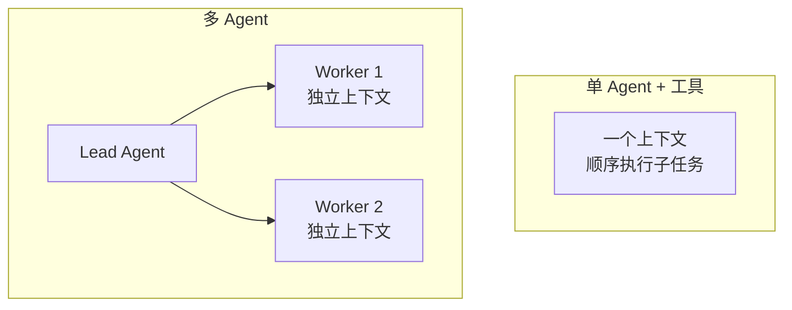

# 👥 多 Agent 协作

> **一句话**：多 Agent 协作 = 把一个大任务拆给多个各自带上下文的 Agent，用并行换速度、用分工换深度、用分歧换质量——但每种收益都要付通信税。
> **难度**：⭐️⭐️ 进阶
> **标签**：`#multi-agent`

## 📌 先看结论

- 三大收益：并行（提速）、上下文隔离（每个 Agent 有干净的专属上下文）、视角分歧（互相纠错）
- 三大代价：token 成本倍增、错误传播、调试指数变难
- Anthropic 多 Agent 研究系统实测：token 消耗约为单 Agent 聊天的 **15 倍**，换来研究类任务的大幅准确率提升——用对了场景才划算
- 决策口诀：**上下文互相污染时才拆 Agent**；否则用单 Agent + 子任务即可

## 🖼️ 单 Agent vs 多 Agent

## ✅ 什么时候用多 Agent

| 信号 | 例子 |
|---|---|
| 子任务间上下文互斥 | 同时审 100 份文档（每份几万字） |
| 天然并行 | 多源调研、A/B 方案各写一版 |
| 需要对抗视角 | 写手 vs 评审、红队 vs 蓝队 |
| 工具权限需隔离 | 只读分析 Agent vs 可执行 Agent |

## 📦 源码案例

- **Anthropic 多 Agent 研究系统**（[工程博客](https://www.anthropic.com/engineering/built-multi-agent-research-system)）：Lead Agent 拆解问题 → 并行派发子 Agent 搜索 → 汇总。核心工程经验：Lead 的任务描述质量决定子 Agent 产出（要明确目标、输出格式、工具指引）；token 占用排名前 1% 的对话贡献了 80% 的性能——并行广度是关键变量
- **Claude Code 的子 Agent**（逆向分析，[架构深拆](https://gist.github.com/yanchuk/0c47dd351c2805236e44ec3935e9095d)）：子 Agent 拥有克隆的文件缓存、全新或分叉的消息、独立磁盘转写、可选 git worktree——「协作」在工程上是**上下文与环境的隔离艺术**
- **DeepSeek Harness 的混合编排**（[InfoQ 解读](https://www.sohu.com/a/1062640652_122014422)）：以 Supervisor–Worker 为主，兼容并行、流水线与 Ralph 循环的混合系统——生产系统从来不是单一协作模式

## ⚠️ 常见误区

- ❌ 「三个臭皮匠顶个诸葛亮」：三个弱模型互相说服的结果常是三个幻觉的共识（→ [辩论、共识与投票](debate-consensus-voting.md)）
- ❌ Agent 越多越强：n 个 Agent 有 n×(n-1) 条潜在通信边，超过 5 个通常收益转负
- ❌ 共享一个大上下文「合作」：那不是多 Agent，是一个被撑爆的上下文

## 🧪 小练习

「给 50 份简历打分并写综合报告」：单 Agent 会遇到什么瓶颈？设计一个多 Agent 方案并估算成本倍数。

## 🔗 相关资源

- [Anthropic: How we built our multi-agent research system](https://www.anthropic.com/engineering/built-multi-agent-research-system)

## 📚 相关知识点

- [监督者模式](supervisor-pattern.md)
- [多 Agent 编排](multi-agent-orchestration.md)
