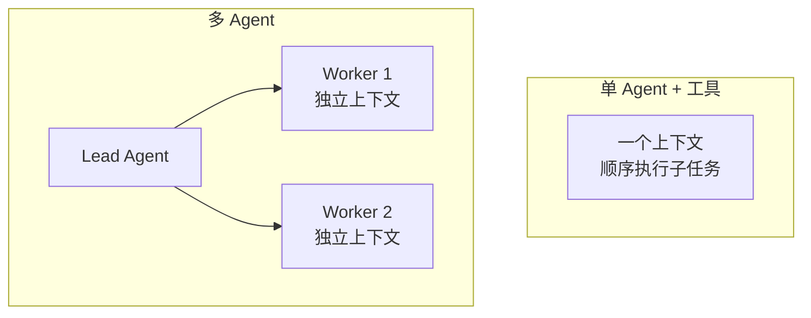

# 多 Agent 协作

> **一句话**：多 Agent 协作 = 把一个大任务拆给多个各自带上下文的 Agent，用并行换速度、用分工换深度、用分歧换质量——但每种收益都要付通信税。

## 先看结论

- 三大收益：并行（提速）、上下文隔离（每个 Agent 有干净的专属上下文）、视角分歧（互相纠错）
- 三大代价：token 成本倍增、错误传播、调试难度指数上升
- 判断标准不是「任务大不大」，而是**上下文是否互相污染**
- Anthropic 的多 Agent 研究系统实测 token 消耗约为单 Agent 聊天的 15 倍——用对场景才划算

## 核心机制

### 1. 通信成本是平方级的

$n$ 个 Agent 之间若允许两两通信，潜在通信边数是：

$$
\binom{n}{2}=\frac{n(n-1)}{2}=O(n^2)
$$

每多一个 Agent，通信（以及由此产生的 token 与失真机会）都近似平方增长。**这就是「Agent 越多不一定越强」的数学原因**：收益通常是线性的（多一点并行度），成本却是平方的。经验阈值：超过 5 个 Agent 后收益常转负。

### 2. 什么情况下才该拆

关键判据是**上下文隔离收益**。设两个子任务的上下文若放在一起会互相稀释：

$$
\text{拆分的收益}\;\approx\;\text{上下文纯度提升}\times\text{可并行度}
$$
$$
\text{拆分的成本}\;\approx\;\text{通信 token}+\text{错误传播风险}+\text{调试成本}
$$

只有收益 > 成本才拆。具体信号：

| 信号 | 例子 |
|---|---|
| 子任务间上下文互斥 | 同时审 100 份文档（每份几万字） |
| 天然并行 | 多源调研、A/B 方案各写一版 |
| 需要对抗视角 | 写手 vs 评审、红队 vs 蓝队 |
| 工具权限需隔离 | 只读分析 Agent vs 可执行 Agent |

反过来，**上下文需要实时共享的任务不要拆**——那不是多 Agent，是把一个上下文切成几份再痛苦地同步。

### 3. 错误传播：多 Agent 的隐形税

单 Agent 的错误是局部的；多 Agent 的错误会**沿通信边传播并被放大**。汇总型的 Lead Agent 如果无条件采信子 Agent 产出，一个子 Agent 的幻觉会污染最终结论：

$$
P(\text{最终错误})\;\ge\;1-\prod_{i=1}^{n}\big(1-P(\text{子错误}_i)\big)
$$

因此多 Agent 系统必须配**校验环节**：交叉验证、引用溯源、以工具结果为准（见 [辩论、共识与投票](debate-consensus-voting.md)）。

## 单 Agent vs 多 Agent

## 工程含义

- **先证明单 Agent 不行**：多 Agent 是最后手段。多数「单 Agent 做不好」其实是上下文管理或工具设计问题，用多 Agent 掩盖只会更贵。
- **Lead 的任务描述质量决定成败**：Anthropic 的经验是四要素必须写全——目标、输出格式、工具指引、边界。
- **子 Agent 只回传产出与引用**：不要回传完整对话，否则上下文爆炸（见 [通信协议](communication-protocol.md)）。
- **给整体设预算**：并行扇出会成倍放大 token，必须有总预算与并发上限。

## 源码案例

- **Anthropic 多 Agent 研究系统**（[工程博客](https://www.anthropic.com/engineering/built-multi-agent-research-system)）：Lead Agent 拆解问题 → 并行派发子 Agent 搜索 → 汇总。核心工程经验：Lead 的任务描述质量决定子 Agent 产出；并行广度是关键变量
- **Claude Code 的子 Agent**（逆向分析，[架构深拆](https://gist.github.com/yanchuk/0c47dd351c2805236e44ec3935e9095d)）：子 Agent 拥有克隆的文件缓存、全新或分叉的消息、独立磁盘转写、可选 git worktree——「协作」在工程上是**上下文与环境的隔离艺术**
- **DeepSeek Harness 的混合编排**（[仓库](https://github.com/deepseek-ai/deepseek-harness)）：以 Supervisor–Worker 为主，兼容并行、流水线与可替换 loop 的混合系统——生产系统很少是单一协作模式

## 常见误区

- ❌ 「三个臭皮匠顶个诸葛亮」：三个弱模型互相说服的结果常是三个幻觉的共识（→ [辩论、共识与投票](debate-consensus-voting.md)）
- ❌ Agent 越多越强：$n$ 个 Agent 有 $O(n^2)$ 条潜在通信边，超过 5 个通常收益转负
- ❌ 共享一个大上下文「合作」：那不是多 Agent，是一个被撑爆的上下文
- ❌ 汇总时不校验：无条件采信子 Agent 产出，会把局部幻觉升级为全局错误
- ❌ 忽略调度开销：每个子 Agent 的启动、上下文构造本身就是成本

## 小练习

「给 50 份简历打分并写综合报告」：单 Agent 会遇到什么瓶颈？设计一个多 Agent 方案，画出通信拓扑，并用 $O(n^2)$ 与 token 倍数量级估算成本。

## 参考资料

- [How we built our multi-agent research system](https://www.anthropic.com/engineering/built-multi-agent-research-system)（Anthropic Engineering）
- [AutoGen: Enabling Next-Gen LLM Applications via Multi-Agent Conversation](https://arxiv.org/abs/2308.08155)（Wu et al., 2023）
- [Why Do Multi-Agent LLM Systems Fail?](https://arxiv.org/abs/2503.13657)（Cemri et al., 2025）

## 相关知识点

- [监督者模式](supervisor-pattern.md)
- [通信协议](communication-protocol.md)
- [多 Agent 编排](multi-agent-orchestration.md)
