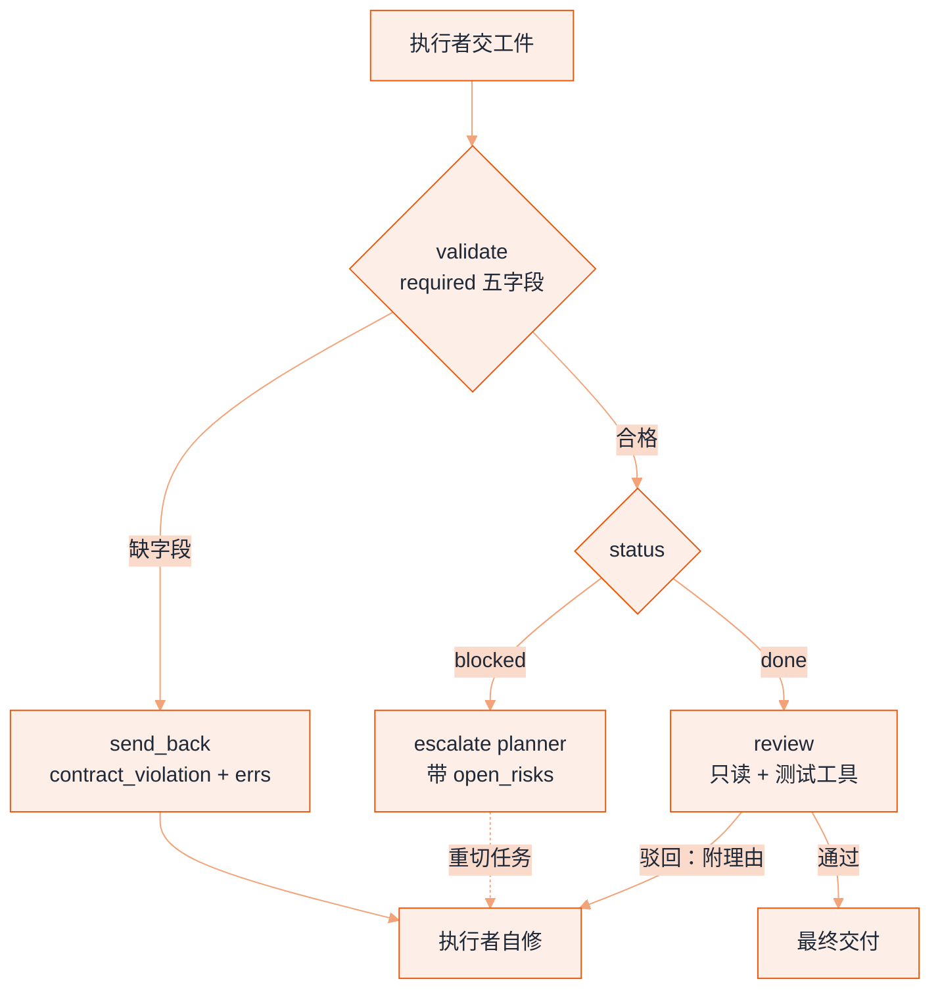

# 角色分配


**一句话**：给每个 Agent 一个明确的角色（角色 = 专属 system prompt + 工具面 + 产出格式），角色越具体，协作越有序。
  **难度**：入门


## 先看结论

- 角色 ≠ 起个名字：角色 = 专属指令 + 专属工具集 + 专属验收标准三件套
- 有效角色设计回答三个问题：它看什么（上下文）、能做什么（工具）、交付什么（格式）
- 角色数量最小化：先试「规划者 + 执行者」二元结构，再按需增加
- 「评审」「验证」类角色性价比最高：独立视角是质量杠杆
- 角色能不能配合，取决于**交接契约**是否允许它诚实说「我做不下去」

## 角色设计模板

| 要素 | 规划者 Planner | 执行者 Worker | 评审者 Reviewer |
|---|---|---|---|
| 上下文 | 全局目标+资源清单 | 单个子任务+所需材料 | 产出+验收标准 |
| 工具 | 只读（搜索、读取） | 全量（写入、执行） | 只读 + 测试工具 |
| 产出 | 任务清单（JSON） | 完成的工件 | 通过/驳回+理由 |

## 最小三角色的协作流

角色间的箭头就是「交接契约」：产出格式提前定死，下游才能稳定消费。注意评审者只有只读与测试工具——它能挑问题，但不能替执行者改代码：


## 交接契约：把「角色间的话」写成可校验格式

协作崩掉的地方极少在「模型不聪明」，而在上游产出的字段下游读不到。契约要包含三段：必填字段、失败时说什么、下游能否据此重试。

```json
{
  "$id": "worker-artifact-v1",
  "required": ["task_id", "status", "changes", "evidence", "open_risks"],
  "properties": {
    "status":      { "enum": ["done", "blocked", "partial"] },
    "changes":     { "type": "array", "items": { "type": "string" } },
    "evidence":    { "type": "array", "description": "测试输出/日志/截图路径" },
    "open_risks":  { "type": "array" }
  }
}
```

消费方拿到工件只有三条路，判序是「先校验形状、再看 `status`、最后才谈质量」——把顺序写反，一个字段缺失的 `blocked` 就会被当成完成收进流程：

```json
{
  "consume_dispatch": {
    "step_1_validate": { "check": "required 五字段齐全且类型对", "on_fail": { "action": "send_back", "to": "worker", "kind": "contract_violation", "carries": "errs" } },
    "step_2_status": { "blocked": { "action": "escalate", "to": "planner", "carries": "open_risks" } },
    "step_3_quality": { "done": { "action": "review", "to": "reviewer", "note": "评审者只读 + 测试工具" } }
  },
  "send_back_shape": { "kind": "contract_violation", "errs": ["evidence: required field missing"], "retryable_by": "worker" },
  "escalate_shape": { "to": "planner", "reason": "blocked", "open_risks": ["依赖的上游接口无文档"] }
}
```

三条分支各自通向不同的角色，这个映射本身就是一份权限声明：**契约违规回到执行者**（形状问题他能自己修，不必打扰别人）；**`blocked` 升级到规划者**（做不下去通常是任务切分或资源的问题，只有握有全局目标的人能改任务）；**只有 `done` 才进评审者**（评审者的算力要留给真工件，不是拿去发现「你少交了一个字段」）。



*《图：两条回路不共用预算——契约违规由执行者自修，驳回由评审者发令；只有 `blocked` 才往上惊动规划者》*

要点：**`blocked` 是合法状态**，不是错误。没有这一档，执行者会用假装完成来摆脱困境——这是多 Agent 系统最常见的失真模式。

## 分步演示：一份工件从交付到通过（含一次驳回）




#### 第 1 步：规划者先出契约，再出任务

规划者只有只读工具（搜索、读取），产出是一份任务清单 JSON：每条带 `task_id`、验收标准、这一子任务允许调用的工具集。**验收标准必须在派发时就写死**，否则第 4 步的评审者没有判据，只能凭语感裁决——多 Agent 的评审一旦退化成语感，它就与生成者共享同一个盲区。




#### 第 2 步：执行者交付，五字段一个不能少

执行者拿全量工具（写入、执行），只做分到的那条 `task_id`，交回 `worker-artifact-v1` 那份契约要求的五个必填字段：`task_id`、`status`、`changes`、`evidence`、`open_risks`。卡住时正确动作是 `status: "blocked"` 并把原因写进 `open_risks`，而不是硬凑一个看起来完成的 `done`。




#### 第 3 步：消费方先 validate，形状问题不出这个门

`validate(artifact, schema)` 只看形状：字段齐不齐、类型对不对、`status` 是否落在 `done / blocked / partial` 三个枚举值里。不合格就 `send_back(worker, kind="contract_violation", errs=...)`，把缺失字段名原样带回去。**这一步不消耗评审者**：形状错误是可自动判定的，用便宜判定挡在前面，贵判定才划算。




#### 第 4 步：评审者只读，裁决只有两种

`status` 为 `done` 才轮到评审者，它手上只有只读与测试工具。产出格式固定：通过，或驳回 + 理由。理由必须指到具体验收标准与具体证据（「`evidence` 里的测试输出显示 `test_export` 未覆盖空值分支」），不能是「感觉还可以更好」。它能挑问题，但不能替执行者改工件——**能改就等于没有第二双眼睛**。




#### 第 5 步：驳回走回路，两轮不成升级改任务

驳回是回到执行者的一次带料返工：附上未满足的验收标准与已试过的方向，而不是让它从零重跑。回路要有计数兜底——同一子任务被驳回两轮，问题多半不在执行者，而在任务切分或验收标准本身，此时升级回规划者重写这条 `task_id`。没有这一档，系统会在「执行者反复试、评审者反复驳」里把预算烧光。



## 改四处会怎样（点标签切换）



`status` 只剩 `done / partial`。执行者遇到做不下去的情况时没有合法出口，最省事的写法就是把 `open_risks` 留空、报一个 `done`——因为报「做不了」会被追问，报「做完了」可以直接往下走。你会在集成阶段才收到这个成本，而且那时已经分不清是哪一条子任务撒的谎。**`blocked` 存在的意义是让诚实比撒谎更省力。**



它开始顺手改而不是提意见：一次改动没有 `changes` 记录、没有走执行者的 `evidence`，评审意见与被评对象混成一份产出，下游再也分不清「这是工件作者写的还是评审写的」。工具面差异是角色能成立的前提——只读不是限制，是这个角色的全部价值。



去掉 `evidence` 与 `open_risks` 后交接消息短了，但 `validate` 从此判不出真假完成，`escalate` 也没有可上报的料：规划者只看到「blocked」两个字，无法决定是补资源还是改切分。字段省下的 token，会以「上游重新问一遍下游」的形式加倍还回来——交接契约的体积要按总账算，不是按单条消息算。



交接边数从 1 条涨到约 $$O(k^2)$$ 量级（5 个角色最多 20 条边），每条边都要一份独立契约、独立回归。能力增益在第三、第四个角色之后就饱和了，通信成本却没有。加角色前先回到上面那四问：有没有互斥工具面、要不要不同模型档、上下文是否互污，三个都否就只改 system prompt。




**验收线**：把三角色跑 20 个子任务，只看两个比例——`contract_violation` 占比（高说明契约写得太松或任务说不清）与「同一 `task_id` 驳回 ≥2 轮」占比（高说明切分错了）。这两个数比任何质量评分都更早暴露问题，也是决定该不该拆第四个角色的依据。


## 什么时候该加一个角色

按顺序问，问到「是」才拆：

1. 是否需要**互斥的工具面**（只读 vs 可写）？→ 拆，这是最硬的理由
2. 是否需要**不同模型或不同 effort 档**？→ 拆（评审用强模型、抽取用便宜模型）
3. 上下文是否会**互相污染**（长检索记录压住判断）？→ 拆，或用子 Agent 隔离
4. 只是「听起来更专业」？→ 不拆，改一条 system prompt 就够

设 $$k$$ 个角色，交接边数约为 $$O(k^2)$$，而能力增益很快饱和——这就是「先试二元结构」的原因。

## 源码案例

- **Claude Code 的内置角色族**（逆向全集：[Piebald-AI/claude-code-system-prompts](https://github.com/Piebald-AI/claude-code-system-prompts)）：Plan Agent（只读探索、产出计划）、Explore Agent（大范围检索）、General Purpose Agent（"Do what has been asked; nothing more, nothing less"）——每个角色的 prompt、工具面、行为约束三位一体；还支持用户自定义子 Agent（.claude/agents/ 目录），角色成了可分发的「软件包」
- **CrewAI 的角色三要素**（[GitHub](https://github.com/crewAIInc/crewAI)）：`role`（职位）+ `goal`（目标）+ `backstory`（背景故事）——把角色写成「人物小传」，实证显示 backstory 能稳定引导语气与取舍，是轻量角色化的流行做法
- **DeepSeek Harness 的 Agent preset**（[仓库](https://github.com/deepseek-ai/deepseek-harness)）：`packages/preset/agent-presets` 预置不同 Agent 配置（工具面、模型、提示词分区）——角色 = 一份可组合的 preset 声明

## 最佳实践

- 角色 prompt 里写「禁止事项」比「职责清单」更能防跑偏
- 角色间交接要定义「契约」：产出格式（JSON schema）+ 必含字段，下游才能稳定消费
- 评审角色与生成角色用不同模型实例（甚至不同模型），避免同一盲区

## 常见误区

- ❌ 角色扮演病：「你是世界顶级 CEO」这类空泛头衔没有信息量，等于没设角色
- ❌ 角色越多越好：每个角色增加通信与调度成本，能力面可以靠工具增加，不必靠角色数
- ❌ 角色无工具差异化：给评审者写文件的工具，它就开始自己改而不是提意见

## 小练习

为「博客自动生产」设计三角色（调研/写作/事实核查）：每个角色的工具面、产出 JSON 格式、禁止事项各写两条。

## 参考资料

- [CrewAI（role / goal / backstory 三元组的实现）](https://github.com/crewAIInc/crewAI)
- [MetaGPT 论文（把人类 SOP 编码成角色分工）](https://arxiv.org/abs/2308.00352)
- [AutoGen（以对话为骨架的多 Agent 角色编排）](https://github.com/microsoft/autogen)
- [Claude Code 系统提示词全集（子 Agent 角色描述的实际写法）](https://github.com/Piebald-AI/claude-code-system-prompts)

## 相关知识点

- [多 Agent 协作](multi-agent-collaboration.md)
- [监督者模式](supervisor-pattern.md)

