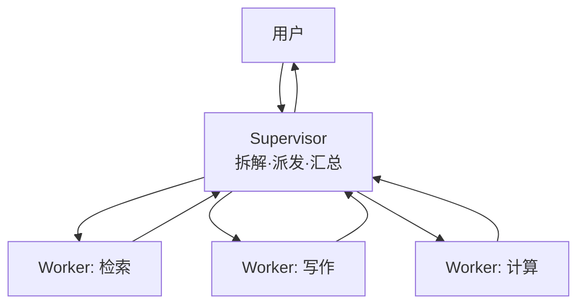

# 监督者模式

> **一句话**：Supervisor（监督者）模式 = 一个协调者 Agent 负责拆解、派发、汇总，多个 Worker 只管干活——多 Agent 系统的默认架构，层级清晰、通信可控。

## 先看结论

- 通信拓扑是星型：所有消息经 Supervisor，Worker 之间互不直接通信
- Supervisor 的三职责：拆解任务（含验收标准）、路由派发（选谁干）、汇总质检（不合格打回）
- 变体：层级制（Supervisor of Supervisors，适合超大规模）、动态路由（每次任务动态生成 Worker）
- 优点：通信可控、Worker 上下文干净、易调试；缺点：Supervisor 是单点瓶颈与单点故障
- **Supervisor 的上下文是真正的瓶颈**——它必须容纳所有 Worker 的报告

## 核心机制

### 1. 星型拓扑把通信从 O(n²) 降到 O(n)

$n$ 个 Worker 若两两通信，边数是 $\binom{n}{2}=O(n^2)$；星型拓扑下每个 Worker 只与 Supervisor 通信：

$$
\text{边数}=n=O(n)
$$

这带来可预测的成本与可控的调试面；代价是**所有信息都要过中心**，中心成为必经之路。

### 2. Supervisor 的上下文压力

Supervisor 必须同时看到「任务 + 每个 Worker 的报告」，其上下文随 Worker 数线性增长：

$$
|\text{ctx}_{\text{sup}}|\;\approx\;|\text{task}|+\sum_{i=1}^{n}|\text{report}_i|
$$

若每个 Worker 回传完整对话，$n$ 一多就必然爆上下文。因此工程上的硬规则是——**Worker 只回「结论 + 引用 + 指针」**，不回过程：

$$
|\text{report}_i|\;\ll\;|\text{worker context}_i|
$$

这条规则同时带来第二个好处：Worker 的错误过程不会污染 Supervisor 的上下文（上下文防火墙）。

### 3. 三职责构成一个控制回路

$$
\text{拆解}\to\text{派发}\to\underbrace{\text{质检}}_{\text{不合格打回}}\to\text{汇总}
$$

**质检环节不能省**：若 Supervisor 无条件采信 Worker 产出，单个 Worker 的幻觉会升级为全局结论（见 [多 Agent 协作](multi-agent-collaboration.md)）。质检的最小形态是按验收标准核对产出（是否有引用、格式是否合规、结论是否有依据）。

### 4. 并行度是性能第一变量

在预算允许的前提下，同时运行的 Worker 数决定了整体吞吐。但并行度受两个约束：模型的并发配额，以及 Supervisor 汇总时的上下文容量。因此合理做法是**先定汇总容量，再定并行度**——反了就会出现「跑得很快、汇总时爆上下文」。

## 架构图

## 源码案例

- **DeepSeek Harness：Supervisor–Worker 的插件化**（[仓库](https://github.com/deepseek-ai/deepseek-harness)）：官方定位为「以层级式 Supervisor–Worker 为主，兼容并行、流水线和可替换循环的混合系统」；子 Agent 调度走同一条事件流——Supervisor 逻辑本身可替换，这是它对多 Agent 架构的主要贡献
- **Anthropic 研究系统 = 教科书级 Supervisor**（[工程博客](https://www.anthropic.com/engineering/built-multi-agent-research-system)）：Lead Agent 负责拆解与派发，子 Agent 并行检索并**只回传浓缩发现**；经验：并行度是性能第一变量；任务描述必须包含「目标、输出格式、工具指引、边界」
- **Claude Code 的 Supervisor 微缩版**（逆向分析，[架构深拆](https://gist.github.com/yanchuk/0c47dd351c2805236e44ec3935e9095d)）：主 Agent 即 Supervisor，派生子 Agent 时给独立上下文与独立转写文件，子 Agent 完成后只回一份报告——上下文防火墙正是该模式的副产物
- **LangGraph 的 supervisor 模板**（[仓库](https://github.com/langchain-ai/langgraph)）：supervisor 节点 + 条件边路由到专家节点，适合第一次动手实现

## 最佳实践

- Supervisor 派发任务必须带：目标、约束、输出格式、超时/预算——「任务描述质量 = 系统上限」
- Worker 只回结论与引用，不回过程（上下文防火墙）
- 给 Supervisor 配「放弃策略」：子任务连续失败时决定降级/跳过/上报，而不是无限派发
- 按汇总容量反推并行度上限

## 常见误区

- ❌ Supervisor 自己下场干活：协调与执行混在一起，调度与上下文全乱——保持角色纯净
- ❌ Worker 结果不经质检直接汇总：垃圾进垃圾出，汇总前必须过验收标准
- ❌ 层级过深：每层都是延迟与失真，三层以上要强烈质疑
- ❌ Worker 回传完整对话：Supervisor 上下文被瞬间打满，是最常见的实现错误
- ❌ 无脑提高并行度：汇总容量与模型配额才是上限

## 小练习

设计「季度财报分析」的 Supervisor 方案：几个 Worker？各自工具面？Supervisor 的派发模板与汇总模板各写一版，并用上下文公式估算 Supervisor 的单轮上下文规模。

## 参考资料

- [How we built our multi-agent research system](https://www.anthropic.com/engineering/built-multi-agent-research-system)（Anthropic Engineering）
- [AutoGen: Enabling Next-Gen LLM Applications via Multi-Agent Conversation](https://arxiv.org/abs/2308.08155)（Wu et al., 2023）
- [LangGraph](https://github.com/langchain-ai/langgraph) / [DeepSeek Harness](https://github.com/deepseek-ai/deepseek-harness)

## 相关知识点

- [多 Agent 协作](multi-agent-collaboration.md)
- [通信协议](communication-protocol.md)
- [子目标规划](../07-planning/subgoal-planning.md)
