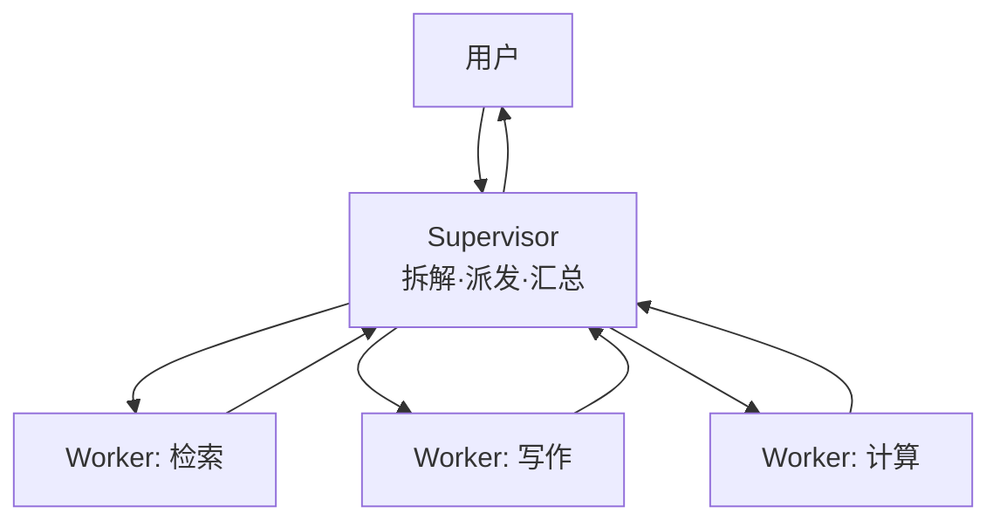

# 👥 监督者模式

> **一句话**：Supervisor（监督者）模式 = 一个协调者 Agent 负责拆解、派发、汇总，多个 Worker 只管干活——多 Agent 系统的默认架构，层级清晰、通信可控。
> **难度**：⭐️⭐️ 进阶
> **标签**：`#multi-agent`

## 📌 先看结论

- 通信拓扑是星型：所有消息经 Supervisor，Worker 之间互不直接通信
- Supervisor 的三职责：拆解任务（含验收标准）、路由派发（选谁干）、汇总质检（不合格打回）
- 变体：层级制（Supervisor of Supervisors，适合超大规模）、动态路由（每次任务动态生成 Worker）
- 优点：通信可控、Worker 上下文干净、易调试；缺点：Supervisor 是单点瓶颈与单点故障

## 🖼️ 架构图

## 📦 源码案例

- **DeepSeek Harness：Supervisor–Worker 的插件化**（[仓库](https://github.com/deepseek-ai/deepseek-harness) / [InfoQ 解读](https://www.sohu.com/a/1062640652_122014422)）：官方定位为「以层级式 Supervisor–Worker 为主，兼容并行、流水线和 Ralph 循环的混合系统」；`core/agent` 的实时注册表 + agent/* 事件让「换一套编排策略」变成换插件——Supervisor 逻辑本身可替换，这是它对多 Agent 架构最大的架构贡献
- **Anthropic 研究系统 = 教科书级 Supervisor**（[工程博客](https://www.anthropic.com/engineering/built-multi-agent-research-system)）：Lead Agent 负责拆解与派发，子 Agent 并行检索并**只回传浓缩发现**；经验：并行度（同时几个 Worker）是性能第一变量；任务描述必须包含「目标、输出格式、工具指引」
- **Claude Code 的 Supervisor 微缩版**（逆向分析，[架构深拆](https://gist.github.com/yanchuk/0c47dd351c2805236e44ec3935e9095d)）：主 Agent 即 Supervisor，AgentTool 派生子 Agent（独立上下文/独立转写/worktree 隔离），子 Agent 完成后只回一份报告——上下文防火墙就是这个模式的副产物
- **LangGraph 的 supervisor 模板**（[langchain-ai/langgraph 官方示例](https://github.com/langchain-ai/langgraph)）：supervisor 节点 + 条件边路由到专家节点，十几个文件即可跑通，适合第一次动手实现

## ✅ 最佳实践

- Supervisor 派发任务必须带：目标、约束、输出格式、超时/预算——「任务描述质量 = 系统上限」
- Worker 只回结论与引用，不回过程（上下文防火墙）
- 给 Supervisor 配「放弃策略」：子任务连续失败时决定降级/跳过/上报，而不是无限派发

## ⚠️ 常见误区

- ❌ Supervisor 自己下场干活：协调与执行混在一起，调度与上下文全乱——保持角色纯净
- ❌ Worker 结果不经质检直接汇总：垃圾进垃圾出，汇总前必须过验收标准
- ❌ 层级过深：每层都是延迟与失真，三层以上要强烈质疑

## 🧪 小练习

设计「季度财报分析」的 Supervisor 方案：几个 Worker？各自工具面？Supervisor 的派发模板和汇总模板各写一版。

## 📚 相关知识点

- [多 Agent 协作](multi-agent-collaboration.md)
- [通信协议](communication-protocol.md)
- [子目标规划](../07-planning/subgoal-planning.md)
