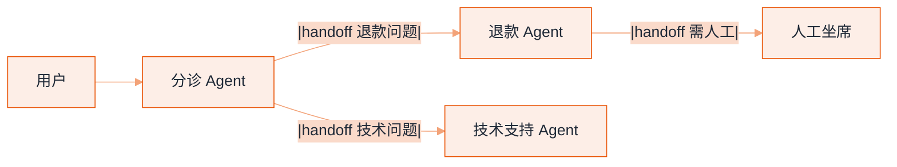

# Swarm


**一句话**：Swarm 模式去掉了中央协调者：Agent 之间通过「移交（handoff）」直接传递控制权，像接力棒一样流动——轻量、去中心化、适合流程可枚举的场景。


## 先看结论

- 核心机制：handoff——Agent A 判断「这事该 B 管」，把对话控制权连同上下文移交给 B
- 与监督者的区别：没有常驻协调者，控制权在 Agent 间流动；每个 Agent 只看自己该看的
- 适用：客服分诊、多专家接力；不适用：需要全局视角统筹的复杂任务
- 最大风险是**移交死循环**，必须用图上的环检测 + 最大跳数兜底

## 核心机制

### 1. Handoff 是控制权的转移

监督者模式下，控制权始终在中心；Swarm 模式下，控制权作为一次事件被转移：

$$
\text{state}_{t+1}=\big(\text{owner}=B,\;\text{context}_{t+1}=\mathrm{brief}(\text{context}_t,\text{user goal})\big)
$$

关键细节是 $$\mathrm{brief}(\cdot)$$：移交不是把整段对话倒过去，而是压成一份「交接简报」（用户目标、已完成步骤、注意事项）。**只传「话」不传「状态」是移交 bug 的头号来源**——接手方不知道前面发生了什么，就会重复劳动或误判。

### 2. 移交关系是一张有向图

把所有可能的 handoff 画成有向图 $$G=(V,E)$$，$$V$$ 是 Agent，边 $$A\to B$$ 表示「A 可以把控制权交给 B」。这张图必须：

- **无环**，或对环加**最大跳数**限制
- 为每个节点定义**终止出口**（给出答案或转人工）

$$
\text{交付}\iff \text{存在一条路径 }A\to\cdots\to \text{终态},\quad |\text{path}|\le H_{\max}
$$

没有 $$H_{\max}$$ 时，两个互相「这不归我管」的 Agent 会无限传球——这是 Swarm 最典型的失效。

### 3. 与监督者模式的取舍

$$
\underbrace{\text{Swarm}}_{\text{局部决策、无全局视图}}
\qquad\text{vs}\qquad
\underbrace{\text{Supervisor}}_{\text{全局统筹、中心瓶颈}}
$$

Swarm 的优势是轻量与低延迟（不需要每次都经中心）；劣势是没有全局视角，跨多步的统筹任务容易在各段之间丢失目标。

## Handoff 流



*《图：只有退款那支 handoff 最终落到人工坐席这个出口，技术支持 Agent 一条出边都没有——缺终止出口的移交图，就是无限传球的温床》*

## Supervisor vs Swarm

| 维度 | 监督者 | Swarm |
|---|---|---|
| 控制权 | 中央常驻 | Agent 间流动 |
| 全局视图 | 有 | 无（各管一段） |
| 适用 | 复杂统筹 | 清晰分诊接力 |
| 失效模式 | 中心瓶颈 | 移交死循环 |
| 延迟 | 每步经中心 | 点对点，更低 |

## 一次移交在链路上流动的三份报文

分诊台做的事只有三步：把用户消息归类、按类别挑接手方、把交接简报打包送出去。三步产出的都是**数据**，不是控制流——把这三份报文定清楚，Swarm 就已经实现了一大半。

**① 分诊结果（分类器 → 编排层）**：`intent` 是封闭枚举 `refund / technical / unclear`，不是自由文本；枚举外的值一律按 `unclear` 处理。之所以要留 `ask_user` 这条兜底分支：猜错接手方不是「慢一点」，而是把用户丢进一条两跳后才暴露的错路。

```json
{
  "kind": "triage_result",
  "intent": "refund",
  "candidates": ["refund", "logistics"],
  "matched_on": "用户提到「退款」并给出订单号",
  "branches": { "refund": "refund_agent", "technical": "tech_agent", "unclear": "ask_user" },
  "ask_user_text": "请问需要什么帮助？"
}
```

**② 交接载荷（编排层 → 接手 Agent）**：编排层能做的动作只有一个——`handoff_to(target, brief)`，产出就是下面这份载荷。`brief` 才是它的本体，`hop` / `hop_limit` 是防止无限传球的计数器。控制权转移 = 换掉 `owner` 字段 + 换掉可见工具集，历史原文并不跟着走。

```json
{
  "kind": "handoff",
  "from": "triage_agent",
  "to": "refund_agent",
  "hop": 1,
  "hop_limit": 3,
  "trace_id": "conv_8f3a",
  "brief": {
    "restated_goal": "订单 20481 已签收，用户要退款，主张商品未拆封",
    "completed": ["核验订单存在", "确认仍在退款窗口内"],
    "ruled_out": [{ "attempt": "自助退款入口", "why": "该入口对已签收订单关闭" }],
    "facts": { "order_id": "20481", "user_confirmed": "未拆封", "window_days_left": 2 },
    "permissions": { "tools": ["refund.lookup", "refund.create"], "approval_required": true },
    "budget": { "hops_left": 2, "deadline_s": 90 }
  }
}
```

`brief` 的六个键不是装饰，它们各自堵一类事故：缺 `restated_goal` → 接手方按上一位的口径理解目标；缺 `ruled_out` → 重走死路；缺 `permissions` → 越权；缺 `budget` → 无人知道这条链还剩几跳、多久收尾。

**③ 移交回执（编排层广播的事件）**：这是状态迁移公式 `state_{t+1} = (owner = B, context_{t+1} = brief(context_t, user goal))` 的线上形状。

```json
{
  "event": "owner_changed",
  "owner": "refund_agent",
  "hops_used": 1,
  "context_inherited": "brief only",
  "user_visible": "正在为你转接退款专员"
}
```

`context_inherited: "brief only"` 要显式写出来：它是对「移交 = 把整段对话倒过去」这个常见误解的否决。`user_visible` 那句也别省——控制权在内部换了三次而用户只看到转圈，是 Swarm 最容易被投诉的形态。

## 分步演示：一次「退款」交接从归类到落到出口




#### 第 1 步：归类，并且承认归类会错

分诊 Agent 读 `context.messages`，产出报文①。它同时给出 `candidates`（这里是 `refund` 与 `logistics` 两个都沾边）——把候选一起带着走，下游发现口径不对时才有重判的余地，而不是从零开始重问用户。




#### 第 2 步：把上下文压成简报，而不是复制对话

`make_brief` 的产物就是报文②里的 `brief` 六个键。判断合不合格只有一条：**把这份简报单独交给一个没参与过对话的人，他能不能接着做下去**。能，交接合格；不能，就是让用户在下面每一跳重复一遍自己刚说过的话。




#### 第 3 步：换 owner，同时换工具面

广播报文③之后，退款 Agent 成为 `owner`，拿到的是 `refund.lookup` / `refund.create` 这一组工具，分诊台那组检索与分类工具对它不可见。权限**随移交收紧而非放宽**：一次错误移交最多让人停下问一次，而一次权限放宽的移交可能直接让人删掉别人的数据。




#### 第 4 步：跳数记账，`hop` 到 `hop_limit` 就强制收尾

每移交一次 `hop` 加一，`hops_left` 减一（示例里 `hop_limit = 3`，交接时剩 2）。两个 Agent 互相认定「这不归我管」时，计数器是唯一能终止传球的机制：触顶不再交给下一个 Agent，而是走**终态出口**——给答案或转人工坐席。没有计数器的图，环上两个节点就能把整场对话耗死。




#### 第 5 步：接手方校验简报，不合格退回而不是重问用户

退款 Agent 进门先查必填键：`restated_goal` 与 `facts.order_id` 缺失就退回分诊台，退回原因写成数据（`brief_incomplete: ["facts.order_id"]`），而不是自己向用户重问一遍——重问是用户视角里最差的失败，他会以为整个系统失忆了。




#### 第 6 步：落到出口，把这条链的跳数记进统计

出口只有两种：给出终答，或移交人工坐席（本页开头那张图里唯一画出的终态）。每次会话都要留下 `hops_used`、终态、是否触顶：跳数分布是判断「这张移交图是不是画错了」的第一手依据——某个 intent 的中位跳数接近 `hop_limit`，说明分诊类别切得不对，该合的边没合。



## 分诊台出来的四条去向（点标签切换）



走报文②，`hop` 变 1、`hops_left` 剩 2，退款 Agent 带着 `refund.*` 工具面接手。注意 `approval_required: true`：退款是写操作，权限收到「可以查、可以起草退款单」这一档，落地仍需确认——移交不改变风险级，只是换一个执行者。



技术支持 Agent 同样能收到合格简报，但本页开头那张图里它**一条出边都没有**：没有终答出口，也没有转人工的边。这条分支的真实结局只能是挂死或靠 `hop_limit` 强制收尾。修法是给它补一条 `→ 人工坐席` 的边，而不是把 `hop_limit` 从 3 调到 10——调大上限只是把无限传球改成有限次数的无限传球。



`intent = unclear` 或枚举外的值，一律走 `ask_user`：一句「请问是想退款，还是使用上遇到了问题？」把分类的球踢回给最便宜的信息源。代价是一轮延迟，收益是省掉一次可能错到底的移交。省掉这一步的系统，通常会在第三跳才发现路走错了。



每跳都是一次失真加一次延迟。同一个问题在两个 Agent 之间来回，说明分诊类别本身切错了（订单与物流高度耦合时，把「查单」和「查物流」拆成两位是自找麻烦）：先合边、合节点；合不动就说明这个任务需要全局视角，此时**正确结论是退回监督者模式**，而不是继续加 Agent 数量。




**先给图配计数器，再谈智能**：一条能跑的 Swarm 链路最少要三样东西——封闭枚举的 `intent`、带 `restated_goal / ruled_out / permissions / budget` 的 `brief`、`hop_limit`（示例取 3）加一个真的终态出口。三样齐了再讨论提示词；缺任何一样，模型再强也只是把传球玩得更久。


## 一次合格交接要带什么

移交不是「把话传过去」，而是「把可继续的状态传过去」。一条交接简报至少四个字段：

- **目标复述**：用接收方的口径重说一遍要什么，别复制用户原话——原话里往往带着只对上一个 Agent 有意义的隐含前提
- **已完成与已排除**：做完了哪几步、试过哪些路并且为什么不通（缺这条，接收方会重走一遍死路）
- **关键事实与标识**：订单号、用户已确认的口径、时间窗等可核对的硬信息，而不是「用户很着急」
- **权限与预算**：交接后允许调用哪些工具、还剩多少步/多少钱——按「收紧而非放宽」写死在简报里

判断标准很简单：把简报单独给一个没参与过对话的人看，他能不能接着做下去。不能，就是交接不合格。

## 源码案例

- **OpenAI Agents SDK 的 handoffs**（[GitHub](https://github.com/openai/openai-agents-python)）：用 `handoffs=[other_agent]` 一行声明移交关系；框架内置回环检测等防护——读它的 handoff 实现是理解该模式的最短路径。其前身是实验项目 [openai/swarm](https://github.com/openai/swarm)（已归档为教学用途）
- **DeepSeek Harness 的对照**（[仓库](https://github.com/deepseek-ai/deepseek-harness)）：其 Supervisor–Worker 为主 + 可替换 loop 的设计意味着 Swarm 也可以作为一个 loop 插件实现——handoff 只是「控制权转移事件」的一种事件流协议
- **Claude Code 的隐式 Swarm**（逆向分析，[提示词全集](https://github.com/Piebald-AI/claude-code-system-prompts)）：主 Agent 可连续派发多个子 Agent，子 Agent 之间不直接通信、由主 Agent 中转——工程上用「监督者化」规避了移交死循环

## 常见误区

- ❌ Swarm 比 Supervisor 先进：只是拓扑不同；无全局视角的统筹任务用 Swarm 会失控
- ❌ 移交链可以很长：每跳都是一次失真与延迟，3 跳内解决不了就回监督者模式
- ❌ 移交后丢上下文：只传「话」不传「状态」是移交 bug 的头号来源
- ❌ 不做环检测：互相「这不归我管」会让对话无限传球
- ❌ 移交时放宽权限：权限应随移交**收紧**而非放宽，否则一次错误移交就可能导致越权

## 小练习

把「电商客服」设计成 Swarm：分诊/订单/退款/物流四个 Agent，画出移交图并标注哪些边有死循环风险、如何防；再给出每条的交接简报应包含什么字段。

## 参考资料

- [OpenAI Agents SDK](https://github.com/openai/openai-agents-python) / [openai/swarm（前身，已归档）](https://github.com/openai/swarm)
- [AutoGen: Enabling Next-Gen LLM Applications via Multi-Agent Conversation](https://arxiv.org/abs/2308.08155)（Wu et al., 2023）
- [A2A 规范](https://a2a-protocol.org/latest/specification/)（跨信任域的移交协议）

## 相关知识点

- [监督者模式](supervisor-pattern.md)
- [通信协议](communication-protocol.md)
- [A2A](../05-tool-protocol/a2a.md)

