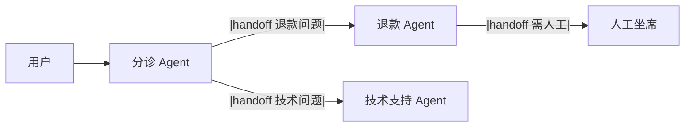

# Swarm

> **一句话**：Swarm 模式去掉了中央协调者：Agent 之间通过「移交（handoff）」直接传递控制权，像接力棒一样流动——轻量、去中心化、适合流程可枚举的场景。

## 先看结论

- 核心机制：handoff——Agent A 判断「这事该 B 管」，把对话控制权连同上下文移交给 B
- 与监督者的区别：没有常驻协调者，控制权在 Agent 间流动；每个 Agent 只看自己该看的
- 适用：客服分诊、多专家接力；不适用：需要全局视角统筹的复杂任务
- 最大风险是**移交死循环**，必须用图上的环检测 + 最大跳数兜底

## 核心机制

### 1. Handoff 是控制权的转移

监督者模式下，控制权始终在中心；Swarm 模式下，控制权作为一次事件被转移：

$$
\text{state}_{t+1}=\big(\text{owner}=B,\;\text{context}_{t+1}=\mathrm{brief}(\text{context}_t,\text{user goal})\big)
$$

关键细节是 $$\mathrm{brief}(\cdot)$$：移交不是把整段对话倒过去，而是压成一份「交接简报」（用户目标、已完成步骤、注意事项）。**只传「话」不传「状态」是移交 bug 的头号来源**——接手方不知道前面发生了什么，就会重复劳动或误判。

### 2. 移交关系是一张有向图

把所有可能的 handoff 画成有向图 $$G=(V,E)$$，$$V$$ 是 Agent，边 $$A\to B$$ 表示「A 可以把控制权交给 B」。这张图必须：

- **无环**，或对环加**最大跳数**限制
- 为每个节点定义**终止出口**（给出答案或转人工）

$$
\text{交付}\iff \text{存在一条路径 }A\to\cdots\to \text{终态},\quad |\text{path}|\le H_{\max}
$$

没有 $$H_{\max}$$ 时，两个互相「这不归我管」的 Agent 会无限传球——这是 Swarm 最典型的失效。

### 3. 与监督者模式的取舍

$$
\underbrace{\text{Swarm}}_{\text{局部决策、无全局视图}}
\qquad\text{vs}\qquad
\underbrace{\text{Supervisor}}_{\text{全局统筹、中心瓶颈}}
$$

Swarm 的优势是轻量与低延迟（不需要每次都经中心）；劣势是没有全局视角，跨多步的统筹任务容易在各段之间丢失目标。

## Handoff 流



## Supervisor vs Swarm

| 维度 | 监督者 | Swarm |
|---|---|---|
| 控制权 | 中央常驻 | Agent 间流动 |
| 全局视图 | 有 | 无（各管一段） |
| 适用 | 复杂统筹 | 清晰分诊接力 |
| 失效模式 | 中心瓶颈 | 移交死循环 |
| 延迟 | 每步经中心 | 点对点，更低 |

## Handoff 伪代码

```python
def triage_agent(context):
    intent = llm.classify(context.messages)
    if intent == "refund":
        return handoff_to(refund_agent, brief=make_brief(context))  # 带交接简报
    if intent == "technical":
        return handoff_to(tech_agent, brief=make_brief(context))
    return reply("请问需要什么帮助？")
```

## 源码案例

- **OpenAI Agents SDK 的 handoffs**（[GitHub](https://github.com/openai/openai-agents-python)）：用 `handoffs=[other_agent]` 一行声明移交关系；框架内置回环检测等防护——读它的 handoff 实现是理解该模式的最短路径。其前身是实验项目 [openai/swarm](https://github.com/openai/swarm)（已归档为教学用途）
- **DeepSeek Harness 的对照**（[仓库](https://github.com/deepseek-ai/deepseek-harness)）：其 Supervisor–Worker 为主 + 可替换 loop 的设计意味着 Swarm 也可以作为一个 loop 插件实现——handoff 只是「控制权转移事件」的一种事件流协议
- **Claude Code 的隐式 Swarm**（逆向分析，[提示词全集](https://github.com/Piebald-AI/claude-code-system-prompts)）：主 Agent 可连续派发多个子 Agent，子 Agent 之间不直接通信、由主 Agent 中转——工程上用「监督者化」规避了移交死循环

## 常见误区

- ❌ Swarm 比 Supervisor 先进：只是拓扑不同；无全局视角的统筹任务用 Swarm 会失控
- ❌ 移交链可以很长：每跳都是一次失真与延迟，3 跳内解决不了就回监督者模式
- ❌ 移交后丢上下文：只传「话」不传「状态」是移交 bug 的头号来源
- ❌ 不做环检测：互相「这不归我管」会让对话无限传球
- ❌ 移交时放宽权限：权限应随移交**收紧**而非放宽，否则一次错误移交就可能导致越权

## 小练习

把「电商客服」设计成 Swarm：分诊/订单/退款/物流四个 Agent，画出移交图并标注哪些边有死循环风险、如何防；再给出每条的交接简报应包含什么字段。

## 参考资料

- [OpenAI Agents SDK](https://github.com/openai/openai-agents-python) / [openai/swarm（前身，已归档）](https://github.com/openai/swarm)
- [AutoGen: Enabling Next-Gen LLM Applications via Multi-Agent Conversation](https://arxiv.org/abs/2308.08155)（Wu et al., 2023）
- [A2A 规范](https://a2a-protocol.org/latest/specification/)（跨信任域的移交协议）

## 相关知识点

- [监督者模式](supervisor-pattern.md)
- [通信协议](communication-protocol.md)
- [A2A](../05-tool-protocol/a2a.md)
