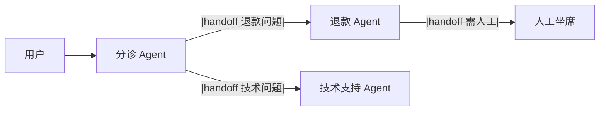

# Swarm

> **一句话**：Swarm 模式去掉了中央协调者：Agent 之间通过「移交（handoff）」直接传递控制权，像接力棒一样流动——轻量、去中心化、适合流程可枚举的场景。
> **难度**：进阶
> **标签**：`#multi-agent`

## 先看结论

- 核心机制：handoff——Agent A 判断「这事该 B 管」，把对话控制权连同上下文移交给 B
- 与监督者的区别：没有常驻协调者，控制权在 Agent 间流动；每个 Agent 只看到自己该看的
- OpenAI 的 `swarm` 实验项目（2024）让该模式流行，其思想已并入 **OpenAI Agents SDK**（[GitHub](https://github.com/openai/openai-agents-python)）的一等公民 `handoffs` 机制
- 适用：客服分诊、多专家接力；不适用：需要全局视角统筹的复杂任务

## Handoff 流



## Supervisor vs Swarm

| 维度 | 监督者 | Swarm |
|---|---|---|
| 控制权 | 中央常驻 | Agent 间流动 |
| 全局视图 | 有 | 无（各管一段） |
| 适用 | 复杂统筹 | 清晰分诊接力 |
| 失效模式 | 中心瓶颈 | 移交死循环 |

## Handoff 伪代码

```python
def triage_agent(context):
    intent = llm.classify(context.messages)
    if intent == "refund":
        return handoff_to(refund_agent)     # 移交控制权
    if intent == "technical":
        return handoff_to(tech_agent)
    return reply("请问需要什么帮助？")
```

## 源码案例

- **OpenAI Agents SDK 的 handoffs**（[GitHub](https://github.com/openai/openai-agents-python)）：`Agent(name=..., handoffs=[other_agent])` 一行声明移交关系；框架内置移交循环防护（回环检测）——读它的 handoff 实现是理解该模式的最短路径
- **DeepSeek Harness 的对照**（[仓库](https://github.com/deepseek-ai/deepseek-harness)）：其 Supervisor–Worker 为主 + 可替换 loop 的设计意味着 Swarm 也可以作为一个 loop 插件实现——handoff 只是「控制权转移事件」的一种事件流协议
- **Claude Code 的隐式 Swarm**（逆向分析）：主 Agent 可以连续派发多个子 Agent，子 Agent 之间不通信但共享「由主 Agent 中转」的接力——工程上用「监督者化」规避了移交死循环

## 最佳实践

- 移交关系画成有向图并检查环；带环的移交要加最大跳数限制
- 移交时带「交接简报」：用户目标、已完成步骤、注意事项，别只传对话
- 每个被移交的 Agent 保持窄工具面，权限随移交收紧而非放宽

## 常见误区

- ❌ Swarm 比 Supervisor 先进：只是拓扑不同；无全局视角的统筹任务用 Swarm 会失控
- ❌ 移交链可以很长：每跳都是一次失真与延迟，3 跳内解决不了就回监督者模式
- ❌ 移交后丢上下文：只传「话」不传「状态」是移交 bug 的头号来源

## 小练习

把「电商客服」设计成 Swarm：分诊/订单/退款/物流四个 Agent，画出移交图并标注哪些边有死循环风险、如何防。

## 相关知识点

- [监督者模式](supervisor-pattern.md)
- [通信协议](communication-protocol.md)
