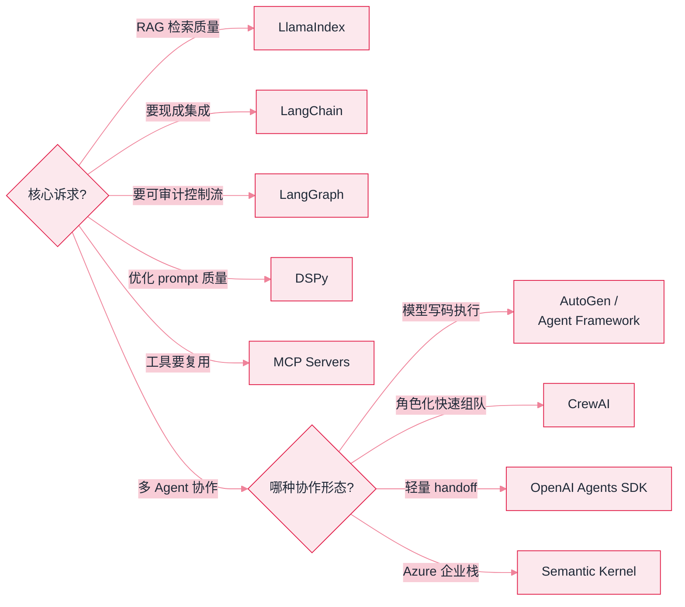
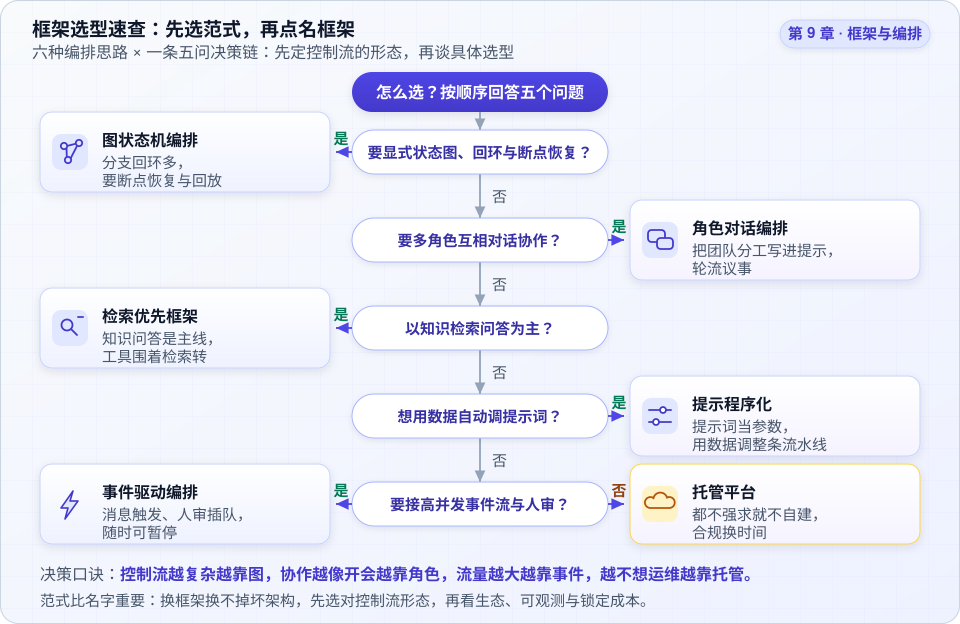
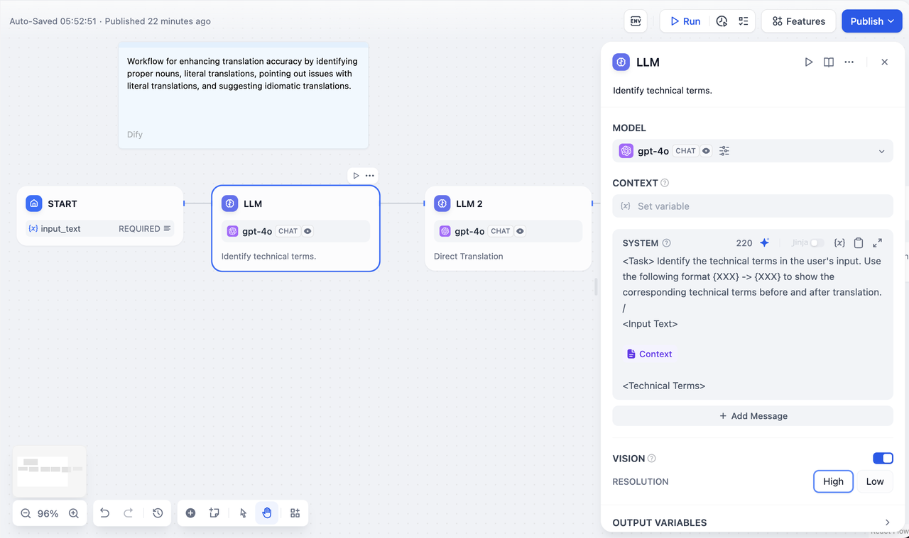

# 09 框架与生态 · 本章导读


**一句话**：框架是前人踩坑的结晶，但也是约束。本章横向对比主流框架的定位与适用场景，帮你「选得准、用得薄、走得出去」。


## 选型总览

| 框架 | 一句话定位 | 适合 | 深入页面 |
|---|---|---|---|
| LangChain | LLM 应用全家桶组件库 | 通用 LLM 应用起步 | [LangChain](langchain.md) |
| LangGraph | 状态图编排 | 复杂 Agent 工作流 | [LangGraph](langgraph.md) |
| LlamaIndex | RAG 优先的数据框架 | 知识检索类应用 | [LlamaIndex](llamaindex.md) |
| AutoGen / Agent Framework | 微软多智能体框架 | 多 Agent 对话研究 | [AutoGen](autogen.md) |
| CrewAI | 角色扮演式多 Agent | 团队隐喻的协作任务 | [CrewAI](crewai.md) |
| Semantic Kernel | .NET 为主的企业级 SDK | 微软技术栈企业 | [Semantic Kernel](semantic-kernel.md) |
| OpenAI Agents SDK | 轻量 handoff 网状多 Agent | OpenAI 生态生产系统 | [OpenAI Agents SDK](openai-agents-sdk.md) |
| Claude Agent SDK | Claude Code 内核库化 | 要生产级循环又想进程内控制 | [Claude Agent SDK](../18-frontier-2026/claude-agent-sdk.md) |
| OpenAI Agents API | 托管 Codex harness | 长时程云端 Agent | [Agents API](../18-frontier-2026/openai-agents-api.md) |
| DSPy | prompt 编译器 | 优化 prompt 管线质量 | [DSPy](dspy.md) |
| MCP Servers | 工具生态协议 | 工具跨应用复用 | [MCP Servers](mcp-servers.md) |
| 向量数据库 | 语义检索存储 | RAG 基础设施 | [向量数据库生态](vector-databases.md) |

> **2026 补充**：托管 harness（Agents API / Agent SDK）与开源框架的分叉见 [模型原生 vs 自建 Harness](../18-frontier-2026/model-native-vs-harness.md)。

*《图：框架选型决策流——先按核心诉求分流，多 Agent 场景再按协作形态细分；循环若非差异化，优先评估托管 harness》*

## 选型心法

- **先问要不要框架**：Pi 用 ~300 行循环证明极简 harness 能覆盖多数场景；框架买的是「状态管理 + 生态」，付出的是「黑盒 + 依赖」
- 框架不锁定模型：选型时确认「换模型只改配置」
- 学框架的正确姿势：读它的「Agent 循环」源码，对照 [02 Agent 基础](../02-agent-basics/README.md) 的原理——框架没有魔法

一条「五问决策链」把六种编排范式收敛到具体选型：先定控制流形态，再看生态、可观测与锁定成本。

*《图：五问自上而下，第一个「是」即定范式——顺序是设计过的：控制流形态一旦定下，生态与锁定成本才有讨论意义》*

「可视化编排」这一路的代表作是 Dify，真实画布长这样：

*《图：右侧一个抽屉装下模型/上下文变量/SYSTEM 提示词，左上 Auto-Saved 与右上 Run、Publish 分离——试跑和上线是两个动作，这是低代码编排相对裸代码最实在的便利》*

*来源：Dify 官方文档 [docs.dify.ai/en/guides/workflow/node/llm](https://docs.dify.ai/en/guides/workflow/node/llm) 内嵌截图，访问日期 2026-09-22。*

看右侧那块面板就能理解低代码的取舍：模型（`gpt-4o CHAT`）、上下文变量、SYSTEM 提示词（还带 220 token 计数与 Jinja 开关）、Vision 分辨率、OUTPUT VARIABLES 全在一个抽屉里——**节点就是 prompt 单元，变量按显式 schema 在节点间流**（左侧 `START` 上那个 `input_text REQUIRED` 就是入口契约）。左上角 `Auto-Saved · Published 22 minutes ago` 与右上角 `Run` / `Publish` 分离，意味着**试跑和上线是两个动作**，这是产品化编排相对裸代码最实在的便利。代价也在这张图里：一条 START→LLM→LLM 的直线很好看，而**循环、动态扇出、断点恢复这些恰恰是代码图（LangGraph）的主场**——所以选型心法第一条仍然是「先问要不要框架」，而不是「哪个画布更漂亮」。

## 读完能做到

- [ ] 用「核心诉求分流」决策树为给定项目选框架：RAG 检索质量→LlamaIndex、复杂可审计控制流→LangGraph、prompt 有指标可优化→DSPy、快速搭集成→LangChain
- [ ] 说清 LangChain「用薄不用厚」的含义，以及复杂控制流为什么要分流给 LangGraph
- [ ] 解释 LangGraph 靠 StateGraph + 条件边 + checkpoint + interrupt 拿到断点恢复 / 时间旅行 / HITL，为什么前提是显式状态
- [ ] 说明 DSPy「先有评估集与指标才能用」的原因，以及换模型时为什么是重新编译而非重写 prompt
- [ ] 讲清 OpenAI Agents SDK「把 handoff 实现成一个特殊工具」的精妙，以及 guardrail 并行、权限审批串行各防什么风险

## 章末自测

1. **回忆**：LangGraph 里的节点为什么建议幂等？不幂等 + checkpoint 重放会导致什么后果？（提示：见 langgraph.md）
2. **应用**：要搭「模型写代码 → 安全执行 → 报错回填 → 修正」的闭环，选 AutoGen/Agent Framework、CrewAI 还是 LangGraph？说理由。（提示：见 autogen.md、crewai.md、langgraph.md）
3. **判断**：「先问要不要框架」——用 Pi 约 300 行循环这个例子，评价框架买来的（状态管理 + 生态）和付出的（黑盒 + 依赖）分别是什么。（提示：本章开头的「选型心法」小节，以及 [LangGraph](langgraph.md)）

## 本章术语速查

框架名本身不值钱，值钱的是每家黑话背后的抽象——表里这些名词认全了，选型决策树就不再是天书。

| 英文术语 | 中文 | 白话一句话 |
|---|---|---|
| Runnable / LCEL | （LangChain）统一接口与管道语法 | `prompt \| llm \| parser` 一根管道能串起来，因为家家都实现同一套 invoke/stream/batch，换模型不改链路 |
| StateGraph | 状态图（LangGraph） | 把 Agent 画成显式的图：节点干活、边定去向、条件边按状态拐弯，难点是控制流不是调模型 |
| Checkpoint / Interrupt | 持久化与中断 | 状态存档 + 停在某节点等人审，断点恢复、时间旅行、HITL 全靠这两件 |
| Reader / Index / Retriever / Query Engine | 检索管线（LlamaIndex） | RAG 被拆成一条每段可换件的流水线：读进来、切成索引、召回、组装作答 |
| GroupChat | 群聊编排（AutoGen） | 人、LLM、工具都只是消息流里的参与者，Manager 用 LLM 挑下一个发言者 |
| Agent / Task / Process | 球队三件套（CrewAI） | role/goal/backstory 填角色、expected_output 定验收、sequential 或 hierarchical 定流程，组队做成填空题 |
| Signature / Optimizer | 签名与优化器（DSPy） | 你只声明输入输出长什么样，措辞交给优化器在评估集上搜——前提是你有指标可优化 |
| Handoff | 移交（OpenAI Agents SDK） | 把转交实现成名为 `transfer_to_xxx` 的特殊工具，模型「选工具」顺便就完成了换人 |
| Guardrail | 护栏 | 旁路安检员：输入输出并行过检，与串行的权限审批各防各的风险 |
| Kernel / Plugin / Planner | 内核与插件（Semantic Kernel） | 按企业容器思路管 LLM：服务注入、原生函数和提示函数在调用侧一个样 |
| MCP Server | 工具服务器 | 把一套能力打包成谁都能插的进程，工具第一次能跨应用复用 |
| Vector Database | 向量数据库生态 | RAG 的地基选型行：嵌入式库、开源服务、托管云各管一段规模与过滤需求 |

