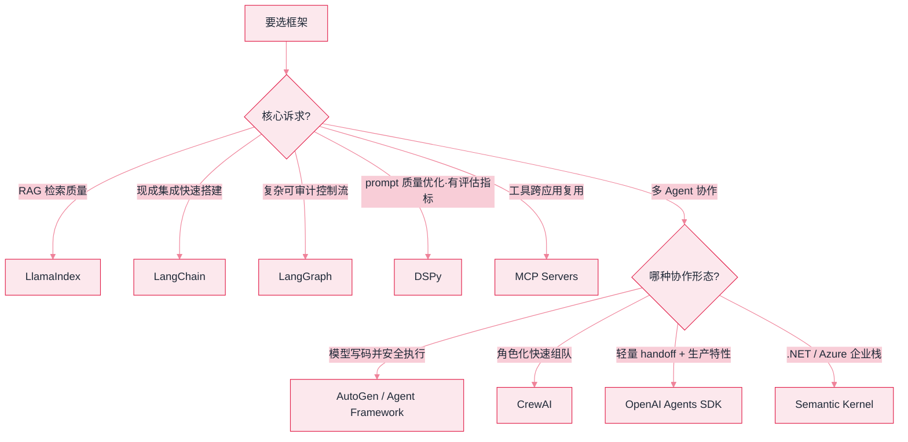

# 09 框架与生态


**一句话**：框架是前人踩坑的结晶，但也是约束。本章横向对比主流框架的定位与适用场景，帮你「选得准、用得薄、走得出去」。


## 选型总览

| 框架 | 一句话定位 | 适合 | 深入页面 |
|---|---|---|---|
| LangChain | LLM 应用全家桶组件库 | 通用 LLM 应用起步 | [LangChain](langchain.md) |
| LangGraph | 状态图编排 | 复杂 Agent 工作流 | [LangGraph](langgraph.md) |
| LlamaIndex | RAG 优先的数据框架 | 知识检索类应用 | [LlamaIndex](llamaindex.md) |
| AutoGen / Agent Framework | 微软多智能体框架 | 多 Agent 对话研究 | [AutoGen](autogen.md) |
| CrewAI | 角色扮演式多 Agent | 团队隐喻的协作任务 | [CrewAI](crewai.md) |
| Semantic Kernel | .NET 为主的企业级 SDK | 微软技术栈企业 | [Semantic Kernel](semantic-kernel.md) |
| OpenAI Agents SDK | 轻量 handoff 网状多 Agent | OpenAI 生态生产系统 | [OpenAI Agents SDK](openai-agents-sdk.md) |
| Claude Agent SDK | Claude Code 内核库化 | 要生产级循环又想进程内控制 | [Claude Agent SDK](../18-frontier-2026/claude-agent-sdk.md) |
| OpenAI Agents API | 托管 Codex harness | 长时程云端 Agent | [Agents API](../18-frontier-2026/openai-agents-api.md) |
| DSPy | prompt 编译器 | 优化 prompt 管线质量 | [DSPy](dspy.md) |
| MCP Servers | 工具生态协议 | 工具跨应用复用 | [MCP Servers](mcp-servers.md) |
| 向量数据库 | 语义检索存储 | RAG 基础设施 | [向量数据库生态](vector-databases.md) |

> **2026 补充**：托管 harness（Agents API / Agent SDK）与开源框架的分叉见 [模型原生 vs 自建 Harness](../18-frontier-2026/model-native-vs-harness.md)。

*《图：框架选型决策流——先按核心诉求分流，多 Agent 场景再按协作形态细分；循环若非差异化，优先评估托管 harness》*

## 选型心法

- **先问要不要框架**：Pi 用 ~300 行循环证明极简 harness 能覆盖多数场景；框架买的是「状态管理 + 生态」，付出的是「黑盒 + 依赖」
- 框架不锁定模型：选型时确认「换模型只改配置」
- 学框架的正确姿势：读它的「Agent 循环」源码，对照 [02 Agent 基础](../02-agent-basics/README.md) 的原理——框架没有魔法

## 读完能做到

- [ ] 用「核心诉求分流」决策树为给定项目选框架：RAG 检索质量→LlamaIndex、复杂可审计控制流→LangGraph、prompt 有指标可优化→DSPy、快速搭集成→LangChain
- [ ] 说清 LangChain「用薄不用厚」的含义，以及复杂控制流为什么要分流给 LangGraph
- [ ] 解释 LangGraph 靠 StateGraph + 条件边 + checkpoint + interrupt 拿到断点恢复 / 时间旅行 / HITL，为什么前提是显式状态
- [ ] 说明 DSPy「先有评估集与指标才能用」的原因，以及换模型时为什么是重新编译而非重写 prompt
- [ ] 讲清 OpenAI Agents SDK「把 handoff 实现成一个特殊工具」的精妙，以及 guardrail 并行、权限审批串行各防什么风险

## 章末自测

1. **回忆**：LangGraph 里的节点为什么建议幂等？不幂等 + checkpoint 重放会导致什么后果？（提示：见 langgraph.md）
2. **应用**：要搭「模型写代码 → 安全执行 → 报错回填 → 修正」的闭环，选 AutoGen/Agent Framework、CrewAI 还是 LangGraph？说理由。（提示：见 autogen.md、crewai.md、langgraph.md）
3. **判断**：「先问要不要框架」——用 Pi 约 300 行循环这个例子，评价框架买来的（状态管理 + 生态）和付出的（黑盒 + 依赖）分别是什么。（提示：见 README 选型心法、langgraph.md）

