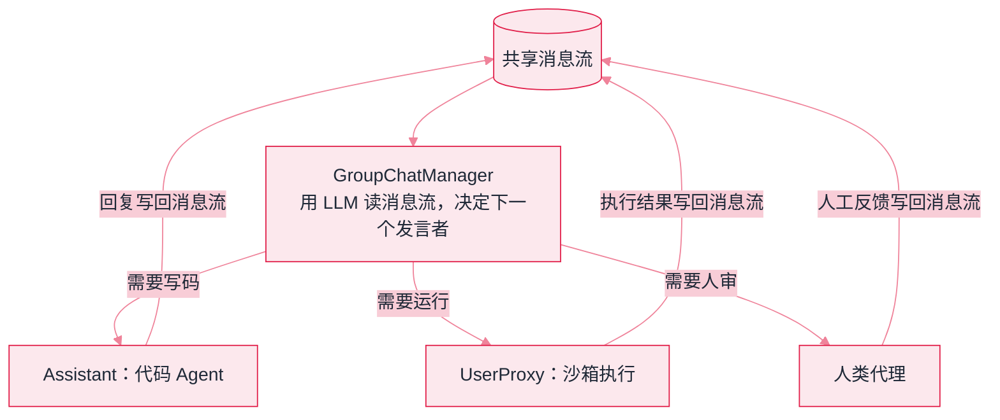
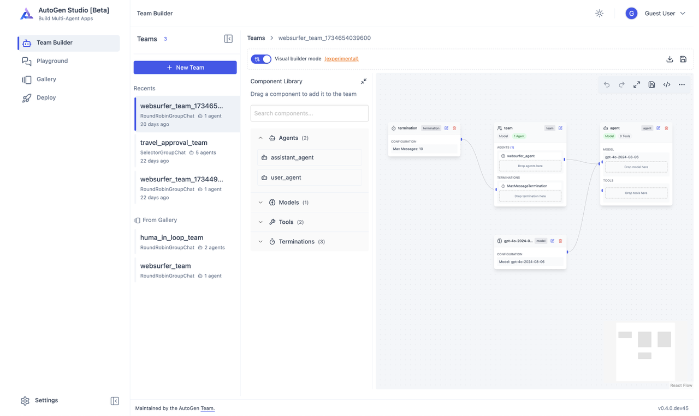
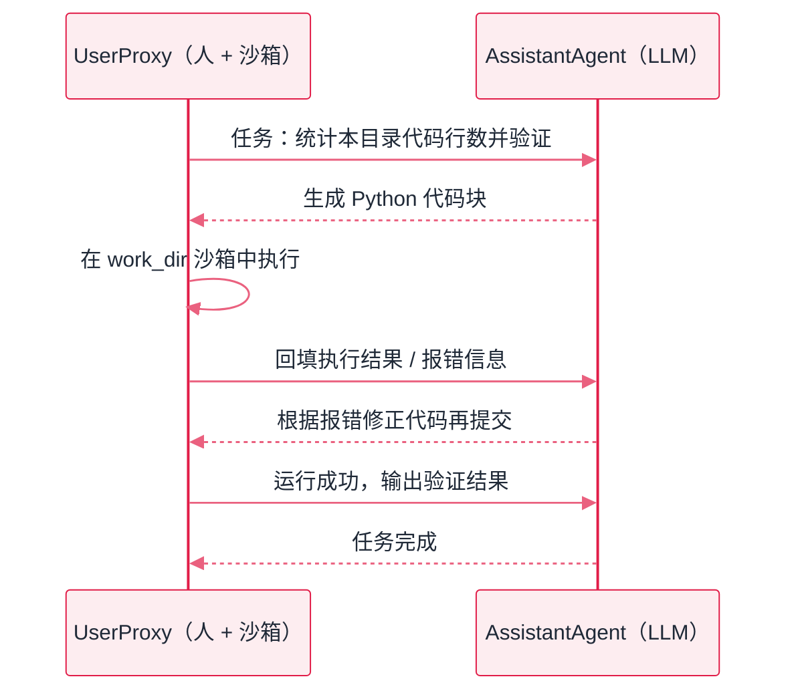

# AutoGen


**一句话**：微软的多智能体对话框架（现与 Semantic Kernel 合流为 Microsoft Agent Framework）：让多个 Agent 通过对话协作，GroupChat 模式的开创者。


## 先看结论

- 核心思想：Agent = 能发消息、能执行代码的对话参与者；协作 = 消息流
- 两大贡献：代码执行沙箱内嵌（对话中生成的代码安全执行）与 GroupChat 编排
- 重要变迁：`microsoft/autogen` 与 Semantic Kernel 已合流为 **Microsoft Agent Framework**（[仓库](https://github.com/microsoft/agent-framework)）；学新项目用后者，学思想可看两者
- 适合：多 Agent 研究原型、代码生成-执行类任务、对话式协作实验

## 核心抽象

AutoGen 把「协作」简化为一个统一模型：

$$
\begin{aligned}
\text{Agent}&=\big(\text{能发消息},\;\text{能接收消息},\;\text{可选：能执行代码}\big)\\
\Longrightarrow\;\text{系统}&=\text{消息流}+\text{发言调度}
\end{aligned}
$$

这个模型的好处是**统一的接口**：人类代理、LLM 代理、工具代理都是「消息参与者」，因此可以自由组合。代价是控制流隐式（谁下一个说话由调度器决定），复杂拓扑不如显式图好调试。

| 概念 | 作用 |
|---|---|
| AssistantAgent | 带 LLM 的对话参与者 |
| UserProxy | 代表人类/执行代码的代理 |
| GroupChat + Manager | 共享消息流 + 发言调度 |
| Handoff | 控制权移交 |



*《图：AutoGen GroupChat 拓扑——调度器每轮从消息流中选出发言者，发言再回流，形成协作循环》*

上面那张拓扑在官方 GUI 里是可以拖出来的——AutoGen Studio 的 Team Builder：



*《图：组件库里 Terminations(3) 与 Agents/Models/Tools 平级——终止条件被当一等组件（画布那根写着 Max Messages: 10），team 节点只是往插槽里装配的壳》*

*来源：AutoGen 官方仓库文档截图（microsoft/autogen · `python/packages/autogen-studio/docs/ags_screen.png`），访问日期 2026-09-22。*

对照上面那张抽象图看这张实物图，GroupChat 的四件事全有了落点：组件库里 `Agents (2)` 是 `assistant_agent` 与 `user_agent` 两类角色、`Models (1)`、`Tools (2)`、`Terminations (3)` 是**终止条件被当成一等组件**（画布左上那根 `termination` 节点写着 `Max Messages: 10`）；中间 `team` 节点的 `AGENTS (1)` 与 `TERMINATIONS` 两个插槽说明团队只是装配壳。值得留意的是 `Visual builder mode (experimental)` 那个开关——**GUI 造团队至今仍是实验特性**，生产路径还是代码；这也解释了为什么本书把 AutoGen 的定位写在「事件驱动架构」而不是「那个拖拽界面」上。

## 双 Agent 对话（经典入门例）

两个角色各一份配置，一次对话一个入口——AutoGen 的入门例拆开就是这几个字段：

```json
{
  "agents": [
    {
      "class": "AssistantAgent",
      "name": "coder",
      "llm_config": "llm_cfg：模型、密钥、重试参数集中在这一个对象里"
    },
    {
      "class": "UserProxyAgent",
      "name": "reviewer",
      "code_execution_config": { "work_dir": "sandbox" },
      "human_input_mode": "默认 ALWAYS：每轮都要人确认一次，全自动跑要显式改成 NEVER",
      "termination": "Assistant 侧默认看消息里的 TERMINATE 终止标记"
    }
  ],
  "conversation": {
    "initiator": "reviewer",
    "target": "coder",
    "first_message": "写个脚本统计本目录代码行数并运行验证",
    "max_consecutive_auto_reply": "自动往返上限，默认 10（Studio 画布上那根终止组件写的也是 Max Messages: 10）"
  }
}
```

`initiate_chat` 只是把 `first_message` 投进消息流并启动调度；此后每一轮谁发言由调度决定——群聊时是 GroupChatManager 读消息流挑人，双 Agent 时就是这两个角色互答。这份配置里真正承担风险的只有一个字段：`work_dir`。

## 分步演示：一次「写码 → 跑挂 → 修好」的闭环




#### 第 1 步：Assistant 产出代码块

`coder` 收到「统计本目录代码行数并运行验证」，回复一条**带 Python 代码块的消息**。注意它并没有执行任何东西——AutoGen 把「写」和「跑」彻底分成两个角色，写代码的一方没有执行能力，这是它整套安全模型的基座。





#### 第 2 步：UserProxy 是唯一有手的一方

`reviewer` 从消息里抽出代码块，在 `code_execution_config` 指定的环境落地执行：脚本写进 `work_dir`（这里是 `sandbox`）再运行。执行器可以是本地目录、Docker 或 Jupyter；选本地目录时它继承的是宿主进程的文件与网络权限——`work_dir` 圈住的是文件位置，不是能力边界。





#### 第 3 步：报错原文回填消息流

执行失败时，**stdout/stderr 原样作为下一轮消息**回给 `coder`。这是 AutoGen 最有价值的设计：报错成为下一轮修正的输入，而不是被吞掉或由人转述。也正因如此，它会自动重试——直到跑通，或者撞到轮次上限。





#### 第 4 步：收敛靠显式终止，不靠模型自觉

两条终止路径：`coder` 在回答里发出 `TERMINATE` 标记，或自动往返数撞到 `max_consecutive_auto_reply`（默认 10）。没有第三条——同一个语法错误反复提交、每次都被沙箱拒绝再回灌，正是这条闭环最典型的失控形态（对照本页「常见误区」第四条）。




## 同一份配置，四种改法的结局（点标签切换）


**`work_dir: "sandbox"` 圈住的只是文件落点，不是权限边界**：用本地执行器时，脚本继承的是宿主进程能做的全部事情。这一份配置里唯一会把「研究原型」变成「生产事故」的字段就是它——下面四个标签讲的都是它不同取值的结果。




模型生成的脚本能读写它「看到」的一切文件。跑「统计本目录代码行数」这类任务看起来一切正常，一次幻觉出的 `open(..., "w")` 就是事故。这条路径只适合在一次性容器里跑，别拿开发机试。



每次执行起一个容器，崩了毁掉的是容器，代价是冷启动延迟与镜像维护——要预装什么包、给不给网络，都变成你要管的配置。这是把「安全边界」从约定变成机制的唯一办法（见 [沙箱与执行环境](../16-ai-infrastructure/sandbox-execution-environments.md)）。



每轮都等人回车。研究场景里这是优点：报错回灌前有人看一眼，能提前掐掉死循环。生产批量任务里它是瓶颈——挂起等人这件事不会自己超时（同一个坑见 LangGraph 的 interrupt）。



双 Agent 互相自动回复可以一路烧到预算耗尽，而且循环往往收敛不了：同一个语法错误反复提交、每次都被沙箱拒绝再回灌。把上限设成你以为需要的轮数再加一档，超了就升级给人，比事后看账单便宜。



这两个角色各自能干什么，全写在配置里；拼起来的运行形态就是下面那张时序图。



*《图：双 Agent 代码执行闭环——报错信息成为下一轮修正的输入，循环直到成功（务必设轮次上限）》*

## 选型对比

| 维度 | AutoGen / Agent Framework | CrewAI | LangGraph |
|---|---|---|---|
| 组织隐喻 | 对话参与者 | 球队角色 | 状态图 |
| 控制流 | 消息流 + 调度器 | 顺序/层级 | 显式图 |
| 代码执行 | 内嵌沙箱（强项） | 需自行接入 | 需自行接入 |
| 调试难度 | 较高（隐式流） | 中 | 低（显式图） |
| 适合 | 代码生成-执行、研究原型 | 角色化快速组队 | 可审计工作流 |

**选型建议**：需要「模型写代码并安全执行」的闭环 → AutoGen/Agent Framework；需要角色化快速组队 → CrewAI；需要严格可审计的控制流 → LangGraph。

## 源码案例

- **GroupChatManager 的发言选择**（[GitHub](https://github.com/microsoft/autogen)）：读它的发言选择实现——用 LLM 看消息流决定下一个发言者，是 [群聊模式](../08-multi-agent/group-chat.md) 的原型代码；后续版本重构为 actor 模型式事件驱动，每个 Agent 是独立 actor，消息队列解耦——与 [状态机与事件驱动](../11-engineering/state-machine-event-driven.md) 的思路相通
- **沙箱执行**：UserProxy 的代码执行配置（Docker/本地/Jupyter）——「模型写代码 → 框架安全执行 → 结果回对话」的完整闭环
- **学术论文背书**：AutoGen 论文（[arXiv:2308.08155](https://arxiv.org/abs/2308.08155)）系统评估了双 Agent / 群聊等拓扑在数学、编码、问答任务上的效果，是少数带消融实验的多 Agent 框架文献

## 常见误区

- ❌ AutoGen = AutoGPT：完全不同的项目；AutoGPT 是早期自治 Agent 尝试，AutoGen 是微软的多 Agent 框架
- ❌ 用旧版教程学新版本：项目经历过彻底重构（API 不兼容），看文档认准版本
- ❌ 群聊当生产架构：发言调度不确定性高，生产环境多用其 handoff/工作流形态
- ❌ 让代码执行默认跑在宿主机：必须用容器/受限目录，否则一次错误生成的代码就可能造成破坏

## 小练习

用 AutoGen 双 Agent（写代码 + 跑代码）解决「解析一个 CSV 并画图」：观察「代码执行 → 报错 → 修正」的循环，记录它重试了几次、错误信息如何被利用。

## 参考资料

- [AutoGen: Enabling Next-Gen LLM Applications via Multi-Agent Conversation](https://arxiv.org/abs/2308.08155)（Wu et al., 2023）
- [Microsoft Agent Framework](https://github.com/microsoft/agent-framework)
- [AutoGen GitHub（旧仓库）](https://github.com/microsoft/autogen)

## 相关知识点

- [群聊模式](../08-multi-agent/group-chat.md)
- [Semantic Kernel](semantic-kernel.md)
- [通信协议](../08-multi-agent/communication-protocol.md)

