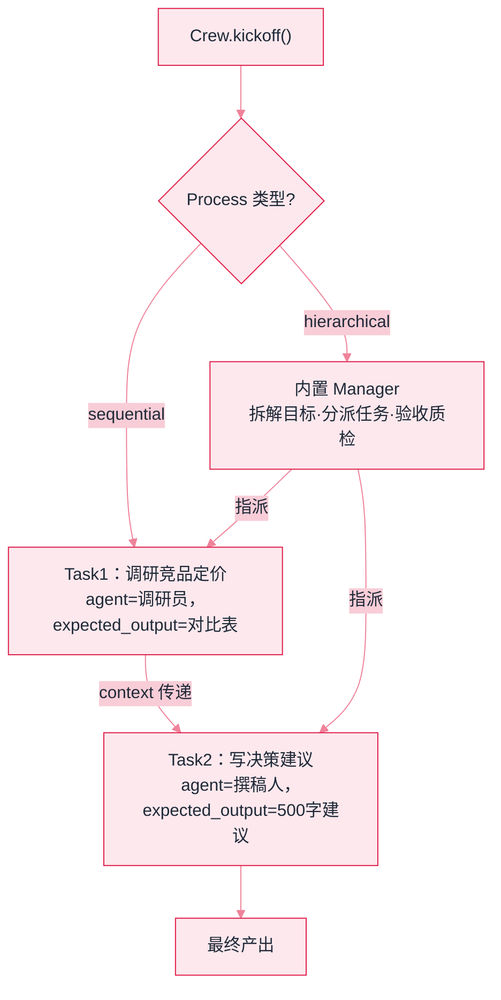

# CrewAI：框架用法与选型


**一句话**：CrewAI 用「球队隐喻」组织多 Agent：角色（Agent）、任务（Task）、团队（Crew）、流程（Process），上手最快的角色化多 Agent 框架。


## 先看结论

- 四个核心抽象：Agent（role/goal/backstory）、Task（含 expected_output）、Crew（组队）、Process（sequential/hierarchical）
- 卖点是「像组建团队一样写多 Agent」：声明式、易读、教程生态友好
- 层级流程内置经理（Manager），是 [监督者模式](../08-multi-agent/supervisor-pattern.md) 的开箱实现
- 复杂控制流（条件分支、状态机）相对薄弱，重编排场景用 LangGraph

## 核心抽象

CrewAI 的设计判断是：**多 Agent 的难点在于「把角色和任务说清楚」，而不是控制流**。于是它提供了四个声明式抽象，把「组队」变成填空题：

$$
\text{Crew}=\big(\{\text{Agent}_i\},\;\{\text{Task}_j\},\;\text{Process}\big)
$$

- **Agent**：`role`（是谁）、`goal`（要什么）、`backstory`（背景）三件套，本质是**结构化的 prompt 片段**
- **Task**：`description` + `expected_output` + `context`（依赖哪些前序任务）
- **Process**：`sequential`（按任务顺序）或 `hierarchical`（经理分配与质检）

**关键理解**：`expected_output` 是这套抽象里最值钱的字段——它把「验收标准」显式写进任务定义，直接对应 [任务分解](../07-planning/task-decomposition.md) 里「可机检完成判据」的要求。

## 最小 Crew

一个「调研 + 撰稿」两人组的全部声明就长这样——三段 agent 字段、四段 task 字段、一个 process 枚举，没有第四层抽象（真实项目里这份配置通常拆成 `agents.yaml` 与 `tasks.yaml`）：

```yaml
agents:
  - role: 调研员                # 是谁
    goal: 收集竞品定价信息       # 要什么
    backstory: 资深市场分析师    # 背景：本质是 prompt 片段，不是性格设定
    tools: [search_tool]        # 只挂这个岗位真用得上的工具
  - role: 撰稿人
    goal: 写出决策建议
    backstory: 商业专栏作者
    tools: []                   # 不挂工具，只消费上游产出

tasks:
  - id: t1
    description: 调研3个竞品定价
    agent: 调研员
    expected_output: 定价对比表   # 验收标准：这句写不出来，任务就不该建
  - id: t2
    description: 基于调研写建议
    agent: 撰稿人
    expected_output: 500字建议
    context: [t1]                # t1 的产出整段拼进 t2 的提示

crew:
  agents: [调研员, 撰稿人]
  tasks: [t1, t2]
  process: sequential            # sequential | hierarchical（内置 Manager）
```

运行侧只有一个入口：`crew.kickoff()`。它按 `process` 驱动任务序列，把「agent 三件套 + task 的 `description`/`expected_output`/`context`」渲染成一次次模型调用，返回最后一个任务的产出。


**看这份配置能得出的三个结论**：不写 `tools` 的撰稿人拿不到任何工具，因此不会幻觉出「我搜了一下」；不写 `context` 的任务之间**互相看不见**，t2 只能靠自己那份 `description` 硬写；编排开关只有 `process` 一个，改成 `hierarchical` 的代价是多出一层 Manager 的调用开销。




*《图：Crew = {Agent, Task, Process} 结构——sequential 按任务顺序接力，hierarchical 由内置经理动态分派（监督者模式开箱版）》*

## 分步演示：一次 `kickoff()` 内部发生了什么




#### 第 1 步：把角色渲染成 system prompt

`role` / `goal` / `backstory` 三个字段被模板织进同一段 system prompt，`tools` 列成可调清单。到这里为止框架没做任何聪明事——所谓「角色」就是三段结构化措辞，改 `backstory` 的效果等同于改 prompt，这也是它「上手快、但没有魔法」的根因。





#### 第 2 步：sequential 沿任务序列接力

t1 先跑：模型读 `description=调研3个竞品定价` + `expected_output=定价对比表`，产出一张表。接着跑 t2：它的提示里除了自己的两个字段，还要拼上 `context` 指向的 t1 产出**全文**。也就是说 `context` 不是引用而是复制——链越长，尾部任务的输入越大（成本公式见本页后段）。





#### 第 3 步：hierarchical 换成经理派活

把 `process` 改成 `hierarchical`，框架会插入一个内置 Manager agent：它读目标与任务清单，决定谁做哪一步，做完按该任务的 `expected_output` 验收，不合格打回重跑。等价于监督者模式的开箱实现（对照 [监督者模式](../08-multi-agent/supervisor-pattern.md)）——但 `expected_output` 写成「一篇好文章」时，经理的验收就退化成再问模型一遍。





#### 第 4 步：拿结果，然后自己补可观测性

`kickoff()` 返回最终产出；每个任务的中间产出可按任务顺序取用。框架默认不导出逐次 LLM 调用的 trace，成本、延迟、失败原因都要自己接（对照 [可观测性工具](../11-engineering/observability-tools.md)）。这是声明式抽象的另一面账单：配置好读，运行过程也更难看见。




## 什么时候选它，什么时候别选（点标签切换）



任务能写成「A 产出 → B 消费 → C 收尾」的线性链，且每步验收能一句话说清（`定价对比表`、`500字建议`）。这时编排代码近乎为零：改流程只动配置，评审时读一份 yaml 就能看懂全链，新人也不需要先理解图、状态、reducer 这些概念。



一旦出现「检索为空就改写查询重试」「跑到一半要人签字」，`sequential / hierarchical` 这两个枚举装不下——它没有条件边，也没有 checkpoint，长任务失败只能整条 `kickoff()` 从头再来，前面所有 token 白烧。这类需求直接看 LangGraph（本页选型表里「控制流灵活性：低」那一栏就是它）。



产出物是代码、还要真跑一遍看报错时，CrewAI 得自己接执行器、自己把报错回灌成下一轮提示——等于把它唯一的优势（开箱即用）手动抵消掉。这条闭环 AutoGen 是内置的（`code_execution_config`）。



`context: [t1, t2, t3]` 看着省事，实际是把三份产出全文塞进同一次提示，输入规模按依赖链线性累加。常见收敛做法是只保留真正需要的那一环依赖，并把 `expected_output` 压成表格或 JSON 短格式——宁可牺牲一点下游可读性，也别让最后一个任务为全链历史付费。



## 选型对比

| 维度 | CrewAI | AutoGen | LangGraph |
|---|---|---|---|
| 抽象方式 | 角色/任务声明式 | 对话参与者 | 状态图 |
| 上手速度 | 最快 | 中 | 中高 |
| 控制流灵活性 | 低（顺序/层级） | 中（消息流） | 高（任意图） |
| 可观测性 | 需自行补 trace | 中 | 强（图级） |
| 适合 | 角色化流水线、快速原型 | 代码执行闭环、研究 | 复杂可审计编排 |

**选型建议**：任务能拆成「几个角色按顺序做几件事」→ CrewAI 最快；需要条件分支/循环/断点恢复 → LangGraph；需要模型写代码并执行 → AutoGen/Agent Framework。

## sequential 成本从哪来

声明式写法容易低估成本。设第 $$j$$ 个任务的指令与产出长度为 $$\ell_j$$，`context` 会把它依赖的前序产出整体拼进提示，则第 $$j$$ 个任务的输入规模约为：

$$
\text{in}_j \;\approx\; \ell_j^{\text{task}} + \sum_{i \in \text{deps}(j)} \ell_i^{\text{out}} + \ell^{\text{tools}}
$$

也就是说：**依赖链越长，后面的任务越贵，而且是累加而非平摊**。三个可动的杠杆：

| 杠杆 | 做法 | 代价 |
|---|---|---|
| 收窄 `context` | 只依赖真正需要的任务，别把全链塞给最后一个角色 | 可能丢信息 |
| 压产出 | `expected_output` 写成结构化短格式（表格/JSON）而非「一篇文章」 | 下游可读性下降 |
| 分档模型 | 调研用便宜模型、终审用强模型 | 需要逐任务验证质量 |

另一个常见坑是**重试放大**：任务没有明确验收判据时，Manager 或人工会反复重跑同一任务，成本按重跑次数线性增长——这也是 `expected_output` 必须可判分的现实理由（对照 [角色分配](../08-multi-agent/role-assignment.md) 的交接契约）。

## 源码案例

- **backstory 的作用机制**（[GitHub](https://github.com/crewAIInc/crewAI)）：读它拼装 prompt 的源码会发现 role/goal/backstory 被模板化地织入 system prompt——「角色」没有魔法，就是结构化的 prompt 片段（呼应 [角色分配](../08-multi-agent/role-assignment.md)）
- **hierarchical 流程**：内置经理做任务分配与质检，是监督者模式的框架化；对照 LangGraph 的 supervisor 模板，可体会「约定俗成的框架 vs 显式图」两种工程风格
- **Flows**：新版加入事件流式编排装饰器，补条件控制流的短板——也反映多 Agent 框架普遍向「图/事件流」收敛的趋势

## 常见误区

- ❌ CrewAI = 生产级多 Agent 银弹：它的抽象屏蔽了通信细节，也屏蔽了可观测性——复杂系统要自己补 trace
- ❌ 角色写得天花乱坠就有用：backstory 过长增量收益很小，工具与验收标准才是关键
- ❌ 需要自由编排还硬用：需要条件/循环时早点迁移到图编排框架
- ❌ 不写 expected_output：验收标准缺失，任务完成与否只能靠模型自述

## 小练习

用 CrewAI 搭「旅行规划三人组」（目的地调研/预算控制/行程编排）：写出每个 Agent 的 role/goal/backstory 与 Task 的 expected_output，跑通后评估产出质量，并指出哪个 Task 的 expected_output 最难写。

## 参考资料

- [CrewAI 官方文档](https://docs.crewai.com)
- [CrewAI GitHub](https://github.com/crewAIInc/crewAI)
- [CrewAI 官方示例仓库](https://github.com/crewAIInc/crewAI-examples)

## 相关知识点

- [角色分配](../08-multi-agent/role-assignment.md)
- [监督者模式](../08-multi-agent/supervisor-pattern.md)
- [任务分解](../07-planning/task-decomposition.md)
- [多 Agent 编排](../08-multi-agent/multi-agent-orchestration.md)
