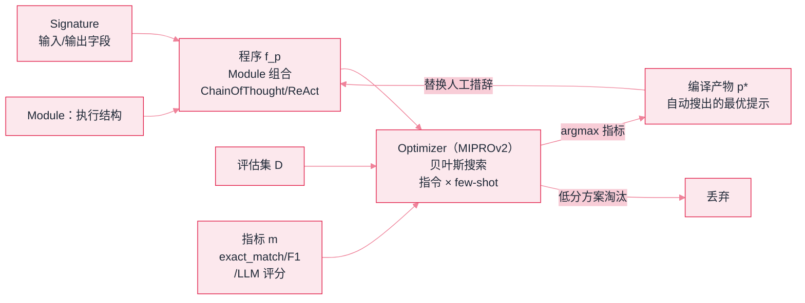

# DSPy


**一句话**：DSPy（Declarative Self-improving Python）把 prompt 从「手写咒语」变成「编译产物」：声明输入输出 + 少量样例，框架自动优化提示词——「prompt 工程的程序化」。


## 先看结论

- 核心思想：写「签名（Signature）」声明模块做什么 → 用优化器在指标上自动搜出最佳 prompt/few-shot 组合
- 价值：prompt 随模型升级可自动重新优化；换模型不用重写咒语，重新编译即可
- 关键前提：必须有**评估集与指标**——没有 metric 就没有优化，这是它倒逼的工程习惯
- 适用：管线型任务（RAG、抽取、分类）的质量优化；不适合：探索型 Agent 循环

## 核心抽象

DSPy 的出发点是一个判断：**手写 prompt 的不可复现性来自「把两件事混在一起」**——程序逻辑（做什么）与提示措辞（怎么说）。它把二者拆开：

$$
\underbrace{\text{Signature}}_{\text{声明做什么}}
\;+\;
\underbrace{\text{Module}}_{\text{怎么组合}}
\;\xrightarrow{\text{Optimizer}}\;
\underbrace{p^*}_{\text{自动搜出的提示}}
$$

其中优化目标写得很直白——在评估集上最大化指标：

$$
p^*=\operatorname*{arg\,max}_{p\in\mathcal{P}}\;
\mathbb{E}_{(x,y)\sim\mathcal{D}}\Big[\,m\big(f_p(x),\,y\big)\Big]
$$

- $$\mathcal{P}$$：**提示空间**，包含指令措辞与 few-shot 示例的选择
- $$f_p$$：给定提示 $$p$$ 的完整程序
- $$m$$：指标函数（精确匹配、F1、LLM 评分等）

现代优化器（如 MIPROv2）用「先自举出候选示例、再用贝叶斯搜索在指令 × 示例的组合空间里找高分方案」的方式近似求解。**这条式子是整个框架的钥匙**：优化上限完全由 $$\mathcal{D}$$ 与 $$m$$ 决定——垃圾指标必然优化出垃圾 prompt。



*《图：DSPy 编译流——Signature+Module 定义程序，Optimizer 在评估集与指标上搜索提示空间，产出可版本化的 prompt 编译产物》*

| 概念 | 作用 | 类比 |
|---|---|---|
| Signature | 声明式接口：输入/输出字段 | 函数签名 |
| Module | 组合签名的程序结构（ChainOfThought/ReAct） | 标准库组件 |
| Optimizer | 用 metric 自动调 prompt/few-shot | 编译器优化器 |
| Metric | 打分函数 | 单元测试断言 |

## 最小示例

一个「按上下文答题」模块从声明到编译，涉及的全部配置如下（字段名与取值均为框架真实接口名）：

```json
{
  "signature": {
    "name": "QA",
    "docstring": "根据上下文回答问题",
    "inputs": [
      { "field": "context", "type": "str", "role": "InputField" },
      { "field": "question", "type": "str", "role": "InputField" }
    ],
    "outputs": [ { "field": "answer", "type": "str", "role": "OutputField" } ]
  },
  "program": { "module": "ChainOfThought", "wraps": "QA", "bound_name": "rag" },
  "trainset": [
    {
      "type": "Example",
      "fields": { "context": "…", "question": "…", "answer": "…" },
      "input_keys": ["context", "question"],
      "note": "answer 是标签，只有它参与打分，不会被喂给模型"
    }
  ],
  "optimizer": {
    "type": "MIPROv2",
    "metric": "exact_match",
    "auto": "light",
    "compile": { "program": "rag", "trainset": "上面的样例集" },
    "output": { "bound_name": "rag_optimized", "contains": "自动搜出的指令 + few-shot 示例组合" }
  }
}
```

三处最容易看漏的地方：**`docstring` 不是注释**，它是会被编进提示的任务说明；**`module` 决定执行结构**，`ChainOfThought` 多出一个推理字段、`ReAct` 多出工具循环，结构定死后措辞才交给优化器；**`auto: "light"` 是搜索预算档位**，可选 `light / medium / heavy`，档位越高自举与评估轮数越多——更贵、更慢，也更容易在小评估集上过拟合。


**这条配置里最危险的一项是 `metric: "exact_match"`**。它只比对字符串是否相等，所以一个正确答案「42 天」写成「大约 42 天」就被判错，优化器随即朝着「把答案压成裸字符串」的方向搜——分数涨了，能力没涨。指标至少要能容忍格式差异（归一化后比对、F1、或 LLM 评分），否则编译产物学的是断言口径而不是任务本身。


## 分步演示：从「声明意图」到「编译产物」




#### 第 1 步：只写接口，不写措辞

Signature 交出去的是字段契约：`context`、`question` 进，`answer` 出，加一行 `docstring` 说明任务。此刻程序里**没有任何 prompt**——它是一个待填充的壳，这正是「逻辑与措辞分离」的落点。





#### 第 2 步：Module 把壳包成可执行结构

`ChainOfThought(QA)` 绑定为 `rag`，运行时先产出推理字段再产出 `answer`。这一步定死了 $$f_p$$ 的结构；提示措辞 $$p$$ 仍然空缺，由优化器负责填。同一份 Signature 换成 `ReAct` 就变成带工具的循环，Signature 一行不用改。





#### 第 3 步：交出评估集与指标

trainset 每条是一个 `Example(context, question, answer)`，`exact_match` 逐条打分。这两样东西划定了优化的全部边界——本页「核心抽象」那条 $$p^*=\arg\max$$ 只在 $$\mathcal{D}\times m$$ 张成的空间里成立。样例数量也是硬约束：几十条量级上编出来的提示，泛化只能靠留出集说话。





#### 第 4 步：优化器搜索「指令 × 示例」组合

`MIPROv2(auto="light")` 先拿未优化的 `rag` 在 trainset 上自举出候选 few-shot，再用贝叶斯搜索在指令与示例的组合空间里逐轮提案：每轮都在评估集上跑一遍分，低分方案直接淘汰。`auto` 档位控制的就是这个「提案—评估」循环的轮数，也就直接控制 token 花费。





#### 第 5 步：产物是 `rag_optimized`，一个可入库的提示

编译返回的新程序内部装着搜出来的指令与示例组合，替换掉人工措辞。它应当像代码一样进版本库、打标签、可回滚——否则你无法回答「这次准确率提升来自哪次优化」。上线前人工读一遍产物，看它学的是能力还是应试技巧。




## 什么时候选它，什么时候别选（点标签切换）



分类准确率、抽取 F1、检索命中率这类能自动判分的任务，且会被反复迭代——DSPy 的收益是**结构性**的：换模型时不重写咒语，重新 `compile` 一遍即可，产物还能版本化对比。手写 prompt 在同样场景下的成本是每次换模型都要重跑人工调优。



没有稳定 metric 就没有优化方向：写「把下面这句改写得更专业」这种 Signature，优化器只能朝着「指标随机噪声」的方向搜。这类任务手写 prompt + 人工评审更实际，硬上 DSPy 只是把措辞权换给了随机数。



`light → heavy` 增加的是自举样例数与搜索轮数：分数通常还会再涨一点，但训练期 token 花费成倍上升，小评估集上的过拟合风险同步上升。经验做法是固定 `light` 起步，只在留出集指标明显低于手写基线时才加档，并始终看留出集而不是 trainset 分数。



`ChainOfThought → ReAct` 加的是工具与循环，单次请求的调用数从 1 次涨到多轮；`Signature` 增删输出字段（比如加一个 `reason`）会立刻改变提示形状和打分口径。结构变更属于「改程序」，必须重新编译并复测——以为优化器会自动兜住是新手最常见的失误。



## 选型对比

| 维度 | DSPy | 手写 prompt | LangChain |
|---|---|---|---|
| prompt 来源 | 编译生成 | 人写 | 人写 |
| 换模型成本 | 重新编译 | 重写/重调 | 重写/重调 |
| 前提条件 | 评估集 + 指标 | 无 | 无 |
| 可复现性 | 高（产物可版本化） | 低（措辞敏感） | 低 |
| 适合 | 有明确指标的任务 | 快速试错 | 应用集成 |

**选型建议**：任务有清晰指标（分类准确率、抽取 F1、检索命中率）且会被反复迭代 → DSPy 收益明显；开放式创意任务难以定义 metric → 手写 prompt 更实际。

## 源码案例

- **dspy.ReAct**（[GitHub](https://github.com/stanfordnlp/dspy)）：DSPy 内置 ReAct 模块——声明工具与签名，推理循环由框架展开；对照 [ReAct](../04-prompt-reasoning/react.md)，体会「手写模板」与「编译生成模板」的差别
- **MIPROv2 优化器**：在指令与示例的组合空间上做贝叶斯搜索，读它的「提案-评估-选择」流程能理解 prompt 搜索空间如何被系统化探索
- **学术背书**：DSPy 论文（[arXiv:2310.03714](https://arxiv.org/abs/2310.03714)）报告：相同管线经编译后，在多任务上超过手写 prompt 基线，且换模型时质量更稳定

## 工程含义

- **先有评估集，再谈优化**：DSPy 的最大副作用是逼你建立指标与评估集——这件事本身的价值常超过自动优化。
- **编译产物要审查**：自动搜出的 prompt 应人工过目，确认它学的是「能力」而不是「应试技巧」。
- **编译产物要入库**：把它当代码资产版本化管理，才能追踪「哪次优化带来了提升」。

## 常见误区

- ❌ DSPy 会「自动」变好：metric 设计决定优化上限，垃圾指标优化出垃圾 prompt
- ❌ 适合一切场景：开放对话、创意生成难以定义 metric，编译无从谈起
- ❌ 拿来即用不读产物：自动优化也可能搜出过拟合评估集的 prompt
- ❌ 评估集太小：几十条样例上编译出的 prompt 极易过拟合，泛化要看留出集

## 小练习

把你的「工单分类」手写 prompt 迁移到 DSPy：定义 Signature，标注 30 条训练样例，跑 MIPROv2 编译，对比手写版的准确率，并检查编译出的 prompt 是否只学到了「分类能力」。

## 参考资料

- [DSPy: Compiling Declarative Language Model Calls into Self-Improving Pipelines](https://arxiv.org/abs/2310.03714)（Khattab et al., 2023）
- [DSPy 官方文档](https://dspy.ai)
- [DSPy 仓库（stanfordnlp）](https://github.com/stanfordnlp/dspy)

## 相关知识点

- [Prompt Engineering](../04-prompt-reasoning/prompt-engineering.md)
- [持续评估](../11-engineering/continuous-evaluation.md)
- [Agent 评估指标](../10-evaluation-safety/evaluation-metrics.md)

