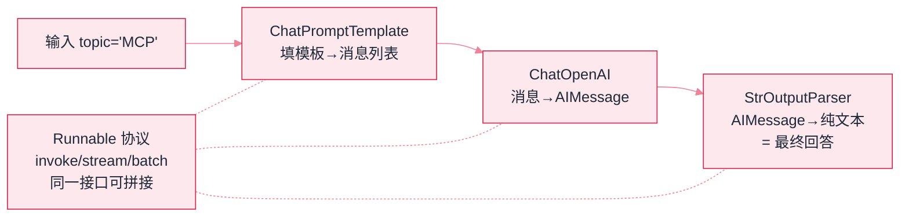

# LangChain：框架用法与选型


**一句话**：LangChain 是最流行的 LLM 应用开发框架：统一模型/向量库/工具的抽象，配以链条式编排——生态最大，抽象也最多，要「用薄不要用厚」。


## 先看结论

- 核心价值：大量集成（模型/向量库/加载器）+ 统一抽象（Runnable/LCEL）+ 丰富的教程与社区
- 定位演变：复杂 Agent 编排已分流给同门的 LangGraph；LangChain 主攻「应用层组件与集成」
- 争议点：抽象层级偏多曾广受批评，近几个版本在持续精简
- 学它最好的方式：把它当「集成速查库」，核心逻辑自己写

## 核心抽象

LangChain 的设计目标是**把异构组件统一成可拼接的接口**，核心是 Runnable 协议与 LCEL 管道语法：

$$
\text{chain}=\text{prompt}\;\big|\;\text{llm}\;\big|\;\text{parser}
$$

`|` 之所以能成立，是因为所有组件都实现了同一套方法（`invoke`/`stream`/`batch`）。这套协议带来三个直接收益：

- **组合性**：任意组件可替换（换模型、换向量库不改链路）
- **可流式**：整条链自动支持流式输出
- **可观测**：每次调用可挂回调，trace 粒度到每个组件（配 LangSmith）

代价是抽象层数多：出问题时需要在「你的代码 → chain → runnable → 具体实现」多层之间定位。

| 概念 | 是什么 | 类比 |
|---|---|---|
| Runnable / LCEL | 组件统一接口 + 管道语法 | 乐高积木的统一凸点 |
| ChatModel | 各家 LLM 的统一封装 | 万能插座 |
| Tool | 函数 + schema 的注册封装 | 插头标准 |
| Retriever | 检索器抽象 | 资料的取件口 |

## 最小示例

一条「模板 + 模型」两段链的完整形状，字段名即接口名：

```json
{
  "prompt": {
    "class": "ChatPromptTemplate",
    "factory": "from_template",
    "template": "用一句话解释{topic}",
    "emits": "填好变量的消息列表"
  },
  "llm": { "class": "ChatOpenAI", "model": "gpt-4o-mini" },
  "chain": {
    "operator": "|",
    "segments": ["prompt", "llm"],
    "protocol": "Runnable：invoke / stream / batch 三件套"
  },
  "call": {
    "method": "invoke",
    "input": { "topic": "MCP 协议" },
    "returns": "AIMessage：正文在 content，元数据在 response_metadata",
    "answer_path": "invoke 结果的 .content"
  }
}
```

三件事最容易被略过：`|` 两端都必须是 Runnable，能否相接只看「前一段的输出类型是否等于后一段的输入类型」；`invoke` 收的是 dict，键名必须与模板变量 `{topic}` 完全一致，写错不会报错而是把 `{topic}` 原样送进提示；出参是 `AIMessage` 不是字符串，`.content` 这一层是新手最常踩的取值坑——想要纯文本就在链尾再接一个输出解析器（下张图第三段）。


**这条链的调试成本是四层栈**：一次 `invoke` 报错，调用要穿过「你的代码 → chain → runnable → 具体实现」四层才落到网络上。经验做法是先接 LangSmith 或 OpenTelemetry 导出再写业务，让每一段的输入输出可见——抽象层数直接放大排障成本，这一层账单不会因为代码少写而消失。




*《图：LCEL 链拓扑——所有组件实现同一 Runnable 接口，`|` 把线性段拼成链，任一段可替换、整链自动可流式/批量/追踪》*

## 分步演示：`invoke({"topic": "MCP 协议"})` 在链里走的三段




#### 第 1 步：模板段接 dict，出消息列表

`ChatPromptTemplate` 把 `{topic}` 替换成 `MCP 协议`，产出的是**结构化消息**（带角色），不是拼好的字符串。这一段没有任何网络调用，出错通常是两类：键名对不上（占位符原样进提示）、模板里塞了不认识的变量。





#### 第 2 步：模型段接消息列表，出 AIMessage

`ChatOpenAI(model="gpt-4o-mini")` 发起一次真实请求，返回值是 `AIMessage`：正文在 `.content`，token 用量与结束原因在 `.response_metadata`。**整条链只有这一段花钱**，也是唯一能改成 `stream` 的一段——链自动支持流式就是从这里来的。





#### 第 3 步：取值或接解析器

`.content` 手动取一次；或者链尾再接一段解析器（`StrOutputParser`），让整条链的输出直接是字符串。两种写法等价，差别在下游：接了 parser 的链可以直接被再拼装，手取 `.content` 的写法则把类型判断留在了业务代码里。





#### 第 4 步：换接口不换结构

同一条链换成 `stream`（逐 token）或 `batch`（一次喂一串 dict），编排代码一行不改——这就是 Runnable 协议换来的全部好处，也是它的抽象税：结构没变，出问题时要多问几层「这一段是谁给的」。




## 什么时候选它，什么时候别选（点标签切换）



LangChain 的真实价值在集成层：几十种向量库、文档加载器、切分器都已经封装成同一套接口。自己写这些适配是纯体力活，而且下个版本还得再适配一次。这一层用 LangChain，业务控制流自己写，就是「用薄」。



一个循环加两家 SDK 就能表达的东西，套上 chain 与 Runnable 只会多两层栈。「学 Agent = 学 LangChain」这条误区（见本页「常见误区」）说的就是这件事：框架是原理的封装，先懂循环再用封装。



链是线性的。一旦需要「检索为空就改写查询重试」「中途停下来等人签字」，继续往 chain 里塞就是在跟接口较劲——同门 LangGraph 把分支放在边上、恢复交给 checkpoint（对照 [LangGraph](langgraph.md)）。



该项目迭代快、破坏性变更多次，抄两年前的教程代码大概率对不上当前接口。锁版本 + 抄前先核对版本，是本页「工程含义」第二条的全部内容；更稳的做法是把 LangChain 限制在「适配层」，业务逻辑别依赖它的接口形状。



## 选型对比

| 维度 | LangChain | LangGraph | 裸 SDK / Pi |
|---|---|---|---|
| 定位 | 组件与集成层 | 复杂编排（状态图） | 最小循环 |
| 学习成本 | 中（抽象多） | 中高（图思维） | 低 |
| 控制流 | 线性链为主 | 图/条件/循环 | 自己写 |
| 集成丰富度 | 最高 | 复用 LangChain | 最少 |
| 适合 | 快速搭建含检索/工具的应用 | 多步骤可审计工作流 | 想彻底理解原理 |

**选型建议**：需要大量现成集成（几十种向量库、加载器）→ LangChain；需要条件分支与断点恢复 → LangGraph；只想跑通一个工具循环 → 裸 SDK 更透明。

## 源码案例

- **对照学习**：LangChain 的 ReAct 式 agent 实现（几百行源码）是 [ReAct 循环](../04-prompt-reasoning/react.md) 的框架化版本——读完最小循环实现再读它，能清楚看到框架在哪几处做了抽象（消息状态管理、工具执行器、回调系统）
- **LangSmith 联动**（→ [可观测性工具](../11-engineering/observability-tools.md)）：调试链路的一等公民，trace 粒度到每个 Runnable
- **何时别用**：只需要「模型调用 + 工具循环」的简单 Agent，直接用各家 SDK 更轻

## 工程含义

- **用薄不用厚**：把 LangChain 限制在「集成适配」层，业务控制流用普通代码或 LangGraph，能显著降低调试难度。
- **固定版本**：该项目迭代快，版本间存在破坏性变更；`requirements` 里锁版本，抄教程前先核对版本。
- **可观测性前置**：接 LangSmith（或 OpenTelemetry 导出）后再写业务，否则多抽象层的 bug 很难定位。

## 常见误区

- ❌ 学 Agent = 学 LangChain：框架是原理的封装，先懂 [Agent 基础](../02-agent-basics/README.md) 再用框架
- ❌ 所有逻辑都塞进 chain：复杂控制流交给 LangGraph 或普通 Python，chain 只管线性段
- ❌ 忽略版本变迁：破坏性变更多次，抄旧教程代码前先看版本
- ❌ 为了「用框架」而用框架：小项目里框架的抽象成本常高于收益

## 小练习

用 LangChain 搭一个「文档问答」chain：加载 → 切分 → 检索 → 生成。然后回答：哪一段你更想用裸代码写？为什么？

## 参考资料

- [LangChain 官方文档](https://python.langchain.com)
- [LangChain GitHub](https://github.com/langchain-ai/langchain)
- [LangGraph 文档](https://langchain-ai.github.io/langgraph/)

## 相关知识点

- [LangGraph](langgraph.md)
- [ReAct](../04-prompt-reasoning/react.md)
- [可观测性工具](../11-engineering/observability-tools.md)

