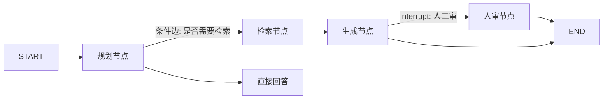

# LangGraph

> **一句话**：LangGraph 把 Agent 表达为「状态图」：节点是步骤、边是流转、checkpoint 提供持久化与时间旅行——复杂 Agent 工作流的当前主流选择。

## 先看结论

- 四大原语：StateGraph（状态图）、条件边（路由）、checkpoint（断点恢复）、interrupt（人工介入）
- 精髓是「显式状态」：所有流转基于声明的状态对象，可测试、可回放、可恢复
- 适合：多步骤可审计工作流、多 Agent 编排、需要 HITL 的关键业务
- 与 LangSmith/Platform 生态联动：trace、部署、队列一体化

## 核心抽象

LangGraph 的出发点是一个反直觉的判断：**Agent 的难点不是「调用模型」，而是「控制流」**。所以它把 Agent 显式建模为图：

$$
G=(V,E),\qquad V=\text{步骤（节点）},\quad E=\text{状态流转（边）}
$$

- **节点**：一个函数，读状态、产状态增量（可以是 LLM 调用、工具执行、任意代码）
- **边**：普通边（固定流转）或**条件边**（按状态决定去哪，实现分支/循环）
- **状态**：一个显式声明的对象，所有节点共享；节点返回的是「增量」而非整体覆盖

因为状态是显式的，三件在普通循环里很难做到的事变得自然：

| 能力 | 依赖的机制 | 解决的问题 |
|---|---|---|
| 断点恢复 | checkpoint 持久化每个超步 | 长任务失败不必从头再来 |
| 时间旅行 | 回到任意历史 checkpoint 重跑 | 调试与「换个决策再试」 |
| 人工介入 | interrupt 在节点前暂停 | HITL 不再靠外部编排 |

$$
\text{可恢复}=\text{状态外置}+\text{确定性重放}
$$

这与 [状态机与事件驱动](../11-engineering/state-machine-event-driven.md) 讨论的「可恢复」是同一原理的两种实现。

## 状态图示例



## 最小示例

```python
from langgraph.graph import StateGraph, MessagesState, START, END

def plan(state: MessagesState):
    return {"messages": [llm.invoke(state["messages"])]}

g = StateGraph(MessagesState)
g.add_node("plan", plan)
g.add_edge(START, "plan")
g.add_edge("plan", END)
app = g.compile(checkpointer=saver)   # 加 checkpoint 即可断点恢复
```

## 选型对比

| 维度 | LangGraph | LangChain（LCEL） | 手写循环 |
|---|---|---|---|
| 控制流 | 图：分支/循环/并行 | 线性链 | 任意但需自建 |
| 状态管理 | 显式状态 + checkpoint | 隐式 | 自己维护 |
| 断点恢复 | 内置 | 无 | 需自建 |
| 可观测性 | 图级 trace | 组件级 trace | 需自建 |
| 学习成本 | 中高 | 中 | 低 |

**选型建议**：需要「条件分支 + 循环 + 可恢复」三者之一时用 LangGraph；纯线性链路 LangChain 足够；只是跑一个工具循环，手写更透明。

## 源码案例

- **官方模板库 = 编排模式教科书**（[langchain-ai/langgraph](https://github.com/langchain-ai/langgraph)）：supervisor、hierarchical、plan-and-execute、multi-agent-chat 等模板——对照 [规划](../07-planning/README.md) 与 [多智能体](../08-multi-agent/README.md) 章节的模式逐一实现，是理论落地的最佳路径
- **checkpoint 机制**：每个超步持久化状态到存储（内存/SQLite/Postgres），线程可恢复、可时间旅行——对照 [Agent 状态管理](../02-agent-basics/state-management.md) 理解不同的「可恢复」设计
- **生产实践**：多家公司公开分享过 LangGraph 生产经验；Anthropic 多 Agent 研究系统的 Lead/Worker 隔离思路，在 LangGraph 模板中也有对应实现

## 工程含义

- **图要能画出来**：如果画不出来，说明控制流还没想清楚——先画图再写代码。
- **节点要幂等**：配合 checkpoint 重放，节点最好可安全重复执行（或显式标注副作用）。
- **状态要精简**：状态对象是「节点间接口」，字段膨胀会变成新的上下文污染源。

## 常见误区

- ❌ 把 LangGraph 当 Agent 引擎：它只管编排，Agent 循环、prompt、工具都是你自己的节点内容
- ❌ 图越画越复杂：节点过多先怀疑「该拆成多个子图/子 Agent」
- ❌ 不用 checkpoint 裸跑生产：没有持久化 = 长任务一次失败全部重来
- ❌ 节点里藏副作用且不幂等：checkpoint 重放会导致重复副作用

## 小练习

把 [工作流编排](../11-engineering/workflow-orchestration.md) 里的「投诉处理」画成 LangGraph 状态图：节点、条件边、HITL interrupt 各在哪？哪个节点需要 checkpoint？

## 参考资料

- [LangGraph 官方文档](https://langchain-ai.github.io/langgraph/)
- [LangGraph GitHub（含模板库）](https://github.com/langchain-ai/langgraph)
- [LangChain 文档](https://python.langchain.com)

## 相关知识点

- [LangChain](langchain.md)
- [状态机与事件驱动](../11-engineering/state-machine-event-driven.md)
- [多 Agent 编排](../08-multi-agent/multi-agent-orchestration.md)
