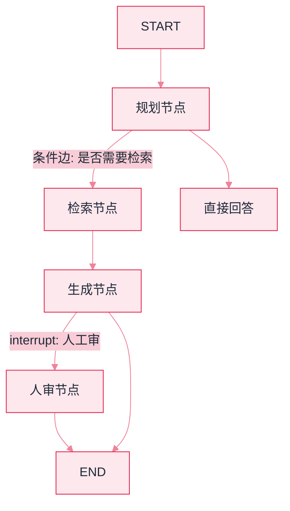
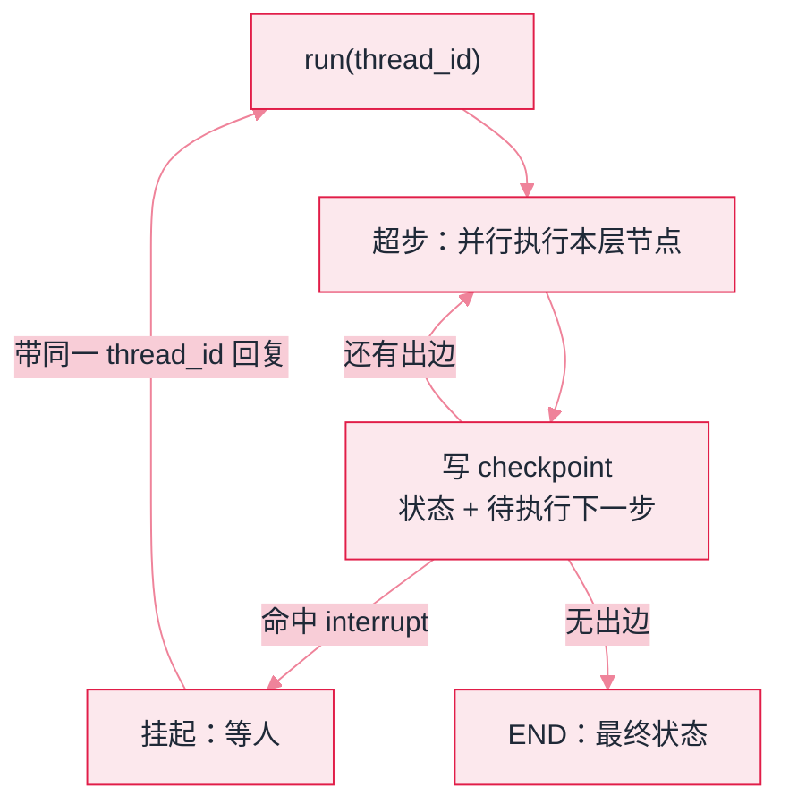

# LangGraph：框架用法与选型


**一句话**：LangGraph 把 Agent 表达为「状态图」：节点是步骤、边是流转、checkpoint 提供持久化与时间旅行——复杂 Agent 工作流的当前主流选择。


## 先看结论

- 四大原语：StateGraph（状态图）、条件边（路由）、checkpoint（断点恢复）、interrupt（人工介入）
- 精髓是「显式状态」：所有流转基于声明的状态对象，可测试、可回放、可恢复
- 适合：多步骤可审计工作流、多 Agent 编排、需要 HITL 的关键业务
- 与 LangSmith/Platform 生态联动：trace、部署、队列一体化

## 核心抽象

LangGraph 的出发点是一个反直觉的判断：**Agent 的难点不是「调用模型」，而是「控制流」**。所以它把 Agent 显式建模为图：

$$
G=(V,E),\qquad V=\text{步骤（节点）},\quad E=\text{状态流转（边）}
$$

- **节点**：一个函数，读状态、产状态增量（可以是 LLM 调用、工具执行、任意代码）
- **边**：普通边（固定流转）或**条件边**（按状态决定去哪，实现分支/循环）
- **状态**：一个显式声明的对象，所有节点共享；节点返回的是「增量」而非整体覆盖

因为状态是显式的，三件在普通循环里很难做到的事变得自然：

| 能力 | 依赖的机制 | 解决的问题 |
|---|---|---|
| 断点恢复 | checkpoint 持久化每个超步 | 长任务失败不必从头再来 |
| 时间旅行 | 回到任意历史 checkpoint 重跑 | 调试与「换个决策再试」 |
| 人工介入 | interrupt 在节点前暂停 | HITL 不再靠外部编排 |

$$
\text{可恢复}=\text{状态外置}+\text{确定性重放}
$$

这与 [状态机与事件驱动](../11-engineering/state-machine-event-driven.md) 讨论的「可恢复」是同一原理的两种实现。

## 状态图示例



*《图：分支长在边上而非节点里：A 的两条出边决定要不要去检索，D 的 interrupt 边决定要不要等人审；同一个生成节点因此既有直达 END 的快路，也有挂起的慢路》*

## 最小示例

一个「只有一个规划节点」的图，声明形状与编译配置如下——`nodes` / `edges` / `state` 三块正好对应它的三个原语：

```json
{
  "state": {
    "schema": "MessagesState",
    "fields": { "messages": "对话消息列表，节点共享" },
    "contract": "节点返回【增量】而非整体覆盖"
  },
  "nodes": [
    {
      "name": "plan",
      "reads": "state['messages']",
      "does": "llm.invoke(state['messages'])",
      "returns": { "messages": ["新增一条 AI 消息（追加，不覆盖）"] }
    }
  ],
  "edges": [
    { "from": "START", "to": "plan", "kind": "normal" },
    { "from": "plan", "to": "END", "kind": "normal" },
    { "from": "plan", "to": "retrieve | answer", "kind": "conditional（按状态路由，可成环）" }
  ],
  "compile": {
    "checkpointer": "saver（内存 / SQLite / Postgres 任一）",
    "gives": ["断点恢复", "时间旅行", "按 thread_id 续跑"]
  }
}
```

关键在最后那个 `compile`：**加一个 checkpointer 就获得断点恢复**，图的定义一行没改。第三类边（条件边）是唯一能表达分支与循环的东西——普通边只说「接下来是谁」，条件边读状态再决定，本页「状态图示例」那张图里「要不要去检索」就长在这里。

## 分步演示：一次运行如何变成可恢复的时间线



*《图：图是静态的，跑起来是「超步 → 落盘」的循环；checkpoint 同时是恢复点、时间旅行入口和 interrupt 的挂起锚》*




#### 第 1 步：声明状态对象

`MessagesState` 只有一个字段 `messages`。状态是**节点之间唯一的通信信道**，也是 checkpoint 序列化的全部内容：字段越多，落盘越重、回放越慢。只在单节点内部用的东西应当留在局部变量里（见本页「实战手记」第一条）。





#### 第 2 步：注册节点，节点只交增量

`add_node("plan", plan)` 挂一个函数，函数读 `state['messages']`，返回 `{"messages": [新的 AI 消息]}`。**返回的是增量而非整份状态**——合并由 reducer 负责（消息列表默认是追加）。写成全量覆盖的节点会让历史消息凭空消失，且很难在图上看出原因。





#### 第 3 步：连边，把分支放进条件边

`add_edge(START, "plan")`、`add_edge("plan", END)` 是固定流转；需要「按状态决定去哪」时改用条件边，它挂一个路由函数，读状态返回目标节点名。分支与循环都活在这里，**而不是藏在节点代码里**——这是 LangGraph 可审计性的来源：把图导出成图片就能评审控制流，不必读函数体（本页「状态图示例」那张图就是导出结果的样子）。





#### 第 4 步：compile 时绑上 checkpointer

`g.compile(checkpointer=saver)` 之后，每执行完一个超步就把状态写一条记录，用 `thread_id` 标识一条会话线程。生产环境用 SQLite/Postgres 而不是内存 saver：进程一重启，内存里的 checkpoint 全部作废，等于没做持久化。





#### 第 5 步：恢复、时间旅行与挂起

崩在第 7 步就带同一个 `thread_id` 再跑一次，前 6 个超步直接读回放；想「换个决策再试」，回到某个历史 checkpoint 从那儿继续。命中 `interrupt` 的线程会停在节点前不动，等人带着输入回来才继续——**它不会超时**，所以每个 interrupt 位都得接通知渠道。




## 什么时候选它，什么时候别选（点标签切换）


**checkpoint 是免费的，留存不是**：每个超步落一条记录，长任务高并发下存储涨得很快；而完全不接 checkpointer 就等于同时放弃恢复、时间旅行与 interrupt。可行做法是只给进行中的线程保留完整记录，跑完的压缩归档（见本页「实战手记」第二条）。




多步骤、要审计、可能跑几十分钟的工作流：投诉处理、研究编排、跨系统对账。这三项需求同时出现时几乎没有替代品——分支和循环是图自带的，恢复是 checkpoint 自带的，而这三件事在手写循环里全要自己造。



「提示 → 模型 → 解析」这种一条道走到黑的场景，LangGraph 的图与状态是净开销：多一层抽象、多一处落盘。同门的 LCEL 链足够，甚至直接调 SDK 更透明（对照 [LangChain](langchain.md)）。



省掉 `checkpointer=saver` 就能少一层存储，但也同时放弃了恢复、时间旅行与 interrupt——线程挂不住，人审环节直接失效。长任务一次失败从头再来，烧掉的 token 通常比 checkpoint 的存储贵得多。



checkpoint 重放会重复执行节点。若节点直接下单、发信、写库，一次故障恢复就变成两次真实副作用。对策是把副作用节点标成幂等（带外部幂等键）或拆成「计算 + 提交」两步，对照 [持久化执行](../16-ai-infrastructure/agent-runtime-durable-execution.md) 的做法。



## 选型对比

| 维度 | LangGraph | LangChain（LCEL） | 手写循环 |
|---|---|---|---|
| 控制流 | 图：分支/循环/并行 | 线性链 | 任意但需自建 |
| 状态管理 | 显式状态 + checkpoint | 隐式 | 自己维护 |
| 断点恢复 | 内置 | 无 | 需自建 |
| 可观测性 | 图级 trace | 组件级 trace | 需自建 |
| 学习成本 | 中高 | 中 | 低 |

**选型建议**：需要「条件分支 + 循环 + 可恢复」三者之一时用 LangGraph；纯线性链路 LangChain 足够；只是跑一个工具循环，手写更透明。

## 源码案例

- **官方模板库 = 编排模式教科书**（[langchain-ai/langgraph](https://github.com/langchain-ai/langgraph)）：supervisor、hierarchical、plan-and-execute、multi-agent-chat 等模板——对照 [规划](../07-planning/README.md) 与 [多智能体](../08-multi-agent/README.md) 章节的模式逐一实现，是理论落地的最佳路径
- **checkpoint 机制**：每个超步持久化状态到存储（内存/SQLite/Postgres），线程可恢复、可时间旅行——对照 [Agent 状态管理](../02-agent-basics/state-management.md) 理解不同的「可恢复」设计
- **生产实践**：多家公司公开分享过 LangGraph 生产经验；Anthropic 多 Agent 研究系统的 Lead/Worker 隔离思路，在 LangGraph 模板中也有对应实现

## 工程含义

- **图要能画出来**：如果画不出来，说明控制流还没想清楚——先画图再写代码。
- **节点要幂等**：配合 checkpoint 重放，节点最好可安全重复执行（或显式标注副作用）。
- **状态要精简**：状态对象是「节点间接口」，字段膨胀会变成新的上下文污染源。

## 常见误区

- ❌ 把 LangGraph 当 Agent 引擎：它只管编排，Agent 循环、prompt、工具都是你自己的节点内容
- ❌ 图越画越复杂：节点过多先怀疑「该拆成多个子图/子 Agent」
- ❌ 不用 checkpoint 裸跑生产：没有持久化 = 长任务一次失败全部重来
- ❌ 节点里藏副作用且不幂等：checkpoint 重放会导致重复副作用

## 小练习

把 [工作流编排](../11-engineering/workflow-orchestration.md) 里的「投诉处理」画成 LangGraph 状态图：节点、条件边、HITL interrupt 各在哪？哪个节点需要 checkpoint？

## 实战手记

- **状态膨胀是肉眼可见的**：起手 state 里两个字段，一个月后能膨胀到十来个，顺手把整段消息历史往图里传。经验值上，给团队立一条「新增字段要说明为什么跨节点传」的规矩就足够，只在单节点用的内容一律收进局部变量，graph 调试会体面很多。
- **checkpoint 先免费后收费**：每个超步都落一条记录，长任务高并发下存储涨得很快。我们常见的项目里，开发期用内存或 SQLite 很顺，上线换 Postgres 后要开始管清理——只对进行中的线程保留完整 checkpoint，跑完的压缩归档，体积通常能掉一半以上。
- **interrupt 等人是真会等爆**：人工审暂停点上线后，最常见的事故不是审错而是没人审——线程挂到第二天早上。每个 interrupt 位都要接通知渠道，并和业务约定超时后的默认动作，否则生产里堆起来的是一排挂着的线程。

## 参考资料

- [LangGraph 官方文档](https://langchain-ai.github.io/langgraph/)
- [LangGraph GitHub（含模板库）](https://github.com/langchain-ai/langgraph)
- [LangChain 文档](https://docs.langchain.com/oss/python/langchain/overview)

## 相关知识点

- [LangChain](langchain.md)
- [状态机与事件驱动](../11-engineering/state-machine-event-driven.md)
- [多 Agent 编排](../08-multi-agent/multi-agent-orchestration.md)

