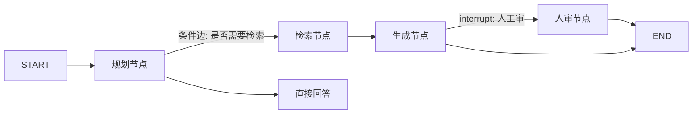

# 🧰 LangGraph

> **一句话**：LangGraph 把 Agent 表达为「状态图」：节点是步骤、边是流转、checkpoint 提供持久化与时间旅行——复杂 Agent 工作流的当前主流选择。
> **难度**：⭐️⭐️ 进阶
> **标签**：`#framework`

## 📌 先看结论

- 四大原语：StateGraph（状态图）、条件边（路由）、checkpoint（断点恢复）、interrupt（人工介入）
- 精髓是「显式状态」：所有流转基于声明的状态对象，可测试、可回放、可恢复
- 适合：多步骤可审计工作流、多 Agent 编排、需要 HITL 的关键业务
- LangSmith/Platform 生态联动：trace、部署、队列一体化

## 🖼️ 状态图示例



## 💻 最小示例

```python
from langgraph.graph import StateGraph, MessagesState, START, END

def plan(state: MessagesState):
    return {"messages": [llm.invoke(state["messages"])]}

g = StateGraph(MessagesState)
g.add_node("plan", plan)
g.add_edge(START, "plan")
g.add_edge("plan", END)
app = g.compile(checkpointer=saver)   # 加 checkpoint 即可断点恢复
```

## 📦 源码案例

- **官方模板库 = 编排模式教科书**（[langchain-ai/langgraph](https://github.com/langchain-ai/langgraph)）：supervisor、hierarchical、plan-and-execute、multi-agent-chat 等模板——对照 [07 规划](../07-planning/README.md) 与 [08 多智能体](../08-multi-agent/README.md) 章节的模式逐一实现，是理论落地的最佳路径
- **checkpoint 机制**：每个超步持久化状态到存储（内存/SQLite/Postgres），线程可恢复、可时间旅行（回到任意历史节点重跑）——对照 [DeepSeek Harness 的事件投影](../02-agent-basics/state-management.md) 理解两种「可恢复」设计
- **生产案例**：Klarna、Uber 等公司公开分享过 LangGraph 生产实践；Anthropic 多 Agent 研究系统虽自研循环，但其设计（Lead/Worker、状态隔离）在 LangGraph 模板中有对应实现

## ⚠️ 常见误区

- ❌ 把 LangGraph 当 Agent 引擎：它只管编排，Agent 循环、prompt、工具都是你自己的节点内容
- ❌ 图越画越复杂：节点 > 20 个先怀疑「该拆成多个子图/子 Agent」
- ❌ 不用 checkpoint 裸跑生产：没有持久化 = 长任务一次失败全部重来

## 🧪 小练习

把 [工作流编排](../07-planning/workflow-orchestration.md) 里的「投诉处理」画成 LangGraph 状态图：节点、条件边、HITL interrupt 各在哪？哪个节点需要 checkpoint？

## 🔗 相关资源

- [LangGraph 文档](https://langchain-ai.github.io/langgraph/)

## 📚 相关知识点

- [LangChain](langchain.md)
- [状态机与事件驱动](../11-engineering/state-machine-event-driven.md)
