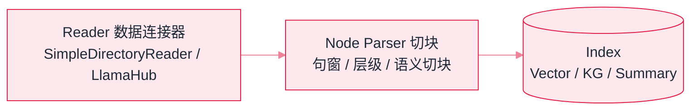

# LlamaIndex


**一句话**：LlamaIndex（原 GPT Index）是「数据接入 + 检索」优先的框架：几十种数据连接器与索引结构，做 RAG 和知识型 Agent 的第一选择之一。


## 先看结论

- 核心价值：数据连接器（LlamaHub，数百种数据源）+ 丰富的索引结构（向量/树/关键词/知识图谱）+ 开箱即用的 Query Engine
- 与 LangChain 的分工：LangChain 偏「应用编排全家桶」，LlamaIndex 偏「RAG 管线专家」——生产中两者常混用
- Agent 能力：支持工具循环，但复杂多 Agent 编排仍建议用图编排框架
- 进阶组件值得精读：句窗检索、自动合并、混合检索、重排序集成

## 核心抽象

LlamaIndex 把 RAG 拆成一条**可替换的管线**，每个环节都有明确的抽象：

$$
\text{Reader}\to\text{Node Parser}\to\text{Index}\to\text{Retriever}\to\text{Query Engine}
$$

| 概念 | 作用 | 对应章节 |
|---|---|---|
| Reader / Loader | 从各数据源读文档 | [RAG 基础](../06-memory-rag/rag-basics.md) |
| Node Parser | 切块策略（句窗/层级/语义切块） | [Embedding 与相似度检索](../06-memory-rag/embedding-similarity.md) |
| Index | 组织 chunks 的结构（Vector/KG/Summary） | [向量数据库](../06-memory-rag/vector-database.md) |
| Retriever | 可插拔的检索策略 | [RAG 基础](../06-memory-rag/rag-basics.md) |
| Query Engine | 检索 + 组装 + 生成的封装 | 同上 |

**为什么这个拆分重要**：RAG 的质量瓶颈几乎从不在「向量库选哪个」，而在**切块与检索策略**。把 Node Parser 与 Retriever 做成独立可替换环节，就是为了让你能针对失败模式逐段换零件，而不是被锁死在一条固定管线上。



*《图：索引侧（离线）——文档解析、切块、embedding 后写入索引，产物只服务下图的查询侧》*


*《图：LlamaIndex 管线——离线索引与在线查询两段分离，Node Parser 与 Retriever 是独立可替换环节，失败模式可逐段定位》*

## 三个关键权衡

| 权衡 | 问题 | LlamaIndex 的解法 |
|---|---|---|
| 切太碎 vs 切太粗 | 碎则丢上下文，粗则稀释语义 | 句窗检索（匹配用句子、返回带窗口） |
| 检索粒度 vs 完整性 | 小块精确但缺上下文 | 自动合并父块（命中子块则返回父块） |
| 语义 vs 精确匹配 | 向量对 ID/型号无能 | 混合检索 + 重排序集成 |

## 最小 RAG 的形状

「一个目录进，一句问题出」的最小配置，展开成契约是下面这份（字段名即接口名）：

```json
{
  "reader": {
    "class": "SimpleDirectoryReader",
    "input_dir": "docs/",
    "method": "load_data()",
    "emits": "Document 列表：一个文件一份，带文件名等元数据"
  },
  "index": {
    "class": "VectorStoreIndex",
    "method": "from_documents(documents)",
    "inside": "切块（默认 Node Parser）→ embedding → 写入向量存储"
  },
  "query_engine": {
    "method": "as_query_engine",
    "params": { "similarity_top_k": 3 },
    "inside": "检索 3 个块 → 拼上下文 → 交给 LLM 生成"
  },
  "ask": "年假政策是什么？",
  "response": { "answer": "自然语言回答", "source_nodes": "命中的那 3 个块及其元数据" }
}
```

这份契约里**没有一项是检索质量的决定因素**：默认 embedding 模型、默认切块策略、默认向量存储全是隐式的，`similarity_top_k=3` 是整条链上唯一被你显式调过的检索参数。这也解释了为什么它能当天跑通、却很难直接上线（对照本页「常见误区」第二条与第四条）。

## 分步演示：一份目录如何变成一条可回答的问题




#### 第 1 步：Reader 只负责把文件变成 Document

`SimpleDirectoryReader("docs/")` 逐文件解析成带元数据的 Document 列表。PDF/表格/图片的解析质量瓶颈全在这一步——**解析出来的正文顺序错、表格被拉平，后面所有环节都救不回来**，这正是 LlamaCloud 把「解析烂 PDF」产品化的原因（见「源码案例」）。





#### 第 2 步：Node Parser 决定「可检索单元」的粒度

`from_documents` 内部先切块：不显式换就用默认策略，句窗 / 层级 / 语义切块都要自己指定。这一步决定命中与召回的上限——切太碎丢上下文，切太粗稀释语义，两种失败模式在「三个关键权衡」表里各占一行。





#### 第 3 步：Embedding 与写入索引

每个节点过一次 embedding 模型，连节点文本与元数据一起写进向量存储。默认用的是 OpenAI 侧的 embedding 模型，**不配密钥就跑不通；换了模型则整个索引必须重建**——查询向量与库向量不同源，相似度就没有意义。





#### 第 4 步：Retriever 按 `similarity_top_k=3` 取回节点

问题向量在库里比对，返回得分最高的 3 个节点，附带各自的分数与元数据。这 3 个块就是答案的全部依据——**检索没召回的内容，模型再强也答不出**，只能编。





#### 第 5 步：Query Engine 组装提示并生成

模板把 3 个节点拼进上下文，交给 LLM 生成 `Response`：`answer` 是文本，`source_nodes` 是依据。生产里必须把 `source_nodes` 一起返回并展示——否则无法判断回答是被文档支撑，还是模型自己补的。




## 什么时候选它，什么时候别选（点标签切换）


**这份契约里没有任何一处写着「你的文档长什么样」**：默认切块策略面对合同、表格、带页眉的 PDF 通常很差（见「常见误区」第二条）。先去看 Node Parser 的选项，再谈检索参数——顺序反了就是拿调参掩盖解析问题。




句窗检索、自动合并父块、混合检索 + 重排序这些组件是现成的，换一件通常只改一处配置。同类需求自己实现，光是调父子块的映射关系就要几天——而这块工作对最终命中率的影响通常远大于换向量库。



它有工具循环与工作流，但编排复杂度天花板低于图编排框架：分支、并发、断点恢复不是它的强项。以「检索 + 生成」为核心的项目用它，需要严格可审计控制流的部分交给 LangGraph（对照 [LangGraph](langgraph.md)）。



调大：召回上升但上下文里噪声同涨，模型容易抓错依据，token 成本线性上升、延迟一起变差。调小到 1：答案变干净，但跨段落问题必丢。真正有效的动作通常不是调它，而是把切块与检索策略换对，再配重排序把 3 个位置留给最相关的块。



先去 LlamaHub 查有没有现成连接器（飞书/Notion/数据库/网盘），几百个数据源的适配自己写不划算。查不到时先评估 LlamaCloud 这类托管解析服务，用它的质量给自建管线定基准，再决定解析这块要不要自建。



## 源码案例

- **SentenceWindowNodeParser**（[文档](https://developers.llamaindex.ai/python/framework/)）：检索时以「句」为单位匹配、返回时带上下文窗口——解决「切太碎丢上下文」的经典方案；配合 AutoMergingRetriever 自动合并父块。读这两个组件胜过读十篇 RAG 调优博客
- **LlamaHub**（[首页](https://llamahub.ai)）：数百个数据连接器与现成模板——找你的数据源（飞书/Notion/数据库/网盘）是否已有连接器，往往是选型第一站
- **LlamaCloud**：官方托管的解析/索引/检索服务——把「解析烂 PDF」这个 RAG 最大痛点产品化，可作为自建管线的质量基准

## 选型对比

| 维度 | LlamaIndex | LangChain | 裸代码 |
|---|---|---|---|
| 定位 | RAG 管线 | 通用集成/编排 | 完全自控 |
| 数据连接器 | 最丰富 | 丰富 | 自己写 |
| 高级检索组件 | 强（句窗/自动合并/重排） | 一般 | 自己实现 |
| Agent 编排 | 够用 | 一般 | 随意 |

**选型建议**：以「检索质量」为核心的项目优先 LlamaIndex；需要大量异构集成与复杂编排，LangChain/LangGraph 更合适；研究单点机制时读源码比用框架更有价值。

## 常见误区

- ❌ LlamaIndex 只能做 RAG：它的 Agent 与工作流能力在增强，但编排复杂度天花板低于图编排框架
- ❌ 默认切块就是最优：默认切块对结构化文档（合同/表格）常很差，先看 Node Parser 选项
- ❌ 评估缺失：框架集成了评估工具（→ [Agent 评估指标](../10-evaluation-safety/evaluation-metrics.md)），别裸奔上线
- ❌ 一上来就上复杂度：先用最简管线跑通并测量，再按失败模式换零件

## 小练习

用 LlamaIndex 对同一批 PDF 分别用默认切块和句窗切块建索引，构造 10 个测试问题对比检索命中率（Recall@3），说明差异来自哪一环节。

## 参考资料

- [LlamaIndex 官方文档](https://developers.llamaindex.ai/python/framework/)
- [LlamaIndex GitHub](https://github.com/run-llama/llama_index)
- [RAG 原始论文](https://arxiv.org/abs/2005.11401)（Lewis et al., 2020）

## 相关知识点

- [RAG 基础](../06-memory-rag/rag-basics.md)
- [LangChain](langchain.md)
- [向量数据库](../06-memory-rag/vector-database.md)

