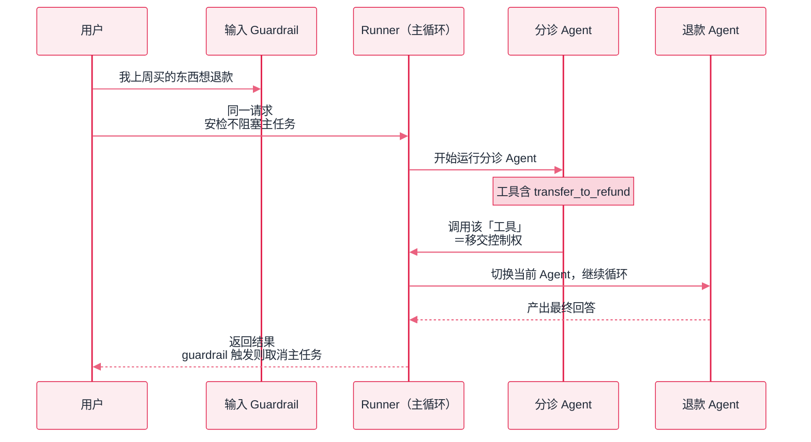

# OpenAI Agents SDK


**一句话**：OpenAI 的轻量生产级 Agent SDK（2025 年发布，Swarm 的正式版）：Agent、Handoff、Guardrail、Session 四件套，追求「少抽象、可上线」。


## 先看结论

- 三大原语：Agent（指令+工具+移交）、Handoff（控制权移交，[Swarm](../08-multi-agent/swarm.md) 的 SDK 化）、Guardrail（输入/输出并行安检）
- 设计哲学与 Pi 类似：核心循环极简，生产特性（tracing、session、guardrail）做成可选件
- Tracing 内置（兼容 OpenTelemetry），配评估工具形成闭环
- 支持非 OpenAI 模型（LiteLLM 集成），但最佳体验在 OpenAI 模型

## 核心抽象

SDK 的核心是一个极简的 Agent 循环，外加三个可选件：

$$
\text{Run}=\text{loop}\big(\underbrace{\text{Agent}}_{\text{指令+工具}},\;\underbrace{\text{Handoff}}_{\text{特殊工具}},\;\underbrace{\text{Guardrail}}_{\text{旁路安检}}\big)
$$

**最精巧的设计是「把 handoff 实现成一个特殊工具」**。模型看到的工具列表里会多出形如 `transfer_to_refund_agent` 的项，因此：

$$
\text{「移交控制权」}=\text{「调用一个工具」}
$$

这一等价让移交**不需要额外的编排机制**——模型按常规工具调用逻辑做决策，框架在执行侧把「调用移交工具」翻译为「切换当前 Agent」。理解这一点，Swarm 模式就没有黑箱了。

| 原语 | 作用 | 对应章节 |
|---|---|---|
| Agent | 指令 + 工具面 + 可移交对象 | [角色分配](../08-multi-agent/role-assignment.md) |
| Handoff | Agent 间控制权转移 | [Swarm](../08-multi-agent/swarm.md) |
| Guardrail | 输入/输出侧安检（并行运行） | [权限控制与沙箱隔离](../10-evaluation-safety/permission-sandbox.md) |
| Session | 自动维护对话历史 | [状态管理](../02-agent-basics/state-management.md) |

**Guardrail 的并行设计**也值得注意：输入安检与主 Agent **并行**执行，一旦触发就取消主任务——这样安检不额外增加延迟。与之相对，权限审批链通常是**串行阻塞**的（因为必须等人类决定）。两种设计对应两类风险：前者防「内容违规」，后者防「动作越权」（见 [工具权限与沙箱](../05-tool-protocol/tool-permission-sandbox.md)）。



*《图：Agents SDK 运行循环——输入 guardrail 与主 Agent 并行安检；handoff 被建模为特殊工具，模型「调工具」即「换 Agent」》*

## 最小示例

一个「分诊 + 两条专线」客服组的完整声明与一次运行，形状如下（字段名即框架接口名）：

```json
{
  "agents": [
    { "name": "退款专员", "instructions": "处理退款申请", "handoffs": [] },
    { "name": "技术支持", "instructions": "解决技术问题", "handoffs": [] },
    {
      "name": "分诊",
      "instructions": "判断意图并移交",
      "handoffs": ["退款专员", "技术支持"]
    }
  ],
  "run": {
    "entry_agent": "分诊",
    "input": "我上周买的东西想退款",
    "mode": "run_sync（同步；异步与流式另有入口）",
    "turn_budget": "max_turns：循环轮数上限，生产里要显式设"
  },
  "tools_visible_to_entry_agent": [
    "transfer_to_refund_agent（名字由 handoff 目标 Agent 的 name 规整而来）"
  ],
  "result": {
    "final_output": "由接手的那个 Agent 给出，不是分诊 Agent 给的",
    "last_agent": "退款专员",
    "also_on_result": "逐次模型响应、完整会话历史、trace 所需的 span"
  }
}
```

三条要点值得单独说：`handoffs` 是**声明在移交发起方**身上的（分诊写 `[refund, tech]`，退款专员那一侧不需要知道）；`final_output` 属于**最后一个 Agent**，所以「谁答的」必须和答案一起取出来，否则线上出问题时无从归因；`instructions` 是移交的唯一依据——模型只看这行文字决定要不要换人。


**别把「少抽象」读成「少预算」**。这套 SDK 只给了循环，没给刹车：`max_turns` 不设就是放开跑，移交图上有环时全靠内置回环防护兜底。上线前两件事必须自己做——把 handoff 关系画成有向图数一遍环，以及给每次运行设轮数与成本上限（对照本页「工程含义」第一条）。


## 分步演示：一句「我上周买的东西想退款」的旅程




#### 第 1 步：声明期就把「移交」编译成工具

Runner 启动时读每个 Agent 的 `handoffs` 清单，为其中每个目标合成一个 `transfer_to_*` 工具，和真工具混在同一份 `tools` 列表里发给模型。也就是说框架没有额外的调度层——移交的决策路径与函数调用完全相同，这正是它「抽象量最少」的具体含义。





#### 第 2 步：模型自己挑，框架不插手分诊

分诊 Agent 拿到 `instructions=判断意图并移交` 加上工具清单，产出一次 `transfer_to_refund_agent` 调用。此时没有任何「意图分类器」「路由规则」被运行——路由完全是一次普通的函数调用（对照 [工具选择与路由](../07-planning/tool-selection-routing.md)）。





#### 第 3 步：执行侧把「调工具」翻译成「换 Agent」

框架收到该调用后不做业务，而是切换当前 Agent：退款专员的 `instructions` 生效，**对话历史整体带走**（否则接手方要用户重述一遍），循环继续。若新 Agent 又声明了 handoffs，就还能再移交——所以移交图上的环是真的能跑成死循环的地方。





#### 第 4 步：终止与产出

接手 Agent 给出不再调工具的回答，循环结束。结果对象上 `final_output` 是答案、`last_agent` 是接手者；`max_turns` 用尽则报错而不是返回半成品。要人工介入就在工具或移交上加审批位，语义与 LangGraph 的 `interrupt` 等价，但挂起状态要持久化得自己接（见下方标签）。




## 什么时候选它，什么时候别选（点标签切换）



tracing、session、guardrail 都是同一套对象上的字段，不必再自己去接 LangSmith 之类的第三方观测。移交逻辑写成 `handoffs=[a, b]` 一个数组，读配置就能画出客服路由图。



「第 3 步失败要回滚第 1、2 步」「这条分支必须双人复核」这类需求，靠 handoff 网表达不清——它没有图、没有节点状态、没有 checkpoint，跨进程恢复全部自己实现。这类场景直接 LangGraph。



输入侧 guardrail 与主 Agent **并行**跑，因此首 token 延迟不变；代价是触发时主任务已经跑了一段，那段算力白花。它拦的是内容，工具执行的副作用一律管不住——那一层要沙箱与权限审批（见 [工具权限与沙箱](../05-tool-protocol/tool-permission-sandbox.md)）。



LiteLLM 桥接能跑，但 Responses API 的原生工具、内置检索与部分 trace 字段会退化。跨模型是刚需时，把本页当概念模型，落地要么用 LangGraph 要么直接对着 OpenAI Chat Completions 手写循环——后者反而更透明。



## 选型对比

| 维度 | Agents SDK | LangGraph | AutoGen |
|---|---|---|---|
| 抽象量 | 最少（四件套） | 中（图/状态） | 中（对话参与者） |
| 控制流 | handoff 网 + 循环 | 显式图 | 消息流 |
| 生产特性 | tracing/session/guardrail 内置 | 需配 LangSmith | 需自行补 |
| 模型绑定 | OpenAI 最佳，LiteLLM 可桥接 | 任意 | 任意 |

**选型建议**：以 OpenAI 模型为主、想要「少抽象 + 生产特性齐全」→ Agents SDK；需要复杂可审计控制流 → LangGraph；需要代码执行闭环 → AutoGen。

## 源码案例

- **handoff 的实现深度**（[GitHub](https://github.com/openai/openai-agents-python)）：handoff 被实现为一种特殊工具——模型「移交」与「调工具」是同一种机制，读完其运行循环的 handoff 处理段可彻底理解 [Swarm](../08-multi-agent/swarm.md) 的工程本质；内置回环防护与移交过滤
- **Guardrail 的并行设计**：输入 guardrail 与主 Agent 并行跑（不阻塞），触发即取消主任务——安检不牺牲延迟的工程取舍
- **Swarm 历史渊源**：实验项目 [openai/swarm](https://github.com/openai/swarm)（2024）是 SDK 的前身，代码仅几百行且明确标注「教学用途」——想看「无框架裸实现」读它，想上生产用 Agents SDK

## 工程含义

- **移交图要显式设计**：把 handoff 关系画成有向图，检查环与跳数上限，别依赖模型的「礼貌」。
- **Guardrail 与沙箱分工不同**：guardrail 管「输入输出内容」，管不住工具执行的副作用——两层都要有。
- **Session 简化但不等于记忆管理**：它维护对话历史，但压缩、检索与遗忘仍需自己设计（见 [记忆压缩](../06-memory-rag/memory-compression-forgetting.md)）。

## 2026 补充：从本地 SDK 到托管 harness

本页讲的是 **进程内 SDK**（你装 `openai-agents-python`，自己管循环与环境）。2026-09 起，OpenAI 与 Anthropic 都把「产品级 harness」变成可采购能力，选型分叉见 [模型原生 vs 自建 Harness](../18-frontier-2026/model-native-vs-harness.md)：

| 形态 | 谁维护循环/压缩/沙箱 | 代表 | 手册页面 |
|---|---|---|---|
| 本地 Agent SDK | 你（库只提供原语） | OpenAI Agents SDK（本页） | — |
| 托管 REST harness | 厂商 | **OpenAI Agents API**（2026-09-10 公测） | [Agents API](../18-frontier-2026/openai-agents-api.md) |
| 库内嵌 Claude Code 内核 | 你的进程 + 厂商版本化循环 | **Claude Agent SDK** | [Claude Agent SDK](../18-frontier-2026/claude-agent-sdk.md) |

含义：handoff / guardrail 仍是正确的概念模型，但 **压缩、tool search、子 Agent 并行、托管沙箱** 正在从「你要自己写」变成运行时开箱能力。新项目应先问「循环是不是差异化」——不是，就优先托管；是，再用本页 SDK 或 LangGraph 细拼。

## 常见误区

- ❌ Agents SDK = 必须 OpenAI 模型：LiteLLM 桥接后可用任意模型，但原生工具绑定 Responses API
- ❌ Handoff 网可以随便织：移交图带环 + 无跳数限制 = 死循环，SDK 的防护不是借口
- ❌ Guardrail 代替沙箱：guardrail 拦的是「模型输入输出」，管不住工具执行的副作用
- ❌ 把 Session 当完整记忆方案：它只维护历史，不负责压缩与检索

## 小练习

用 Agents SDK 搭二级客服：分诊 → 退款/物流/技术三线 → 人工升级。画出 handoff 图，标出你在哪两个 Agent 间加了 guardrail、为什么，并指出哪些动作需要串行权限审批。

## 参考资料

- [OpenAI Agents SDK 文档](https://openai.github.io/openai-agents-python/)
- [openai/swarm（前身，教学用途）](https://github.com/openai/swarm)
- [OpenAI Agents SDK GitHub](https://github.com/openai/openai-agents-python)

## 相关知识点

- [Swarm](../08-multi-agent/swarm.md)
- [Semantic Kernel](semantic-kernel.md)
- [工具权限与沙箱](../05-tool-protocol/tool-permission-sandbox.md)
- [模型原生 vs 自建 Harness](../18-frontier-2026/model-native-vs-harness.md)
- [OpenAI Agents API](../18-frontier-2026/openai-agents-api.md)
- [Claude Agent SDK](../18-frontier-2026/claude-agent-sdk.md)
