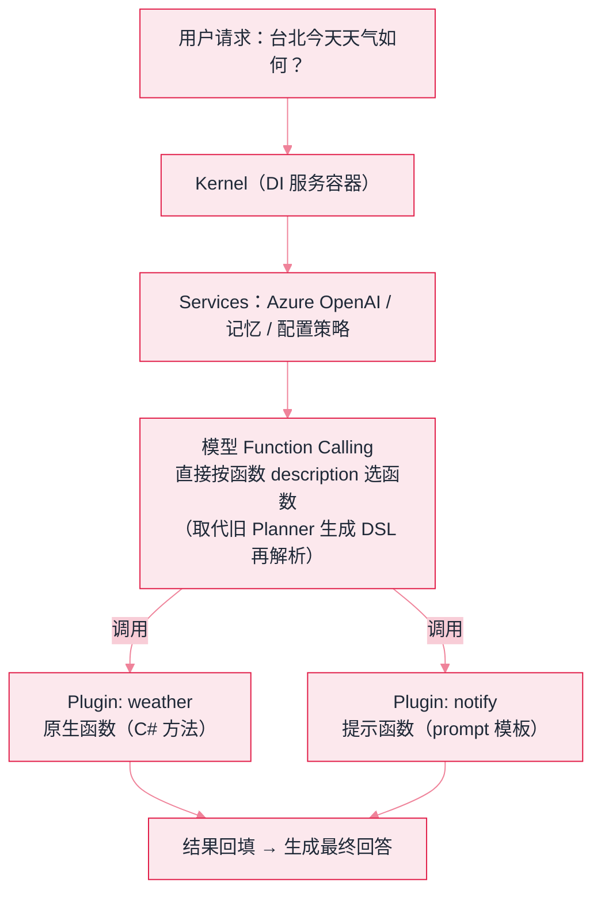

# Semantic Kernel


**一句话**：微软的企业级 LLM SDK（C#/Python/Java 三栖）：以「插件 + 规划器」为核心，深度集成 Azure 生态——微软技术栈企业的默认选择。


## 先看结论

- 定位：面向企业 .NET 生态的 LLM 编排 SDK，强调依赖注入、可观测、负责任 AI
- 核心抽象：Kernel（内核）+ Plugin（原生函数/提示函数）+ Planner（规划器）+ Memory
- 与 AutoGen 的关系：两者合流演进的成果是 **Microsoft Agent Framework**——新项目优先看后者；SK 自身持续服务存量企业
- 特色：Process Framework（类型化事件驱动工作流）与对 Azure OpenAI / Azure AI Search 的一线集成

## 核心抽象

Semantic Kernel 的设计语言来自**企业应用框架**而非 AI 研究：它把 LLM 能力当作可注入的服务来管理。

$$
\text{Kernel}=\big(\underbrace{\text{Services}}_{\text{模型/记忆等}},\;\underbrace{\text{Plugins}}_{\text{函数集合}},\;\underbrace{\text{Config}}_{\text{注入与策略}}\big)
$$

- **Kernel**：服务容器（类似 Spring 容器），负责解析依赖、统一配置
- **Plugin**：一组函数的集合，函数可以是**原生代码**（C#/Python 方法）或**提示函数**（prompt 模板）——两者在调用侧无差别
- **Planner**：早期负责「按目标生成函数调用计划」

**最值得学的是 Planner 的演进史**：从专用规划器（生成 DSL 计划）→ 到最终由模型的 Function Calling 直接选函数。这条路线是整个行业的缩影——**「让模型直接选工具」取代了「让模型生成计划文本再解析」**，因为后者脆弱、易被幻觉破坏（见 [工具选择与路由](../07-planning/tool-selection-routing.md)）。

| 概念 | 作用 | 类比 |
|---|---|---|
| Kernel | 配置、服务、插件的容器 | Spring 容器 |
| Plugin / Function | 原生代码或提示词封装的能力 | 带注解的接口方法 |
| Planner | 按目标规划（已收敛到函数调用路由） | 调度员 |
| Process Framework | 类型化事件 + 步骤的工作流 | 状态机引擎 |



*《图：SK 插件架构——Kernel 注入模型服务与插件函数清单，模型经 Function Calling 直接选中原生/提示函数执行，两类函数在调用侧无差别》*

## 一次装配的真实形状

上面那张图落到工程上就是三次注册加一次调用。整条装配链的形状、参数与默认行为，收在下面这份清单里（字段名即 API 名）：

```yaml
builder:
  entry: Kernel.CreateBuilder          # 开一个 DI 容器构建器
  services:
    - add: AddAzureOpenAIChatCompletion
      params: [deployment, endpoint, key]   # 部署名 / 端点 / 密钥，三者缺一即在 Build 期报错
      role: 聊天补全服务（可再注册多个，按 service_id 解析）
  plugins:
    - name: weather                    # ImportPluginFromFunctions 的第一个参数
      functions:
        - factory: KernelFunctionFactory.CreateFromMethod
          method: GetWeather
          description: 查询天气          # 模型就靠这一行决定要不要调它
          kind: native                 # 另一类是 prompt function：yaml/handlebars 模板
kernel:
  build: Build()                       # 产出不可变内核实例；按作用域管理，别当全局单例
invocation:
  method: InvokePromptAsync
  prompt: 台北今天天气如何？需要时调用工具。
  function_choice: auto                # 由模型 Function Calling 直接挑函数
  returns: 最终回答文本（原生/提示函数在调用侧无差别）
```

注意 `description: 查询天气` 这一行——它是整套企业框架里**唯一影响选函数准确率的字段**，其余全是装配工作。SK 的「插件」概念之所以能被模型用起来，靠的就是这一句被序列化进函数清单；写得含糊，模型就多调或漏调（对照 [工具选择与路由](../07-planning/tool-selection-routing.md)）。

## 分步演示：从建容器到拿到回答




#### 第 1 步：CreateBuilder，开一个 DI 容器

这一步和 AI 无关，是标准的企业框架动作：注册配置、日志、HTTP 客户端、过滤器。SK 的差异化正在这——模型服务、记忆、插件都是**可注入、可替换、可按作用域隔离**的服务，所以多租户与单元测试都有的抓手（反面见「常见误区」最后一条：把 Kernel 当全局单例滥用）。





#### 第 2 步：AddAzureOpenAIChatCompletion 注册模型服务

三个参数 `deployment / endpoint / key` 对应 Azure 侧的部署名、端点与密钥。注册多个服务时靠 `service_id` 区分，提示函数可以在调用点指定用哪个——这一步是「换模型不动业务代码」的落点，与 Python 生态里直接实例化一个客户端就写死的做法形成对比。





#### 第 3 步：ImportPluginFromFunctions 把方法变成函数

`KernelFunctionFactory.CreateFromMethod(GetWeather, "查询天气")` 从方法签名反射出参数 schema，再挂上 description，组成一个名为 `weather` 的插件。原生函数与提示函数在此刻**注册成同一种对象**，所以模型看到的清单是混排的，它也无法分辨哪一个是 C# 方法、哪一段是模板。





#### 第 4 步：InvokePromptAsync，让模型自己挑函数并回填

`"台北今天天气如何？需要时调用工具。"` 发给模型时，函数清单随请求一起出去；模型点中 `weather` 插件的函数，内核执行、把结果回填进对话，再让模型续写直到不再要求调用。`function_choice` 处于 auto 时这条循环由框架跑完——旧路线（Planner 先生成 DSL 计划再解析）在自动函数调用成熟后被淘汰，原因见「源码案例」第一条。




## 什么时候选它，什么时候别选（点标签切换）


**这份清单里只有一行会改变模型的行为**：`description: 查询天气`。其余全是装配工作——所以线上出现「模型没调用我的函数」时，先读这一行，再数函数清单有多长，最后才怀疑模型。




依赖注入、健康检查、日志、密钥管理全都走企业栈现成的那一套，LLM 能力以「可注入服务」的身份进容器，安全与合规评审有现成流程可套。Python 框架在这个语境里是净增运维负担——多一个运行时、多一套依赖解析。



SK 与 AutoGen 的合流成果是 Microsoft Agent Framework，官方推荐新项目走后者。在 SK 上继续加多 Agent 逻辑的风险是**迁移成本**：Process 步骤里编进多少「模型之外的决策」（规划、人工确认、失败补偿），将来就要重写多少（本页「选型对比」下方那段把这笔账列清了）。



函数 description 从「查询天气」改成「按城市与日期查询实时天气，含体感温度」，模型点中它的概率通常明显上升——但副作用是清单变长、每次请求都带这段文字。**清单里每个字符都是常驻成本**，别只在漏调时加词，也要在误调时删词。



只 `AddAzureOpenAIChatCompletion` 不 `ImportPluginFromFunctions`，同一句提示词会得到一个自信的错误回答（模型不知道天气从哪来，又倾向于答）。函数清单为空时模型不会反问，这一点和「工具越多越准」是两个方向的坑。



## 选型对比

| 维度 | Semantic Kernel | AutoGen | LangChain |
|---|---|---|---|
| 语言生态 | .NET 最强（含 Java） | Python 优先 | Python 优先 |
| 设计语言 | 企业 DI / 插件 | 对话参与者 | 链式编排 |
| 工作流 | Process Framework | 消息流 | LCEL / LangGraph |
| 适合 | .NET 企业集成、Azure 栈 | 多 Agent 研究/代码执行 | 快速搭建应用 |

**选型建议**：.NET/Java 企业且已在 Azure 生态 → SK；新多 Agent 项目 → 关注 Microsoft Agent Framework；Python 快速原型 → LangChain/AutoGen。

**迁移成本集中在三处**：Kernel 的 DI 注册与过滤器、Plugin/Function 的声明方式、Process Framework 的步骤定义。多 Agent 逻辑在 SK 里写得越薄，往 Agent Framework 挪越便宜；反过来，把规划、人工确认、失败补偿全都编进 Process 步骤的项目，迁移实际等于一次重写——所以评估迁移时先数一数 Process 里有多少步骤在编排「模型之外的决策」。

## 源码案例

- **Planner 的演进**（[GitHub](https://github.com/microsoft/semantic-kernel)）：从早期 ActionPlanner/SequentialPlanner 到 Handlebars/Stepwise Planner，最终收敛到 Function Calling 自动路由——「让模型直接选函数」取代「专门规划器生成 DSL 计划」，这段演进史本身就是工具选择与路由的行业缩影
- **Process Framework**：类型化事件 + 步骤的工作流框架，读它的「订单处理」示例可见「事件驱动的确定性编排 + LLM 步骤」的混合范式（呼应 [工作流编排](../11-engineering/workflow-orchestration.md)）
- **与 Agent Framework 的关系**：[microsoft/agent-framework](https://github.com/microsoft/agent-framework) 是 SK 与 AutoGen 合流后的新家——存量企业代码维护在 SK，新多 Agent 项目官方推荐 Agent Framework

## 常见误区

- ❌ Semantic Kernel 是 Python 优先框架：它最强的生态在 .NET；Python 侧 LangChain/AutoGen 生态更大
- ❌ Planner 什么都能规划：早期 Planner 生成的计划脆弱易错（模型幻觉出的 DSL 无法执行），这正是行业转向 Function Calling 的原因
- ❌ 混淆 SK 与 Agent Framework：关注 microsoft/agent-framework 获取多 Agent 新特性
- ❌ 把 Kernel 当全局单例滥用：它是 DI 容器，应按作用域管理，否则测试与多租户隔离都变难

## 小练习

如果你的团队是 .NET 技术栈：设计一个「工单自动分派」的 Kernel 插件集（查询工单/查员工负载/分派/通知），用 InvokePrompt 串起来，并说明每个插件函数的 description 要写什么。

## 参考资料

- [Semantic Kernel 文档](https://learn.microsoft.com/semantic-kernel/)
- [Semantic Kernel GitHub](https://github.com/microsoft/semantic-kernel)
- [Microsoft Agent Framework](https://github.com/microsoft/agent-framework)

## 相关知识点

- [AutoGen](autogen.md)
- [OpenAI Agents SDK](openai-agents-sdk.md)
- [工具选择与路由](../07-planning/tool-selection-routing.md)

