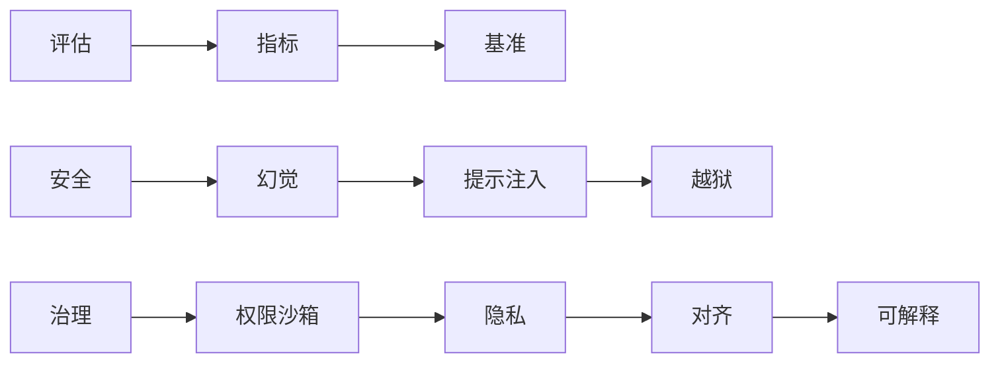

# 📊 10 评估、安全与对齐

> **一句话**：Agent 不评估 = 裸奔上线；不设防 = 等着被提示注入。本章覆盖评估指标、基准测试、幻觉治理、攻击面防御与对齐安全。

## 📌 你将学到

- Agent 评估的分层指标：任务成功率、轨迹质量、成本延迟
- 主流基准怎么读：SWE-bench / GAIA / WebArena / AgentBench / ToolBench
- 三大安全攻击面：幻觉、提示注入、越狱——各自原理与防御
- 权限沙箱、数据隐私、对齐与可解释性的工程落点

## 全章地图

## 🚦 一条主线

评估驱动一切：**没有评估集，安全加固、prompt 优化、模型选型全靠感觉**。建议任何 Agent 项目第一周就建 20 个测试用例（→ [持续评估](../11-engineering/continuous-evaluation.md)）。

## 本站页面

- [Agent 评估指标](evaluation-metrics.md)
- [基准测试总览](benchmarks.md)
- [AgentBench、WebArena、SWE-bench、GAIA、ToolBench](agentbench-webarena-swebench-gaia-toolbench.md)
- [幻觉问题](hallucination.md)
- [提示注入](prompt-injection.md)
- [越狱攻击](jailbreak.md)
- [权限控制与沙箱隔离](permission-sandbox.md)
- [数据隐私](data-privacy.md)
- [对齐与安全](alignment-safety.md)
- [可解释性](explainability.md)
