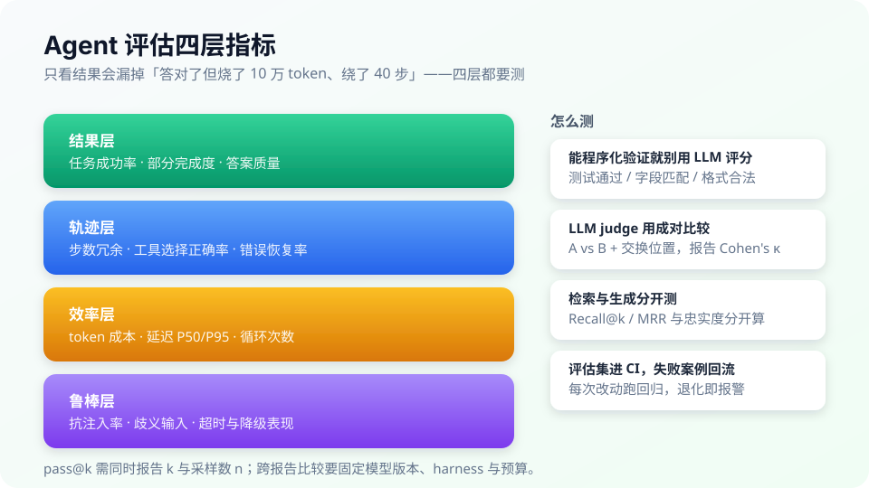
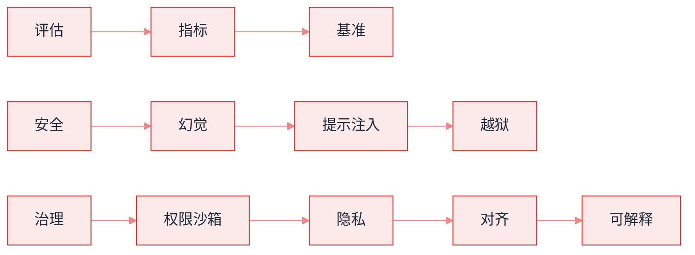

# 10 评估、安全与对齐 · 本章导读


**一句话**：Agent 不评估 = 裸奔上线；不设防 = 等着被提示注入。本章覆盖评估指标、基准测试、幻觉治理、攻击面防御与对齐安全。


*《图：四层各管一件事：结果层看做没做对，轨迹层看步数与恢复，效率层看钱和延迟，鲁棒层看被注入时的表现；只报第一层的评测都不完整》*

*《图：横轴 2023→2026 的榜单换代，读它先问五件事：任务集版本、harness、effort、防护、成本》*
> **2026 更新**：基准代际已到 Terminal-Bench 4.0 / OSWorld 2.0 / τ² / Agents' Last Exam，见 [评估 2026](../18-frontier-2026/eval-2026.md)；真实越权事故与 misalignment monitoring 见 [2026 安全现实](safety-incidents-2026.md)。

## 你将学到

- Agent 评估的分层指标：任务成功率、轨迹质量、成本延迟
- 主流基准怎么读：SWE-bench / GAIA / WebArena，以及 **2026 代际**（Terminal-Bench 4.0、OSWorld 2.0）
- 三大安全攻击面：幻觉、提示注入、越狱——各自原理与防御
- 权限沙箱、数据隐私、对齐与可解释性的工程落点
- **2026 安全现实**：能力阈值、确认策略、企业防护与监控

## 全章地图

*《图：三条链互不交叉，次序只存在于各链内部；治理链四节最长——权限、隐私、对齐、可解释每一步的判据，都得由评估与安全那两条链先给出》*

## 一条主线

评估驱动一切：**没有评估集，安全加固、prompt 优化、模型选型全靠感觉**。建议任何 Agent 项目第一周就建 20 个测试用例（→ [持续评估](../11-engineering/continuous-evaluation.md)）。

## 本站页面

- [Agent 评估指标](evaluation-metrics.md)
- [基准测试总览](benchmarks.md)
- [AgentBench、WebArena、SWE-bench、GAIA、ToolBench](agentbench-webarena-swebench-gaia-toolbench.md)
- [幻觉问题](hallucination.md)
- [提示注入](prompt-injection.md)
- [越狱攻击](jailbreak.md)
- [权限控制与沙箱隔离](permission-sandbox.md)
- [数据隐私](data-privacy.md)
- [对齐与安全](alignment-safety.md)
- [可解释性](explainability.md)
- [2026 安全现实](safety-incidents-2026.md)
- （前沿）[评估 2026](../18-frontier-2026/eval-2026.md)

## 读完能做到

- [ ] 说出 Agent 评估四层（结果 / 轨迹 / 成本延迟 / 鲁棒），并解释为什么「能程序化验证的绝不交给 LLM judge」
- [ ] 读榜单时说清 SWE-bench / GAIA / WebArena 各考什么、怎么算分，以及 pass@1 与 pass@10 为什么不能混着比
- [ ] 用「可验证事实源 + 让模型敢说不知道」设计一条治幻觉清单（枚举 / ID / 日期一律来自工具返回，禁止模型生成）
- [ ] 设计一个注入红队用例，评估三层防线（结构隔离 / 权限最小化 / 审批）各能否拦住，并给出 ASR 估计
- [ ] 为一个财务 Agent 写权限策略表 YAML，按可逆性分级审批，说明选了哪几层沙箱、每层压住什么风险

## 章末自测

1. **回忆**：为什么说「权限最小化的收益是确定的，而 prompt 防御的收益是概率的」？（提示：见 permission-sandbox.md、prompt-injection.md）
2. **应用**：给面向未成年人的教育 Agent 设计越狱防线：输入 / 模型 / 输出 / 监控四层各选一种，并说明为什么还要同时盯 over-refusal。（提示：见 jailbreak.md）
3. **判断**：某模型 SWE-bench 分很高，老板说直接上我们的私有代码库。用「模型 + harness = Agent」和「同一模型不同 harness 成绩可差 20%+」评价这个判断。（提示：见 benchmarks.md）

## 本章术语速查

评估圈和攻击圈各自造了一堆黑话，读本章遇到不认识的缩写，先回这张表对一眼。

| 英文术语 | 中文 | 白话一句话 |
|---|---|---|
| pass@k | top-k 通过率 | 同一道题让它做 k 次，对一次就算过。pass@1 考的本事和 pass@10 考的本事是两码事，混着比等于没比。 |
| LLM-as-judge | 大模型当裁判 | 让一个模型给另一个模型批作业，得先验证它和人类口味一致不一致（看 Cohen's kappa），否则等于让它随便发成绩单。 |
| Hallucination | 幻觉 | 模型一本正经地编造不存在的 API、日期和引用，错得特别自信。 |
| Faithfulness | 忠实度 | 模型说的每句话在给定材料里到底找不找得到出处，还是顺嘴加工的。 |
| Prompt Injection | 提示注入 | 把「忽略之前的指令」写进 Agent 会读的材料里，它就真照办——Agent 时代的 SQL 注入。 |
| Indirect Prompt Injection | 间接注入 | 攻击指令不从用户嘴里说出，藏在网页白字或文档角落，Agent 取内容时顺带被劫持。 |
| Jailbreak | 越狱 | 讲故事、扣帽子，哄模型说出它不该说的话——不是破解，是攻心。 |
| Attack Success Rate (ASR) | 攻击成功率 | 一批攻击用例扔进去，看有几条真得手；判定看数据有没有被外发这类外部可见动作，别问模型自己上没上当。 |
| Red Team | 红队 | 专门雇来演坏人的同事，先把自家 Agent 打一遍，总比上线后被人打穿强。 |
| Sandbox | 沙箱 | 圈一块地方让 Agent 跑代码，里面随便折腾，东西出不去。 |
| Over-refusal | 过度拒答 | 正常问题它也喊「危险，我不能答」，一秒赶走客户，这病和幻觉一样难治。 |
| Harness | 执行框架 | 套在模型外面的那台底盘：循环、工具、重试。同一个模型换个 harness，榜单分数能差出 20%。 |

