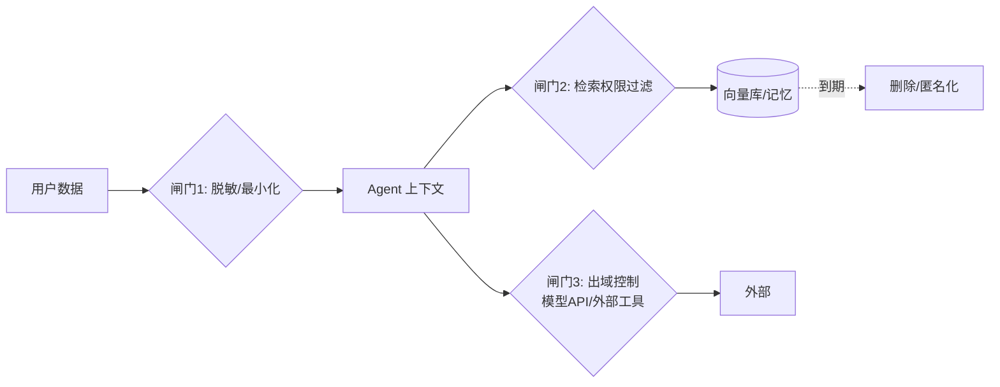

# 📊 数据隐私

> **一句话**：Agent 放大了数据隐私风险——它主动读、主动传、主动记；治理靠「最小化 + 出域控制 + 记忆卫生」三道闸。
> **难度**：⭐️⭐️ 进阶
> **标签**：`#safety` `#engineering`

## 📌 先看结论

- Agent 特有的隐私风险：自主检索把无关 PII 拉进上下文、跨系统工具调用造成数据串联、会话记忆长期留存敏感信息
- 合规框架（GDPR/个保法）对 Agent 的三个硬要求：数据主体权利（可删除）、目的限定、跨境传输合规
- 技术三板斧：脱敏/匿名化（进出上下文前）、检索权限过滤（RAG 多租户隔离）、记忆生命周期管理（到期删除）
- 自托管模型（DeepSeek/Qwen/Llama + vLLM）是数据不出域的硬保障，pi-mono 的 vLLM pods 就是为此设计

## 🖼️ 数据流与闸门

## 📦 源码案例

- **RAG 多租户过滤**（→ [向量数据库](../06-memory-rag/vector-database.md)）：Qdrant 的 payload 过滤在检索层强制租户隔离——权限过滤放在检索层而非生成层，模型根本「看不到」无权数据
- **本地化全栈**（[badlogic/pi-mono](https://github.com/badlogic/pi-mono)）：pi-ai 统一接口指向本地 vLLM/Ollama + vLLM pods 部署清单——从模型到 embedding 到向量库全链路内网闭环，适合医疗/金融/政务
- **会话数据的隐私设计**（[DeepSeek Harness](https://github.com/deepseek-ai/deepseek-harness)）：append-only 日志保留全量轨迹，合规上要配套「数据保留策略 + 删除接口」——事件流架构的隐私代价需要用治理补齐
- **Claude Code 的边界**（逆向分析）：项目数据默认不用于训练（企业条款），CLAUDE.md 内容会进入上下文——提醒：往记忆文件里写什么之前想清楚它会被发给模型 API

## ✅ 最佳实践

- 数据分级进 Agent：P0（公开）/P1（内部）/P2（个人敏感），P2 默认脱敏后才进上下文
- 工具白名单控制出站：邮件/网盘/第三方 API 是泄漏通道，egress 白名单 + DSS 扫描
- 「被遗忘权」落地：用户可请求删除其数据在记忆/向量库/日志的所有副本

## ⚠️ 常见误区

- ❌ 换「企业版」API 就合规：传输加密 ≠ 目的限定，训练用途、留存期限要逐条核对条款
- ❌ 脱敏一次一劳永逸：LLM 能从多字段组合反推身份（链接攻击），聚合层面的最小化同样必要
- ❌ 忽略日志与缓存：审计日志、prompt 缓存、向量库里都躺着的 PII 是合规检查的重灾区

## 🧪 小练习

「HR 助手 Agent」要读员工档案回答经理询问：设计数据分级、脱敏规则、检索过滤与日志保留策略——经理能问「小王薪资多少」吗？

## 📚 相关知识点

- [向量数据库](../06-memory-rag/vector-database.md)
- [权限控制与沙箱隔离](permission-sandbox.md)
