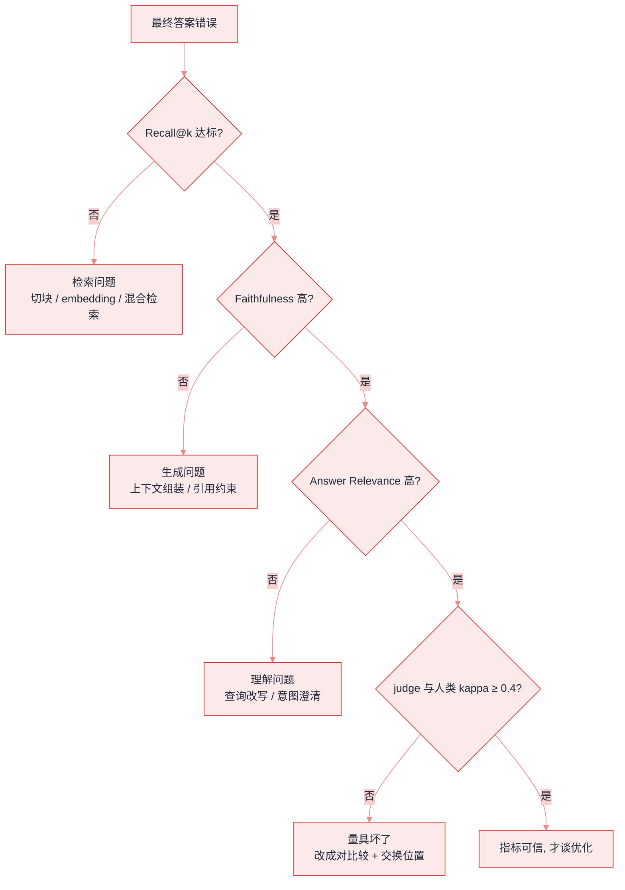
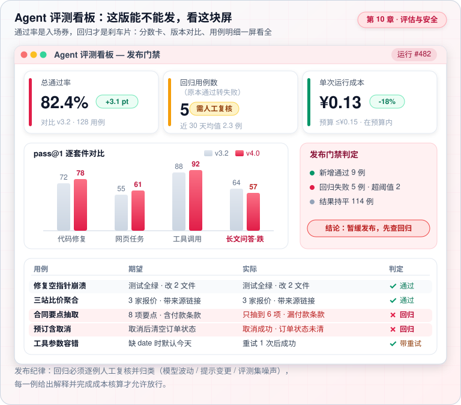
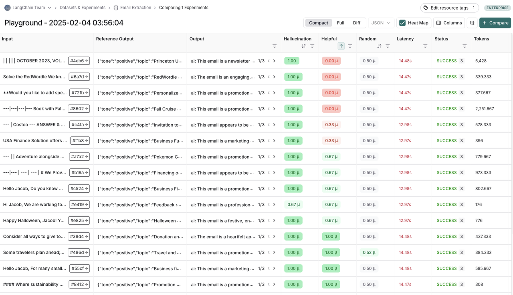

# Agent 评估指标


**一句话**：Agent 评估分四层：结果对不对（成功率）、过程好不好（轨迹质量）、贵不贵慢不慢（成本延迟）、稳不稳（鲁棒性）——四层都测才叫评估。


## 问题动机

只看「最终答案对错」会掩盖问题：答对了但烧了 10 万 token、走了 40 步弯路，生产上不可接受；答错了但只差最后一步，和完全跑偏也不是一回事。Agent 的评估必须同时看结果与过程，而检索类、生成类、工具类任务又需要各自的指标。

## 核心机制

### 1. 分类指标：精确率、召回率、F1

对任意「判定为相关/正确」的任务（检索命中、字段抽取、缺陷识别）：

$$
P=\frac{TP}{TP+FP},\qquad
R=\frac{TP}{TP+FN},\qquad
F_1=\frac{2PR}{P+R}
$$

$$P$$ 关心「判为正的有多少真的对」（误报代价），$$R$$ 关心「真的对的捞回来多少」（漏报代价）。两者往往此消彼长，$$F_1$$ 是调和平均。**选哪个取决于业务代价**：客服自动回复怕误报（降低 $$P$$ 门槛没用），风控怕漏报（优先 $$R$$）。

### 2. 检索排序指标：Recall@k、MRR、nDCG@k

RAG 与记忆检索关心「相关内容排得够不够前」：

$$
\text{Recall@}k=\frac{\#\{\text{前 }k\text{ 个结果中的相关文档}\}}{\#\{\text{全部相关文档}\}}
$$

$$
\text{MRR}=\frac{1}{|Q|}\sum_{i=1}^{|Q|}\frac{1}{\mathrm{rank}_i}
$$

其中 $$\mathrm{rank}_i$$ 是第 $$i$$ 个问题第一个相关结果的排名——只奖励「第一个对的排多前」。若需要区分多个相关结果的位置，用 nDCG：

$$
\text{DCG@}k=\sum_{i=1}^{k}\frac{2^{rel_i}-1}{\log_2(i+1)},\qquad
\text{nDCG@}k=\frac{\text{DCG@}k}{\text{IDCG@}k}
$$

$$rel_i$$ 是第 $$i$$ 位的相关性等级，IDCG 是理想排序的 DCG（归一化到 $$[0,1]$$）。

### 3. 代码与多解任务：pass@k

对「一题多解、跑测试判对错」的任务（HumanEval、SWE-bench 类），常用 pass@k——生成 $$n$$ 个样本、其中 $$c$$ 个正确，无偏估计为：

$$
\text{pass@}k=\mathbb{E}_{\text{problems}}\left[1-\frac{\dbinom{n-c}{k}}{\dbinom{n}{k}}\right]
$$

直觉：从 $$n$$ 个样本里随机抽 $$k$$ 个，至少有一个正确的概率。$$k$$ 越大越宽松，比较成绩时必须对齐 $$k$$ 与 $$n$$。

### 4. LLM-as-judge 的可信度

用 LLM 打分时必须量化它和人类的一致度，否则分数不可信。用 Cohen's $$\kappa$$ 校正「随机也能一致」的部分：

$$
\kappa=\frac{p_o-p_e}{1-p_e}
$$

$$p_o$$ 是观察到的同意率，$$p_e$$ 是随机情况下的期望同意率。$$\kappa<0.4$$ 一般视为不可用。实践上：**用成对比较（A vs B 谁更好）而非绝对打分**，并交换位置重复一次以抵消位置偏差。

### 5. 失败该记在哪一环：指标逐层归因

「答案错了」是一个复合信号，用指标顺序往下问，才能定位到可修的那一层：

## 四层指标体系

| 层级 | 指标 | 怎么测 |
|---|---|---|
| 结果层 | 任务成功率、部分完成度、$$F_1$$ | 断言/单测/LLM 评分 |
| 轨迹层 | 步数冗余、工具选择正确率、错误恢复率 | 轨迹对比黄金路径 |
| 效率层 | token 成本、延迟 P50/P95、循环次数 | 计量埋点 |
| 鲁棒层 | 抗注入率、歧义输入表现、超时表现 | 对抗用例集 |

## 工程含义

一套跑得动的评估，最后都收敛成一块「发布门禁」屏：总通过率、回归用例数、单次成本三张卡，配版本对比与逐用例判定——绿了才放行，红了先查回归。

*《图：一套评估最终收敛成一块发布门禁屏——总通过率、回归用例数、单次成本三张卡配版本对比，绿了才放行、红了先查回归》*

上面是示意，下面是 LangSmith 实验对比页的真实截图——一块真正在用的评测屏长什么样：

*《图：一行一用例、多评估器并排成列，Latency 与 Tokens 和得分同表；那列 Random 稳在 0.5 附近——把随机打分器当对照组跑进来，就能量出 LLM-as-judge 到底比瞎猜强多少》*

*来源：LangSmith 官方文档 [docs.smith.langchain.com/evaluation](https://docs.smith.langchain.com/evaluation) 内嵌截图，访问日期 2026-09-22。*

三个细节值得抄：① **一行一个用例，多个评估器并排成列**（`Hallucination` / `Helpful` / `Random`），于是「同一条输出幻觉满分但有用性 0 分」这种冲突会直接摊在眼前——单一总分会把它抹平；② `Latency` 和 `Tokens` 与得分同表，**慢和贵会被当成质量问题一起看**，而不是等成本月报才发现；③ 那列 `Random` 稳定在 0.5 附近——把随机打分器当对照组跑进同一张表，是检验「LLM-as-judge 到底比瞎猜强多少」最省事的做法，正好对应本节前面那条 judge 可信度。

- **能程序化验证的，绝不交给 LLM 评分**：测试是否通过、字段是否匹配、格式是否合法都是客观信号，优先级高于 judge。
- **评估集是资产**：从第一天开始把线上失败案例回流进评估集，回归测试才能防退化。
- **分环节评估**：RAG 要分开测检索（Recall@k）与生成（忠实度），否则无法定位问题出在哪一环。

## 源码案例与工具

- **Ragas**（[GitHub](https://github.com/explodinggradients/ragas) / [论文](https://arxiv.org/abs/2309.15217)）：RAG 专项评估（忠实度、答案相关性、上下文精确率/召回率）——检索与生成分开打分，是分环节评估的工程落地
- **LangSmith 评估流**（[文档](https://docs.smith.langchain.com/)）：数据集 + 评估器（规则/LLM judge）+ 实验对比的完整闭环；把每次 prompt 改动变成一次「实验」
- **OpenAI Agents SDK**（[文档](https://openai.github.io/openai-agents-python/)）：内置 tracing + evaluation 钩子，Agent 运行即产出可评估轨迹
- **SWE-bench 的启示**（[仓库](https://github.com/princeton-nlp/SWE-bench)）：编程任务用「测试通过」做客观指标——凡是有可执行验证的任务，优先用程序化指标

## 常见误区

- ❌ 用 vibe check 代替评估：「我试了几个例子都挺好」不是评估
- ❌ 数据泄漏：评估集进了 RAG 索引或 few-shot，成绩虚高
- ❌ 只评新不评旧：模型升级后老 case 回归才是防退化的关键
- ❌ 不报 $$k$$ 就比 pass@k：pass@1 和 pass@10 是两个指标，混用等于没比

## 实战手记

- **评估集是养出来的**：从零起步的团队，经验值上第一个月能攒出两三百条评估用例就算合格——其中一半应该来自线上失败案例和人工抽查记录。第一版跑下来通常有一半过不了，别慌，那一半恰恰是它的价值所在。
- **先修量具，再谈优化**：常见的项目里，分数纹丝不动时，一查有一半概率是 judge 本身在抖，而不是 Agent 没变。所以先花半天人工标 50–100 条算一致性，再决定信不信自动分——不然你是在拿一个坏掉的尺子调 prompt。
- **成本曲线比成功率先报警**：上线后第一周最先异动的信号，往往不是成功率而是平均步数和单任务 token。一次 prompt 改版让 Agent 开始绕路，任务照旧完成，账单却能翻近一倍——效率层的指标值得单独盯。

## 参考资料

- [RAGAS: Automated Evaluation of Retrieval Augmented Generation](https://arxiv.org/abs/2309.15217)（Es et al., 2023）
- [Evaluating Large Language Models Trained on Code](https://arxiv.org/abs/2107.03374)（Chen et al., 2021，pass@k 定义）
- [Judging LLM-as-a-Judge with MT-Bench and Chatbot Arena](https://arxiv.org/abs/2306.05685)（Zheng et al., 2023）
- [SWE-bench: Can Language Models Resolve Real-World GitHub Issues?](https://arxiv.org/abs/2310.06770)（Jimenez et al., 2023）

## 相关知识点

- [基准测试总览](benchmarks.md)
- [持续评估](../11-engineering/continuous-evaluation.md)

