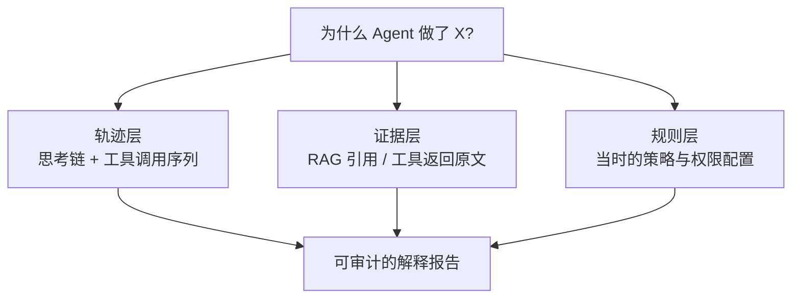

# 可解释性

> **一句话**：可解释性 = 回答「Agent 为什么这么做」；分两层——模型内部机制（机理层）与决策依据（行为层），工程落地主要靠行为层的轨迹透明化。
> **难度**：高级
> **标签**：`#safety` `#evaluation`

## 先看结论

- 两层含义：机理可解释（注意力权重、特征回路——研究前沿）≠ 行为可解释（为什么调这个工具、基于什么信息——工程可落地）
- Agent 的天然优势：轨迹（思考/工具调用/结果）天然构成「解释材料」，事件流架构让解释可回放
- 但要警惕「解释表演」：模型的自我解释可能是事后合理化，与真实机制无关（→ [CoT 误区](../04-prompt-reasoning/chain-of-thought.md)）
- 落地三件套：完整轨迹留存、决策依据溯源（RAG 引用/工具结果）、关键决策的独立复审

## 行为层解释的来源

## 源码案例

- **DeepSeek Harness：为解释而生的架构**（[仓库](https://github.com/deepseek-ai/deepseek-harness)）：append-only 事件流把「每一步的 system prompt、推理内容、工具调用与结果、子 Agent 调度、上下文注入」全部留痕，Trajectory 视图按来源检查——「解释」变成按时间轴重放事件，这是行为层可解释性的标杆实现
- **Anthropic 的机理研究**（[Transformer Circuits](https://www.anthropic.com/research/transformer-circuits) 团队）：特征可视化和「电路分析」探索模型内部机制——重要进展但离工程日常尚远；其「模型生物学」路线值得跟踪
- **可观测工具的 trace**（→ [日志、追踪与监控](../11-engineering/logging-tracing-monitoring.md)）：LangSmith/LangFuse 记录每步输入输出与 token 消耗，是行为层解释的通用基建
- **推理模型的思考链**（[DeepSeek-R1](https://arxiv.org/abs/2501.12948)）：`reasoning_content` 提供了前所未有的「过程可见性」，但论文同时提示思考链可能包含错误归因——过程可见 ≠ 过程可信

## 最佳实践

- 合规场景定义「解释等级」：L1 轨迹可查 → L2 证据可溯 → L3 决策可复核
- 每个事实性输出绑定证据 ID（检索片段/工具调用），一键跳转原文
- 关键决策做「反事实审计」：换一个输入会怎样？暴露决策边界的脆弱性

## 核心机制：可解释性的三个层次

「解释一个 Agent 为什么这样做」有三种不同深度的手段，工程可用性差异很大：

| 层次 | 做法 | 工程可用性 |
|---|---|---|
| 机制层 | 看注意力权重、神经元激活 | 低（与决策的因果关系弱，易误读） |
| 行为层 | 记录输入、推理、工具调用、结果的全轨迹 | 高（可回放、可审计） |
| 反事实层 | 改变某个输入，观察输出是否改变 | 中高（成本高但结论强） |

机制层最容易被高估：注意力权重只是信息通路的一环，后续前馈层与残差同样在起作用，因此「权重可视化 = 解释」是常见误解。**工程上真正可依赖的是行为层**——这正是事件溯源架构的价值（见 [状态机与事件驱动](../11-engineering/state-machine-event-driven.md)）。

反事实解释可以形式化为「最小改动使结论翻转」：

$$
\Delta^*=\operatorname*{arg\,min}_{\Delta}\;\|\Delta\|\quad
\text{s.t.}\quad f(x+\Delta)\neq f(x)
$$

找到的 $\Delta$ 越具体（例如「去掉这条检索片段，就会给出不同答案」），解释就越可信。

### 解释 ≠ 事后合理化

模型生成的「我这样做的原因是……」是**另一段生成文本**，可能只是对已发生行为的合理化，而非真实因果。区分二者的实用判据是**可验证性**：

$$
\text{可信解释}\;\Longleftrightarrow\;\text{能对上可观测的行为轨迹或可执行的反事实实验}
$$

因此审计场景应依赖「轨迹 + 工具结果 + 反事实」三类证据，而不是模型自述的理由。

这也给出一条实用的产品设计建议：**把解释做成界面能力，而不是模型台词**。展示「这一步调用了什么工具、看到了什么结果、依据哪条引用」，比让模型写一段「我为什么这样做」更有价值——前者可核验，后者不可。

可解释性同样需要评估：可以构造「给定轨迹，人能否判断出决策依据」的测试，或统计「解释与轨迹一致的比例」。没有这类度量，可解释性就只是宣传语。

## 常见误区

- ❌ 把模型的自我解释当真：研究表明 CoT 解释与真实决策原因可能脱节（政策还可能「写进解释里讨好你」）
- ❌ 注意力热图 = 解释：注意力只是信息通路统计，与因果解释有本质差距
- ❌ 可解释性是纯研究话题：轨迹透明、证据溯源、审计复核是当下就能落地的工程实践

## 小练习

给「贷款预审 Agent」设计解释报告模板：审批决定 + 依据的三条证据 + 所用规则版本 + 评审入口。哪些字段必须来自系统记录而非模型生成？

## 相关资源

- [Anthropic: Transformer Circuits](https://www.anthropic.com/research/transformer-circuits)

## 相关知识点

- [Chain of Thought](../04-prompt-reasoning/chain-of-thought.md)
- [幻觉问题](hallucination.md)
