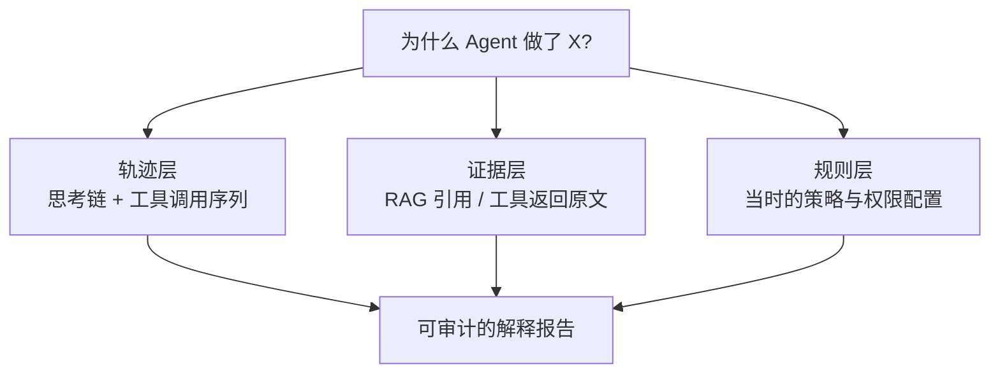

# 可解释性

> **一句话**：可解释性 = 回答「Agent 为什么这么做」；分两层——模型内部机制（机理层）与决策依据（行为层），工程落地主要靠行为层的轨迹透明化。
> **难度**：高级
> **标签**：`#safety` `#evaluation`

## 先看结论

- 两层含义：机理可解释（注意力权重、特征回路——研究前沿）≠ 行为可解释（为什么调这个工具、基于什么信息——工程可落地）
- Agent 的天然优势：轨迹（思考/工具调用/结果）天然构成「解释材料」，事件流架构让解释可回放
- 但要警惕「解释表演」：模型的自我解释可能是事后合理化，与真实机制无关（→ [CoT 误区](../04-prompt-reasoning/chain-of-thought.md)）
- 落地三件套：完整轨迹留存、决策依据溯源（RAG 引用/工具结果）、关键决策的独立复审

## 行为层解释的来源

## 源码案例

- **DeepSeek Harness：为解释而生的架构**（[仓库](https://github.com/deepseek-ai/deepseek-harness)）：append-only 事件流把「每一步的 system prompt、推理内容、工具调用与结果、子 Agent 调度、上下文注入」全部留痕，Trajectory 视图按来源检查——「解释」变成按时间轴重放事件，这是行为层可解释性的标杆实现
- **Anthropic 的机理研究**（[Transformer Circuits](https://www.anthropic.com/research/transformer-circuits) 团队）：特征可视化和「电路分析」探索模型内部机制——重要进展但离工程日常尚远；其「模型生物学」路线值得跟踪
- **可观测工具的 trace**（→ [日志、追踪与监控](../11-engineering/logging-tracing-monitoring.md)）：LangSmith/LangFuse 记录每步输入输出与 token 消耗，是行为层解释的通用基建
- **推理模型的思考链**（[DeepSeek-R1](https://arxiv.org/abs/2501.12948)）：`reasoning_content` 提供了前所未有的「过程可见性」，但论文同时提示思考链可能包含错误归因——过程可见 ≠ 过程可信

## 最佳实践

- 合规场景定义「解释等级」：L1 轨迹可查 → L2 证据可溯 → L3 决策可复核
- 每个事实性输出绑定证据 ID（检索片段/工具调用），一键跳转原文
- 关键决策做「反事实审计」：换一个输入会怎样？暴露决策边界的脆弱性

## 常见误区

- ❌ 把模型的自我解释当真：研究表明 CoT 解释与真实决策原因可能脱节（政策还可能「写进解释里讨好你」）
- ❌ 注意力热图 = 解释：注意力只是信息通路统计，与因果解释有本质差距
- ❌ 可解释性是纯研究话题：轨迹透明、证据溯源、审计复核是当下就能落地的工程实践

## 小练习

给「贷款预审 Agent」设计解释报告模板：审批决定 + 依据的三条证据 + 所用规则版本 + 评审入口。哪些字段必须来自系统记录而非模型生成？

## 相关资源

- [Anthropic: Transformer Circuits](https://www.anthropic.com/research/transformer-circuits)

## 相关知识点

- [Chain of Thought](../04-prompt-reasoning/chain-of-thought.md)
- [幻觉问题](hallucination.md)
