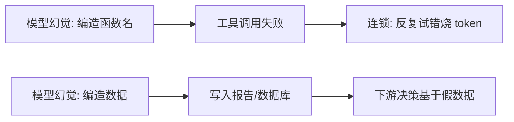

# 📊 幻觉问题

> **一句话**：幻觉 = 模型一本正经地编造事实；Agent 场景下幻觉会通过工具调用「落地成真」——治理靠「可验证的事实源 + 让模型承认不知道」双管齐下。
> **难度**：⭐️⭐️ 进阶
> **标签**：`#safety` `#evaluation`

## 📌 先看结论

- 三类幻觉：事实编造（假数据）、过程幻觉（不存在的 API/函数名）、引用幻觉（编造出处）——Agent 里最危险的是**过程幻觉**（调不存在的工具、写错参数）
- 根源：LLM 是概率补全器，「编一个合理的」和「说真实的」在生成机制上没有区别
- Agent 特有解法：给真实世界「地锚」——工具返回、RAG 引用、测试结果；纯生成环节无法自查知识盲区
- 检测：自一致性检查、引用核验、工具结果交叉验证

## 🖼️ Agent 的幻觉落地路径

## 📦 源码案例

- **Claude Code 的防幻觉工程**（逆向全集：[Piebald-AI/claude-code-system-prompts](https://github.com/Piebald-AI/claude-code-system-prompts)）：系统提示词强制「先 Read 再 Edit」（杜绝凭记忆改代码）、错误信息原文回传（不信模型的「我觉得哪里错了」）、diff 预览让人审（幻觉在落地前被拦）——防幻觉是 prompt + 工具流程 + 人审的合力
- **RAG 引用约束**（→ [RAG 基础](../06-memory-rag/rag-basics.md)）：要求模型「只依据检索片段回答并标注出处」，检索片段里没有就说「资料未覆盖」——开卷考试的答案可信度远高于闭卷默写
- **知识图谱地锚**（→ [知识图谱](../06-memory-rag/knowledge-graph.md)）：关系型事实查图作答、附推理路径，把「生成」降级为「查证」
- **推理模型的诚实度**：DeepSeek-R1 类模型思考链中自发「等等，我可能记错了，先验证」——RL 对齐能降低幻觉倾向，但无法根除（[论文](https://arxiv.org/abs/2501.12948)）

## ✅ 最佳实践

- 关键字段「零幻觉」设计：枚举、ID、日期一律来自工具返回，禁止模型生成
- 让「我不知道」成为正确行为：评估集里放「应回答不知道」的题，答了反而扣分
- 输出附证据链：每个事实性断言带可点击的来源引用

## ⚠️ 常见误区

- ❌ 更大模型 = 更少幻觉：流畅度上升反而让幻觉更难被察觉
- ❌ 「让模型自查」有效有限：模型对自身幻觉没有可靠自我觉察，外部验证才可靠（→ [Self-Refine 的误区](../04-prompt-reasoning/self-refine.md)）
- ❌ RAG 万能：检索错了照样错上加错，检索质量评估是前置（→ [Agent 评估指标](evaluation-metrics.md)）

## 🧪 小练习

「药品说明书问答 Bot」：列出三类最危险的幻觉场景，为每类设计一个「地锚」机制（用什么数据源、怎么强制引用、怎么拒答）。

## 📚 相关知识点

- [RAG 基础](../06-memory-rag/rag-basics.md)
- [可解释性](explainability.md)
