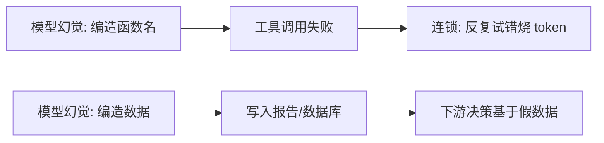

# 幻觉问题

> **一句话**：幻觉 = 模型一本正经地编造事实；Agent 场景下幻觉会通过工具调用「落地成真」——治理靠「可验证的事实源 + 让模型承认不知道」双管齐下。

## 问题动机

LLM 是概率补全器：对「巴黎是……的首都」它给出「法国」，对「张三的工号是……」它同样能给出一个格式完美、语气笃定的编号——生成机制上「编一个合理的」和「说真实的」没有区别。在纯聊天里这只是答错；在 Agent 里，幻觉会被写进数据库、发进邮件、提交到生产环境，后果被放大。

## 核心机制

### 1. 幻觉的三类

| 类型 | 表现 | Agent 场景的危害 |
|---|---|---|
| 事实幻觉 | 编造不存在的事实/数据 | 报告、决策基于假数据 |
| 过程幻觉 | 编造不存在的 API、函数名、参数 | 工具调用失败、反复试错烧 token |
| 引用幻觉 | 编造出处、文献、链接 | 无法溯源，误导性强 |

Agent 最危险的是**过程幻觉**：它直接作用在「执行」上，而不只是「回答」上。

### 2. 检测：自一致性与语义熵

核心思想是——**模型对同一问题的多次回答若互相矛盾，说明它在编**。

**自一致性（Self-Consistency）**：对同一问题采样 $k$ 个回答，统计最大一致比例：

$$
\text{consistency}=\frac{\max_{y}\ \#\{i: a_i = y\}}{k}
$$

一致率低 → 高风险。但对开放式回答，字面不同不等于意思不同，需要用语义聚类。

**语义熵**：先把语义等价的回答聚成概念类 $c$，再算分布的熵：

$$
\text{SE}=-\sum_{c} p(c\mid x)\log p(c\mid x)
$$

熵越高，说明模型在多个「意思」间摇摆，越可能是幻觉。相比字面一致率，语义熵对措辞变化更稳健。

### 3. 事实性度量：支持率

把回答拆成若干原子断言 $S$，逐条核验是否有可靠来源支持：

$$
\text{Factual Precision}=\frac{\big|\{s\in S:\ s\ \text{有来源支持}\}\big|}{|S|}
$$

这与 RAG 评估里的**忠实度（Faithfulness）**是同一思想（见 [RAG 基础](../06-memory-rag/rag-basics.md)）。对应地，还要看**召回**：该说的关键事实有没有漏。

### 4. 为什么「让模型自查」不够

模型对自身幻觉缺乏可靠的自我觉察：它编造时内部置信度同样高。因此有效手段是**引入模型之外的地锚**——工具返回的真实结果、检索片段、测试通过与否。这也是 Agent 相比纯聊天更容易治理幻觉的原因：它有可执行的外部验证器。

## Agent 的幻觉落地路径

## 源码案例

- **Claude Code 的防幻觉工程**（逆向全集：[Piebald-AI/claude-code-system-prompts](https://github.com/Piebald-AI/claude-code-system-prompts)）：系统提示词强制「先 Read 再 Edit」（杜绝凭记忆改代码）、错误信息原文回传（不信模型的「我觉得哪里错了」）、diff 预览让人审——防幻觉是 prompt + 工具流程 + 人审的合力
- **RAG 引用约束**（→ [RAG 基础](../06-memory-rag/rag-basics.md)）：要求模型「只依据检索片段回答并标注出处」，检索片段里没有就说「资料未覆盖」
- **知识图谱地锚**（→ [知识图谱](../06-memory-rag/knowledge-graph.md)）：关系型事实查图作答、附推理路径，把「生成」降级为「查证」
- **推理模型的诚实度**：DeepSeek-R1 类模型思考链中自发出现「等等，我可能记错了，先验证」——RL 对齐能降低幻觉倾向，但无法根除（[论文](https://arxiv.org/abs/2501.12948)）

## 最佳实践

- 关键字段「零幻觉」设计：枚举、ID、日期一律来自工具返回，禁止模型生成
- 让「我不知道」成为正确行为：评估集里放「应回答不知道」的题，答了反而扣分
- 输出附证据链：每个事实性断言带可点击的来源引用
- 上线前用自一致性/语义熵跑一遍高风险问题的采样检测

## 常见误区

- ❌ 更大模型 = 更少幻觉：流畅度上升反而让幻觉更难被察觉
- ❌ 「让模型自查」有效有限：模型对自身幻觉没有可靠自我觉察，外部验证才可靠（→ [Self-Refine 的误区](../04-prompt-reasoning/self-refine.md)）
- ❌ RAG 万能：检索错了照样错上加错，检索质量评估是前置（→ [Agent 评估指标](evaluation-metrics.md)）
- ❌ 只看最终答案：过程幻觉（编造工具名）会让 Agent 在正确的路上反复失败，必须从轨迹层排查

## 参考资料

- [Survey of Hallucination in Natural Language Generation](https://arxiv.org/abs/2202.03629)（Ji et al., 2022）
- [SelfCheckGPT: Zero-Resource Black-Box Hallucination Detection for Generative Large Language Models](https://arxiv.org/abs/2303.08896)（Manakul et al., 2023）
- [Semantic Uncertainty: Linguistic Invariances for Uncertainty Estimation in Natural Language Generation](https://arxiv.org/abs/2302.09664)（Kuhn et al., 2023；其期刊版为 Nature 2024）
- [RAGAS: Automated Evaluation of Retrieval Augmented Generation](https://arxiv.org/abs/2309.15217)（Es et al., 2023，忠实度指标）

## 相关知识点

- [RAG 基础](../06-memory-rag/rag-basics.md)
- [可解释性](explainability.md)
