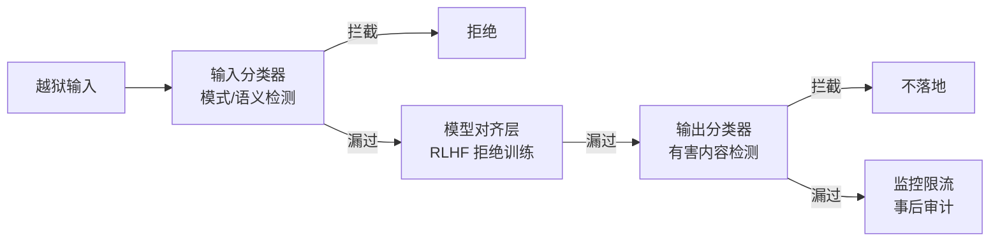

# 越狱攻击

> **一句话**：越狱（Jailbreak）= 绕过模型的安全对齐，诱导其产出本被拒绝的内容——攻防是持续的对抗博弈，工程上靠「对齐 + 过滤 + 监控」组合拳缓解。
> **难度**：进阶
> **标签**：`#safety`

## 先看结论

- 与提示注入的区别：注入是「骗 Agent 做事」（外部目标劫持），越狱是「骗模型说出不该说的」（对齐绕过）；实践中两者常组合
- 经典手法：角色扮演（"你是 DAN"）、假设嵌套（"写小说里的坏人会怎么说"）、编码变形（Base64/拼音/多语言绕过）、长上下文稀释
- 防御：对齐训练是第一道（RLHF 拒绝训练）、输入输出分类器过滤、上下文净化、滥用监控与限流
- Agent 场景附加风险：越狱 + 工具 = 产出可落地的有害产物（钓鱼文案 + 自动群发）

## 攻击面与防线

## 源码案例与资源

- **对抗数据集**：AdvBench（[论文 HarmBench 附录](https://arxiv.org/abs/2402.04249)）、HarmBench——标准化越狱测试集，红队评估的起点；强模型（Claude/GPT/DeepSeek）在已知手法上拦截率高，但**新手法首日拦截率仍是行业难题**
- **分类器工程**：Llama Guard（[GitHub](https://github.com/meta-llama/PurpleLlama)）——Meta 开源的输入/输出安全分类模型，部署在 Agent 前后做双向安检，是自建防线的流行起点
- **DeepSeek 的对齐实践**（[R1 论文](https://arxiv.org/abs/2501.12948)）：安全对齐分阶段注入（预训练数据清洗 → SFT 安全样本 → RL 安全奖励），报告承认「长思考链可能包含有害中间推理」，需要在部署层加输出过滤——推理模型的越狱面有特殊性（思考过程本身就是内容）
- **Claude 的宪法式对齐**（[Constitutional AI 论文](https://arxiv.org/abs/2212.08073)）：用一组明文原则自我批评再训练——对齐策略可审计，是「对齐黑箱」批评的回应

## 最佳实践

- 纵深四层：输入过滤 → 对齐模型 → 输出过滤 → 监控限流，别把宝押在单层
- 品牌场景加「语气与合规 guardrail」（如 OpenAI Agents SDK 的 Guardrail、Llama Guard）
- 把越狱攻击样本进评估集做回归；模型/提示词每次变更重跑

## 常见误区

- ❌ 越狱是模型厂商的事：部署层的 guardrail、监控、限流是应用方责任
- ❌ 一次测试安全 = 永久安全：新手法持续出现（多语言、图像载体、长上下文），对抗要常态化
- ❌ 拦截率 100% 才上线：现实是概率防御，配合审计与人工复核把残余风险控制在可接受水平

## 小练习

为一个面向未成年人的教育 Agent 设计越狱防线：输入侧、模型侧、输出侧、监控侧各选一种机制并说明理由。

## 相关知识点

- [提示注入](prompt-injection.md)
- [对齐与安全](alignment-safety.md)
