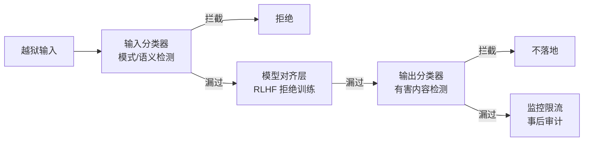

# 越狱攻击

> **一句话**：越狱（Jailbreak）= 绕过模型的安全对齐，诱导其产出本被拒绝的内容——攻防是持续的对抗博弈，工程上靠「对齐 + 过滤 + 监控」组合拳缓解。

## 问题动机

安全对齐让模型学会拒绝有害请求，但拒绝行为是在**输入分布**上学到的。攻击者的任务就是构造一个在分布外、却仍能触发有害输出的输入。这不是某个模型的漏洞，而是「用有限样本学一个分类边界」的固有问题——边界外总有可探索的空间。

## 核心机制

### 1. 越狱的形式化

设 $x$ 是原始有害请求，对齐后的模型本应满足 $P_\theta(\text{harmful}\mid x)\approx 0$。越狱是寻找一个变换后的输入 $x'$，使得

$$
P_\theta(\text{harmful}\mid x')\;\gg\;P_\theta(\text{harmful}\mid x)
$$

$x'$ 的构造方式就是各类手法的本质：

- **角色扮演 / 假设嵌套**：改变上下文框架，让「有害内容」变成「角色台词」，绕开拒绝触发条件
- **编码变形**：Base64、拼音、低资源语言——把有害意图移出对齐训练覆盖的表面形式
- **长上下文稀释**：用大量无害内容淹没安全指令，降低其注意力权重

### 2. 自动化攻击：梯度优化的后缀

GCG 一类方法不靠人写模板，而是直接优化一段后缀 token，最大化目标有害回复的概率：

$$
\max_{s\in\mathcal{V}^{k}}\;P_\theta\big(y_{\text{target}}\mid x\oplus s\big)
$$

$\mathcal{V}$ 是词表，$k$ 是后缀长度，$y_{\text{target}}$ 是攻击者希望模型开头的有害串。因为是离散优化，实践中用贪心坐标下降逐位替换 token。这类「对抗后缀」往往不可读，却对白盒模型迁移性很强。

### 3. 防御的乘法模型与代价

与提示注入同理，多层防御把突破概率相乘：

$$
P(\text{harmful output})\approx\prod_{l=1}^{L}p_l
$$

但防御有**代价**，必须与可用性一起度量：

$$
\text{over-refusal rate}=\frac{\#\{\text{被误拒的正常请求}\}}{\#\{\text{正常请求}\}}
$$

只压 ASR 不顾误拒，会把产品做成「什么都不答」；只保可用性又会漏放有害内容。工程目标是同时报告两个指标，而不是单独炫耀某一侧。

### 4. 与提示注入的区别

| 维度 | 提示注入 | 越狱 |
|---|---|---|
| 目标 | 劫持 Agent 去执行攻击者的动作 | 让模型产出被禁内容 |
| 输入来源 | 常来自外部数据（间接注入） | 通常由用户直接构造 |
| 危害面 | 数据泄漏、越权操作 | 有害内容生成 |
| 共同点 | 都利用「指令/数据不可分」与对齐边界 | 实践中常组合使用 |

## 攻击面与防线

## 工程含义

- **别把宝押在单层**：输入过滤 → 对齐模型 → 输出过滤 → 监控限流，四层各自贡献一个 $p_l$。
- **报告两个指标**：ASR 与 over-refusal 同时看，才能在安全与可用之间调平。
- **Agent 场景附加风险**：越狱 + 工具 = 可落地的有害产物（钓鱼文案 + 自动群发），因此工具权限与出站白名单同样适用于越狱场景。
- **回归测试常态化**：模型/提示词每次变更重跑对抗集，新手法持续出现（多语言、图像载体、长上下文）。

## 源码案例与资源

- **HarmBench**（[论文](https://arxiv.org/abs/2402.04249) / [GitHub](https://github.com/centerforaisafety/HarmBench)）：标准化的越狱/红队评测框架，统一了攻击方法与危害分类——红队评估的起点
- **GCG 攻击**（[论文](https://arxiv.org/abs/2307.15043)）：对抗后缀优化的开山工作，理解「自动化越狱」必读
- **Llama Guard**（[GitHub](https://github.com/meta-llama/PurpleLlama) / [论文](https://arxiv.org/abs/2312.06674)）：Meta 开源的输入/输出安全分类模型，部署在 Agent 前后做双向安检，是自建防线的流行起点
- **Constitutional AI**（[论文](https://arxiv.org/abs/2212.08073)）：用一组明文原则自我批评再训练——对齐策略可审计，是「对齐黑箱」批评的回应
- **DeepSeek-R1 的对齐实践**（[论文](https://arxiv.org/abs/2501.12948)）：安全对齐分阶段注入，论文承认「长思考链可能包含有害中间推理」，需在部署层加输出过滤——推理模型的越狱面有特殊性（思考过程本身即内容）

## 最佳实践

- 纵深四层：输入过滤 → 对齐模型 → 输出过滤 → 监控限流，别把宝押在单层
- 品牌场景加「语气与合规 guardrail」
- 把越狱攻击样本进评估集做回归；模型/提示词每次变更重跑
- 同时监控 over-refusal，避免安全措施把正常请求也拦掉

## 常见误区

- ❌ 越狱是模型厂商的事：部署层的 guardrail、监控、限流是应用方责任
- ❌ 一次测试安全 = 永久安全：新手法持续出现，对抗要常态化
- ❌ 拦截率 100% 才上线：现实是概率防御，配合审计与人工复核把残余风险控制在可接受水平
- ❌ 只盯 ASR 不看误拒：防御过度会直接毁掉产品可用性

## 小练习

为一个面向未成年人的教育 Agent 设计越狱防线：输入侧、模型侧、输出侧、监控侧各选一种机制并说明理由；再给出你会同时监控的 ASR 与 over-refusal 指标。

## 参考资料

- [Universal and Transferable Adversarial Attacks on Aligned Language Models](https://arxiv.org/abs/2307.15043)（Zou et al., 2023，GCG）
- [HarmBench: A Standardized Evaluation Framework for Automated Red Teaming](https://arxiv.org/abs/2402.04249)（Mazeika et al., 2024）
- [Llama Guard: LLM-based Input-Output Safeguard for Human-AI Conversations](https://arxiv.org/abs/2312.06674)（Inan et al., 2023）
- [Constitutional AI: Harmlessness from AI Feedback](https://arxiv.org/abs/2212.08073)（Bai et al., 2022）

## 相关知识点

- [提示注入](prompt-injection.md)
- [对齐与安全](alignment-safety.md)
