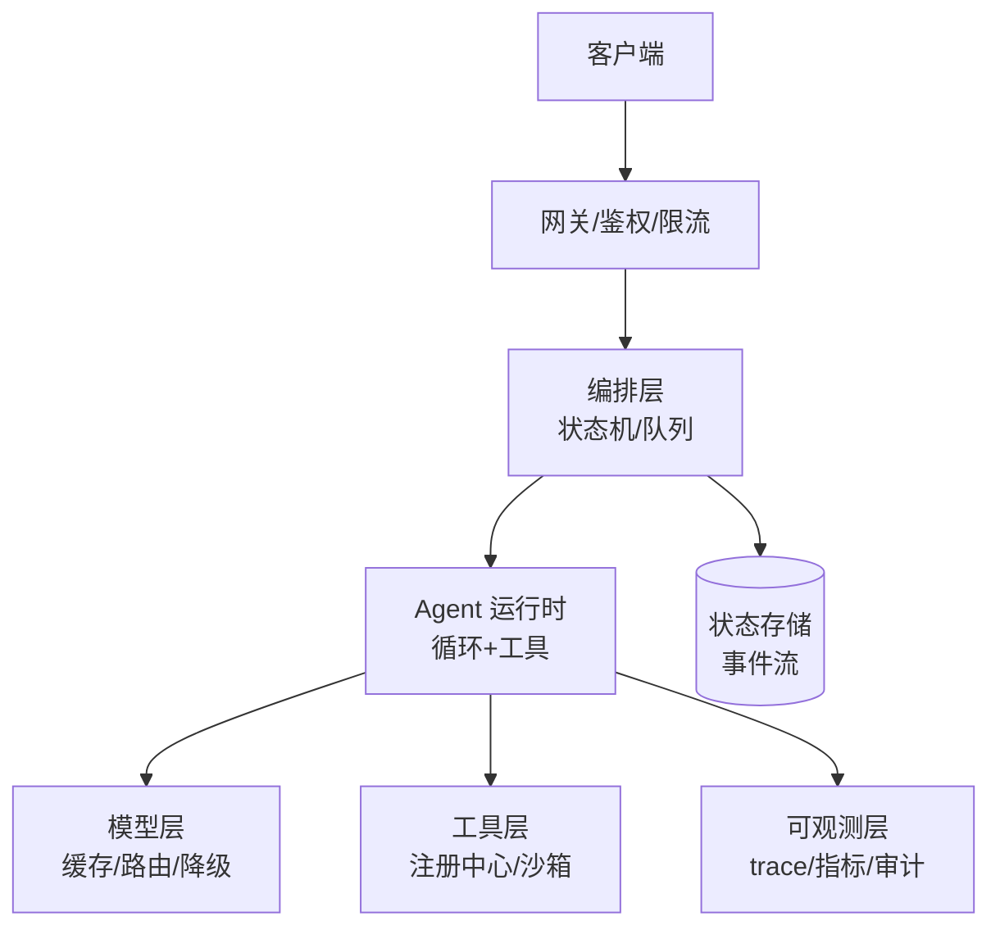

# 11 工程化与可观测性

> **一句话**：从 Demo 到生产隔着一条工程鸿沟：编排、状态机、工具注册、追踪监控、错误处理、部署扩容、成本优化、持续评估——本章就是过桥的图纸。

## 你将学到

- Agent 生产架构的参考分层与模式选择
- 状态机与事件驱动：为什么「append-only 事件流」正在成为主流
- 工具注册中心：工具的版本、鉴权与生命周期管理
- LangSmith/LangFuse/Phoenix/OpenTelemetry 的选型与落地
- 错误处理、部署扩缩容、缓存成本与持续评估的工程清单

## 一张参考架构

## 延伸必读

- [12-Factor Agents](https://github.com/humanlayer/12-factor-agents)——Agent 工程化的 12 条原则，本章多个小节与之呼应
- [Anthropic: Building Effective Agents](https://www.anthropic.com/engineering/building-effective-agents)——编排模式的工程共识

## 本站页面

- [Agent 工作流编排](workflow-orchestration.md)
- [状态机与事件驱动](state-machine-event-driven.md)
- [工具注册中心](tool-registry.md)
- [日志、追踪与监控](logging-tracing-monitoring.md)
- [LangSmith、LangFuse、Phoenix、OpenTelemetry](observability-tools.md)
- [错误处理、重试与降级](error-handling-retry-fallback.md)
- [部署与扩缩容](deployment-scaling.md)
- [缓存与成本优化](caching-cost-optimization.md)
- [持续评估](continuous-evaluation.md)
