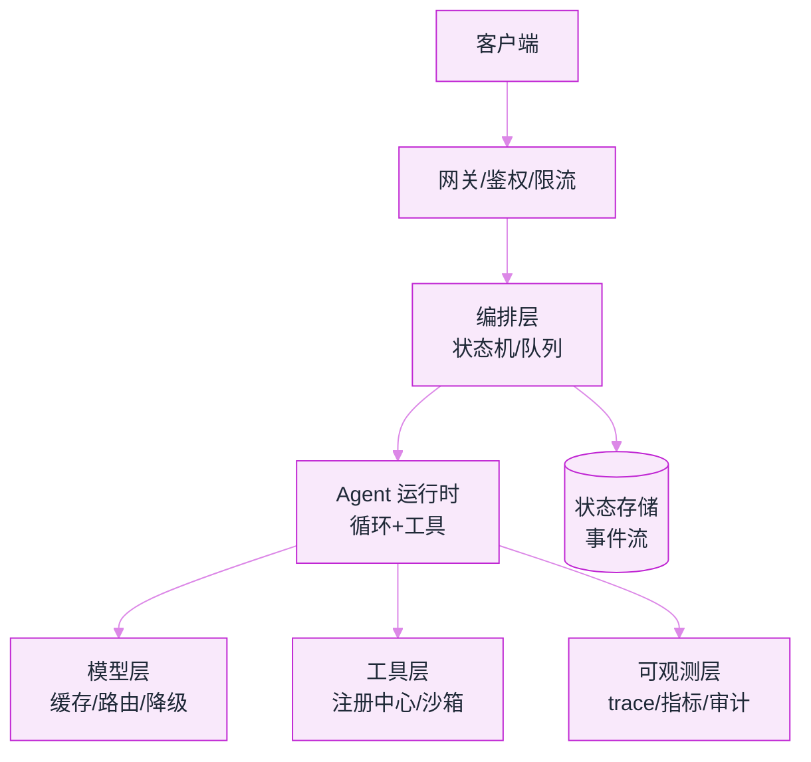

# 11 工程化与可观测性


**一句话**：从 Demo 到生产隔着一条工程鸿沟：编排、状态机、工具注册、追踪监控、错误处理、部署扩容、成本优化、持续评估——本章就是过桥的图纸。


## 你将学到

- Agent 生产架构的参考分层与模式选择
- 状态机与事件驱动：为什么「append-only 事件流」正在成为主流
- 工具注册中心：工具的版本、鉴权与生命周期管理
- LangSmith/LangFuse/Phoenix/OpenTelemetry 的选型与落地
- 错误处理、部署扩缩容、缓存成本与持续评估的工程清单

## 一张参考架构

## 延伸必读

- [12-Factor Agents](https://github.com/humanlayer/12-factor-agents)——Agent 工程化的 12 条原则，本章多个小节与之呼应
- [Anthropic: Building Effective Agents](https://www.anthropic.com/engineering/building-effective-agents)——编排模式的工程共识

## 本站页面

- [Agent 工作流编排](workflow-orchestration.md)
- [状态机与事件驱动](state-machine-event-driven.md)
- [工具注册中心](tool-registry.md)
- [日志、追踪与监控](logging-tracing-monitoring.md)
- [LangSmith、LangFuse、Phoenix、OpenTelemetry](observability-tools.md)
- [错误处理、重试与降级](error-handling-retry-fallback.md)
- [部署与扩缩容](deployment-scaling.md)
- [缓存与成本优化](caching-cost-optimization.md)
- [持续评估](continuous-evaluation.md)

## 读完能做到

- [ ] 定义 5 个核心事件类型（user_input / assistant_message / tool_call / tool_result / turn_end），实现「从事件重放出当前上下文」，并加一个每 20 事件生成快照的机制
- [ ] 给 Agent 加 trace：定义 span 层级（agent_turn→llm_call/tool_call），按四个黄金信号建一版看板，并找出当前 token 成本 Top3 的步骤
- [ ] 用成本公式估算单任务成本，说清为什么缓存命中要求「前缀字节级一致」、动态内容为什么要后置到 prompt 尾部
- [ ] 画出完整降级链（主模型→备模型→缩水任务→人工信箱），每级写触发条件与用户话术，并解释非幂等操作为什么绝不自动重试
- [ ] 为核心评估集做规模测算：n=100、p=0.9 时 95% 置信区间约 ±6pp，据此判断能否分辨 92% 与 88%

## 章末自测

1. **回忆**：事件溯源为什么要求 fold（投影）是纯函数？哪些「不确定输入」必须也写成事件？（提示：见 state-machine-event-driven.md）
2. **应用**：为什么「只监控 CPU 和延迟」是错的？哪个指标才是 Agent 的北极星，最早的退化信号又是什么？（提示：见 logging-tracing-monitoring.md）
3. **判断**：「自托管一定比 API 省钱」「小模型单价低所以一律用小模型」——用总账公式和「失败重试反而更贵」的成本—质量权衡各反驳一句。（提示：见 caching-cost-optimization.md、deployment-scaling.md）

