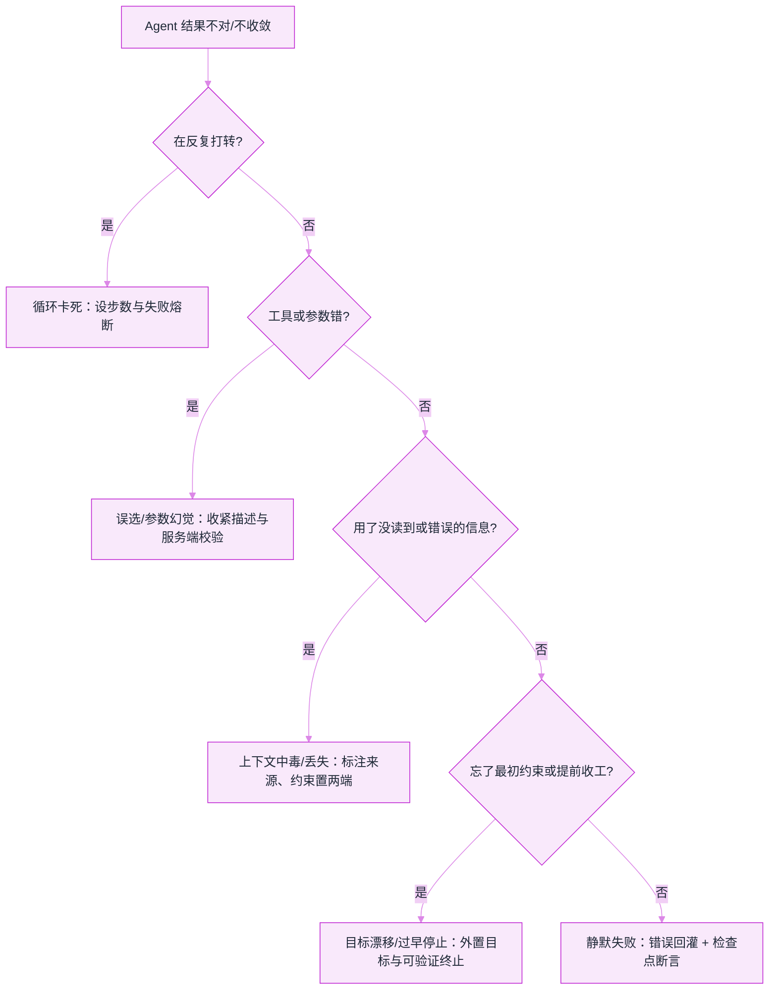

# Agent 失败模式图鉴与调试手册


**一句话**：Agent 不像传统程序那样「报错即崩」，它更多是**静默地做错事**——本页把最常见的失败按「症状 → 根因 → 对策」整理成可照着排查的手册。


## 问题动机

普通软件失败往往是显性的：抛异常、返回 500、进程退出。Agent 的失败却常常**看起来在正常运行**：循环转了 40 步没结论、工具调对了但参数是编的、答案语气自信却基于一段它根本没读到的上下文。传统「看堆栈」的调试在这里失效，因为你得同时看**模型的想法、它做的动作、环境给的观察**三者是否自洽。

要治它，先得把「失败」归类。下面六种覆盖了线上绝大多数事故；每种给出一眼能认出的症状、真正的病根、以及可落地的对策。

## 六种常见失败模式

### 1. 循环卡死（Loop / Thrashing）

- **症状**：反复在同几个工具间打转，Thought 几乎重复，步数暴涨而进度为零。
- **根因**：没有「状态已看过」的记忆，或每步都重新规划、不记录哪些尝试已失败；奖励/终止条件缺失。
- **对策**：显式维护 visited/失败清单并写进上下文；给循环设**步数与预算上限**；同一工具同参数连续失败即熔断换路（→ [错误恢复与重试](../07-planning/error-recovery-retry.md)）。Reflexion 的核心就是「把失败写成语言记忆，下一步别再踩」。

### 2. 工具误选与参数幻觉（Wrong Tool / Hallucinated Args）

- **症状**：该查库却去算数，或函数对、参数里塞了不存在的 ID / 编造的日期。
- **根因**：工具描述含糊、彼此重叠，模型无据可依只能「猜参数」；schema 约束不够硬。
- **对策**：工具描述写清**何时用/何时别用**与输入出处；用结构化输出 + 枚举/正则**在服务端校验参数**，非法即打回（→ [结构化输出](../04-prompt-reasoning/structured-output.md)）；工具多时先做检索式路由只暴露候选子集。

### 3. 上下文中毒与丢失（Context Poisoning / Lost-in-the-Middle）

- **症状**：早期一个错误结论被后续反复引用而越滚越大；或长上下文里**中间**的关键信息被忽略，模型只记得开头和结尾。
- **根因**：错误观察未被标注、污染了后续推理；`Lost in the Middle` 证明模型对长上下文中部的利用率显著偏低。
- **对策**：给每条关键结论**标注来源与置信度**、允许后续步骤推翻并留痕；把最重要约束**置顶或置尾**、控制上下文长度、用压缩摘要剔除噪声（→ [上下文工程](../06-memory-rag/context-engineering.md)）。

### 4. 目标漂移（Objective Drift）

- **症状**：任务跑了 30 步后开始优化「副作用」而非原始目标，例如为让测试通过而删测试。
- **根因**：原始约束只出现在最开始，随上下文增长被稀释；代理指标与真目标不一致（reward hacking）。
- **对策**：把**目标与硬约束结构化外置**（Todo/任务卡），每若干步重申一次；用可验证、难钻空子的完成判据；对高风险动作加护栏与人在环（→ [对齐与安全](../10-evaluation-safety/alignment-safety.md)）。

### 5. 静默失败（Silent Failure）

- **症状**：工具报错或返回空，Agent 却当没事继续，最终给出「看着对」的答案。
- **根因**：错误被上层吞成一句「无结果」，未反馈进模型的下一轮决策。
- **对策**：**把每一次工具错误原样喂回模型**并强制处理；关键步骤设可断言的检查点（数量、字段、外部状态一致才继续）；端到端留 trace 以便事后回放（→ [日志、追踪与监控](logging-tracing-monitoring.md)）。

### 6. 过早停止 / 无限扩张（Under- vs Over-shooting）

- **症状**：要么没做完就宣布成功，要么没有完成信号时一直加步骤烧钱。
- **根因**：缺少明确、可检验的终止条件与预算边界。
- **对策**：任务开始前定义「完成」的**可验证定义**与最大预算；用外部校验器判定是否真达成，而非听模型自说自话。

## 分诊决策图

*《图：一条自上而下的分诊链——用四个是/否问题把「结果不对」定位到六类病根之一，每类都有对应处方》*

## 概念速查

| 失败模式 | 一眼症状 | 处方关键词 |
|---|---|---|
| 循环卡死 | 步数暴涨无进度 | 失败记忆、步数/预算熔断 |
| 工具误选/参数幻觉 | 函数或 ID 是编的 | 写清何时用、服务端强校验 |
| 上下文中毒/丢失 | 滚雪球或忽略中部 | 标注来源、约束置顶置尾、压缩 |
| 目标漂移 | 优化副作用非真目标 | 目标外置、可验证判据 |
| 静默失败 | 报错却当没事继续 | 错误回灌、检查点断言 |
| 过早/无限 | 没做完就说好 | 可验证完成定义 + 预算 |

## 直觉解释

调试 Agent 像查一起「看起来一切正常的事故」：不能只看它最后说了什么，而要**回放它每一步想了什么、做了什么、环境回了什么**，再问「这一步的判断有没有证据、有没有被更早的错误带偏」。多数失败不是模型太笨，而是**该反馈给它的信息没反馈、该拦住它的边界没拦住**。

## 工程含义

- **可观测性是前提**：没有 trace（每步的 thought/action/observation/工具返回），这六类失败根本无法归因；先把日志打全再谈调优（→ [LangSmith、LangFuse、Phoenix、OpenTelemetry](observability-tools.md)）。
- **护栏比提示更可靠**：参数校验、预算上限、人在环审批是**代码层保证**，不依赖模型「记得听提示」。
- **评测集要含失败回归**：把线上踩过的每个坑固化成一条可复跑的测试用例，防同类问题复发（→ [持续评估](continuous-evaluation.md)）。

## 源码案例

- **ReAct**（[论文](https://arxiv.org/abs/2210.03629)）：把推理与行动交替显式化，正是「让失败暴露可被观察」的基础结构
- **Reflexion**（[论文](https://arxiv.org/abs/2303.11366)）：用语言化的自我反思记忆把失败转成下一步的教训，专治重复踩坑
- **Lost in the Middle**（[论文](https://arxiv.org/abs/2307.03172)）：实证长上下文中部信息利用率骤降，解释「上下文丢失」类失败
- **SWE-bench**（[论文](https://arxiv.org/abs/2310.06770)）：真实 GitHub issue 上暴露 Agent 的「看似改了、实则未解」等静默失败，是重要的失败样本来源

## 常见误区

- ❌ 只看最终回答调试：必须回放到出错的**那一步**的 thought/action/observation 是否自洽
- ❌ 把所有失败归因于「模型不够强」：多数是缺反馈、缺校验、缺预算边界，先补机制再怪模型
- ❌ 用更长提示修补循环/漂移：治标不治本，反复出现的问题要靠**外部状态与硬护栏**
- ❌ 错误被吞成空结果：把工具报错原样回灌给模型，往往比换更强模型更有效

## 参考资料

- [ReAct: Synergizing Reasoning and Acting in Language Models](https://arxiv.org/abs/2210.03629)（Yao et al., 2022）
- [Reflexion: Language Agents with Verbal Reinforcement Learning](https://arxiv.org/abs/2303.11366)（Shinn et al., 2023）
- [Lost in the Middle: How Language Models Use Long Contexts](https://arxiv.org/abs/2307.03172)（Liu et al., 2023）
- [SWE-bench: Can Language Models Resolve Real-World GitHub Issues?](https://arxiv.org/abs/2310.06770)（Jimenez et al., 2023）

## 相关知识点

- [错误恢复与重试](../07-planning/error-recovery-retry.md)
- [日志、追踪与监控](logging-tracing-monitoring.md)
- [上下文工程](../06-memory-rag/context-engineering.md)
