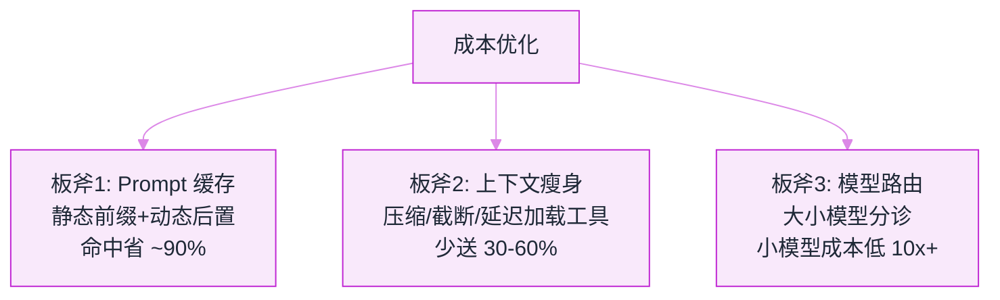
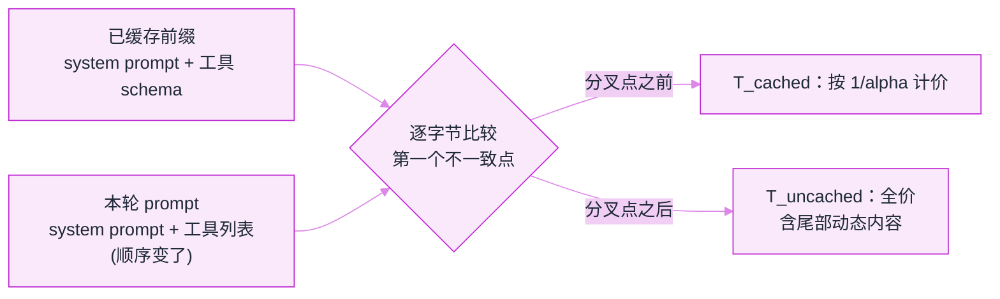

# 缓存与成本优化


**一句话**：Agent 成本优化的三板斧：prompt 缓存（结构性省钱）、上下文瘦身（少送 token）、路由降级（按任务难度分配模型）——三板斧下来常见能省 50–80%。


## 先看结论

- Prompt caching 是 Agent 场景的最大红利：system prompt + 工具定义每轮重复，前缀命中即按更低单价计价——前提是**前缀字节级一致**
- 上下文成本大头通常是工具输出与历史，压缩与截断直接省钱（→ [记忆压缩](../06-memory-rag/memory-compression-forgetting.md)）
- 模型路由：简单步骤用小模型、关键决策用旗舰模型，混合成本大降
- 成本要「可归因」：按任务/用户/功能维度记账，才能找到优化点

## 核心机制

### 1. 成本公式与缓存的经济学

单次调用的成本是输入、输出的线性组合：

$$
\text{cost}=c_{\text{in}}\,T_{\text{in}}+c_{\text{out}}\,T_{\text{out}}
$$

其中输出单价通常显著高于输入。开启 prompt 缓存后，命中的输入部分按折扣单价计：

$$
\text{cost}'=c_{\text{in}}\Big(\frac{T_{\text{cached}}}{\alpha}+T_{\text{uncached}}\Big)+c_{\text{out}}T_{\text{out}},
\qquad \alpha\approx10
$$

**关键推论**：Agent 每轮都要重发 system prompt 与工具 schema，$$T_{\text{cached}}$$ 占比极高，因此缓存对 Agent 的收益远大于单轮聊天。但前提是前缀**字节级一致**——一个时间戳就能让整段缓存失效。

### 2. 为什么"看起来一样的 prompt"经常 miss

缓存按**前缀**匹配，因此任何混进前缀的易变内容都会导致从该点起全部失效：

$$
\text{命中长度}=\text{最长公共前缀长度}
$$

据此可以列出常见「缓存杀手」：时间戳、随机 ID、文件树、动态工具列表、拼在 system prompt 里的当前用户信息。工程规则很简单：**静态在前、动态在后**。

### 3. 路由的成本-质量权衡

按步骤难度分配模型，期望成本为：

$$
\mathbb{E}[\text{cost}]=p_{\text{fail}}\cdot C_{\text{retry}}+(1-p_{\text{fail}})\cdot C_{\text{first}}
$$

这条式子说明**不能只看单价**：小模型单价低，但失败重试会把成本与延迟都加回来。因此路由规则应基于「步骤类型 × 风险」而非「一律用便宜模型」：格式化、抽取、分类用小模型；规划、复杂工具选择、高风险动作用旗舰模型。

### 4. 总账要含全链路

$$
C_{\text{total}}=\underbrace{C_{\text{tokens}}}_{\text{模型调用}}+\underbrace{C_{\text{tools}}}_{\text{沙箱/API}}+\underbrace{C_{\text{human}}}_{\text{人工复核}}+\underbrace{C_{\text{retry}}}_{\text{重试}}
$$

只盯 token 账会漏掉沙箱算力、第三方 API 与人工成本——后两者在长任务里可能占比可观。

## 三板斧



*《图：三板斧各攻一处且能叠加——缓存让重复前缀按一折计价，瘦身直接少送 token，路由按步骤风险换大小模型》*

## 路由规则：step 进来先看哪两个字段

路由要读的输入其实只有两项半：`step.type`、`step.risk`，外加一个 `step.is_planning` 布尔。写成配置而不是散在各处的 `if` 链，是因为路由档位要能按租户灰度、要能被成本看板反向验证——它属于「改一行就能让账单翻倍或腰斩」的那类配置。

```json
{
  "routing_rules": {
    "input_fields": ["step.type", "step.risk", "step.is_planning"],
    "rules": [
      { "if": "step.type in [format, extract, classify]", "then": "small-model",   "why": "单价低一个量级，质量够用" },
      { "if": "step.risk == high or step.is_planning",     "then": "flagship-model", "why": "关键决策不省钱" },
      { "else": "mid-model" }
    ],
    "expected_cost": "E[cost] = p_fail * C_retry + (1 - p_fail) * C_first"
  },
  "prompt_layout": {
    "static_prefix": ["system prompt（模块化注册，顺序固定）", "工具 schema（延迟加载：先只列名字）", "少变动的示例"],
    "dynamic_tail": ["时间戳", "随机 ID", "当前用户信息", "文件树", "本轮检索结果"],
    "invariant": "前缀必须字节级一致；命中长度 = 最长公共前缀长度"
  },
  "cache_economics": { "discount_alpha": 10, "cached_input_price_ratio": 0.1 },
  "budget_breaker": {
    "scope": "per-task",
    "on_breach": ["降级到更便宜的池", "缩水任务（少步骤 / 少工具）", "中止并说明"],
    "accounting_dims": ["task_type", "user", "feature", "model"]
  }
}
```

三点值得单独盯：**判定顺序**——先查类型白名单再查风险级，反过来会让一次 `risk="low"` 的格式化任务被兜底档吃掉；**`is_planning` 与 `risk="high"` 是同一档**，规划错了后面每一步都要重做，它的钱最不该省；**`accounting_dims` 决定你能不能归因**，没有这四个维度，「哪个功能最烧钱」这个问题无法回答（→ [可观测性工具](observability-tools.md)）。

## 命中的三个层次（点标签切换）

同一份 prompt，前缀对齐到什么程度，账单就长成什么形状。



静态前缀（system prompt + 工具 schema + 固定示例）字节级一致，$$T_{\text{cached}}$$ 覆盖整段前缀，这部分按 $$1/\alpha$$（约一折）计价，只有尾部增量走全价。Agent 的每轮重发让这一档收益最大：步骤越多、对话越长，摊薄越明显。代价是架构约束——**任何想往 system prompt 里塞动态内容的冲动都要被拒**，那是在动别人的账单。



命中长度等于最长公共前缀长度，所以「前 8 个工具描述一致、第 9 个换了顺序」这种改动，效果是前 8 个享一折、从第 9 个起整段全价：看着只是命中率掉了一截，实际省下的钱少了大半。最常见的诱因是**动态工具列表与无序字典序列化**：工具集合本身没变，但每轮拼出的字符串顺序不同。修法是排序 + 稳定序列化，不是把缓存 TTL 调长。



一个时间戳、一个随机 ID、一段拼进 system prompt 的当前用户信息，只要落在前缀最前面，`命中长度 = 0`，这一轮全价。症状很好认：账单结构没变、token 数没变，命中率却贴着地板——命中率是「架构约束是否被破坏」的探针，它掉 0 的时候几乎一定有人的改动混进了前缀，而不需要猜。





*《图：分叉点前面打折、后面全价——尾部动态内容本来就要付全价，但一个动态工具列表会把前面本可打折的段落一起拖进全价区》*

## 分步演示：一个十步长任务从头省到尾




#### 第 1 步：先排布，再谈优化

把 `static_prefix` 三项按固定顺序拼在最前，`dynamic_tail` 五项全部落到尾部。这一步不省一个 token，但它决定后面三板斧能不能生效——排布错了，缓存整段失效，剩下两斧省下的钱会被这一处全数还回去。




#### 第 2 步：工具 schema 延迟加载

首轮只把工具**名字**列给模型，选中某个工具再取它的完整 schema。三十个工具的完整 schema 每轮都在重发，而单轮真正用到的往往只有一两个；延迟加载同时改善两件事：前缀更小更稳定（更容易满命中），选择面更窄（选错工具的概率下降）。




#### 第 3 步：上下文瘦身，砍大头

成本大头通常是工具输出与历史，不是用户那句话。回填前先截断/摘要（常见上限几千到上万字符），历史走压缩与摘要（→ [记忆压缩](../06-memory-rag/memory-compression-forgetting.md)）。注意顺序：瘦身改的是尾部，不会破坏前缀；如果为了瘦身去动 system prompt 的写法，就要重新付一次缓存冷启动。




#### 第 4 步：按步骤类型分档派模型

十步里通常有格式转换、字段抽取、分类这类机械步骤，走 `small-model`；规划步与 `risk="high"` 的动作走 `flagship-model`；剩下的落 `mid-model`。判据是 `p_fail · C_retry` 而不是单价：小模型在这类步骤上失败率低，重试代价可忽略，才谈得上「低一个量级的单价净赚」。把规划也压给小模型，省下的钱会在整条任务重跑时加倍付出去。




#### 第 5 步：分开记账，命中数与钱一起看

`in / out / cached` 三类 token 分别落账，并按 `task_type × user × feature × model` 四个维度聚合。只看总额看不出问题：缓存命中率是「架构约束有没有被破坏」的探针，输出 token 占比是「回答有没有变啰嗦」的探针（输出单价更高，这一项最容易被忽视）。




#### 第 6 步：预算熔断收尾

给每个任务配 `budget_breaker`：超预算先降级到更便宜的池，再缩水任务（少步骤、少工具），最后中止并向用户说明，而不是一路跑到底等月账单来教育你。熔断触发要计入 `C_retry` 与 `C_human` 两项——降级和人工复核都是成本，只盯 token 账的优化会在总账上翻车。




**三个数一起看才有结论**：命中率（前缀稳定性）、`cached` 在输入里的占比（折扣到底吃到多少）、输出 token 均值（啰嗦程度）。三板斧叠加后常见落在 50–80% 的节省区间——如果只做到 10%，先怀疑有动态内容混进了前缀，而不是怀疑公式不成立。


## 源码案例

- **Claude Code：把缓存当架构约束**（逆向分析，[架构深拆](https://gist.github.com/yanchuk/0c47dd351c2805236e44ec3935e9095d)）：system prompt 模块化注册 + 动静分离，静态 section 保证字节级稳定以命中缓存；工具 schema 延迟加载（列名字 vs 载入完整 schema）；动态清单挪到后置附件——「为缓存而架构」的开源教材
- **DeepSeek Harness 的分区组装**（[仓库](https://github.com/deepseek-ai/deepseek-harness)）：每步动态组装看似与缓存冲突，实际通过「分区组装 + 稳定前缀」兼顾——动态上下文置于前缀之后，缓存仍可命中头部区块
- **统一模型网关实践**：多模型路由 + 成本记账的开箱方案（如 LiteLLM，[GitHub](https://github.com/BerriAI/litellm)）；Anthropic 的多 Agent 系统也强调在换取质量的同时严格做成本归因

## 最佳实践

- 动态内容（时间戳、文件树）永远放 prompt 尾部，别污染缓存前缀
- 工具结果回填前先截断/摘要（常见上限几千到上万字符）
- 成本看板按「任务类型 × 模型」聚合，每周找 Top3 烧钱点
- 预算熔断：单任务超预算自动降级或中止（→ [错误处理与重试回退](error-handling-retry-fallback.md)）
- 定期校验缓存命中率：它是「架构约束是否被破坏」的探针

## 常见误区

- ❌ 缓存命中是自动的：前缀差一个字符全失效，「看似相同的 prompt」常因时间戳/随机 ID 而 miss
- ❌ 一刀切用小模型：规划、复杂工具选择上小模型的失败重试反而更贵——按步骤风险路由
- ❌ 只算 token 账：重试、人工复核、沙箱算力都是成本，总账要含全链路
- ❌ 不做成本归因：没有按任务/用户/功能的维度，优化只能靠猜
- ❌ 忽略输出 token：输出单价更高，冗长回答是最容易被忽视的成本项

## 小练习

估算你的 Agent 单任务成本：列出每步的输入/输出 token、缓存命中率假设，用上面的公式算出总额，找出最大的一个成本项并给出优化动作。

## 参考资料

- [Anthropic: Prompt caching](https://docs.anthropic.com/en/docs/build-with-claude/prompt-caching)
- [LiteLLM](https://github.com/BerriAI/litellm)（多模型路由与成本记账）
- [How we built our multi-agent research system](https://www.anthropic.com/engineering/built-multi-agent-research-system)

## 相关知识点

- [推理、量化、蒸馏与部署](../03-llm/inference-quantization-deployment.md)
- [记忆压缩、遗忘与摘要](../06-memory-rag/memory-compression-forgetting.md)
- [可观测性工具](observability-tools.md)

