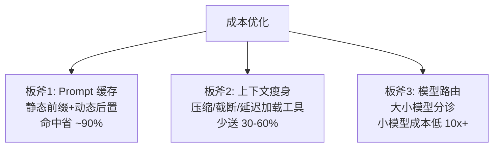

# 缓存与成本优化

> **一句话**：Agent 成本优化的三板斧：prompt 缓存（结构性省钱）、上下文瘦身（少送 token）、路由降级（按任务难度分配模型）——三板斧下来常见能省 50–80%。

## 先看结论

- Prompt caching 是 Agent 场景的最大红利：system prompt + 工具定义每轮重复，前缀命中即按更低单价计价——前提是**前缀字节级一致**
- 上下文成本大头通常是工具输出与历史，压缩与截断直接省钱（→ [记忆压缩](../06-memory-rag/memory-compression-forgetting.md)）
- 模型路由：简单步骤用小模型、关键决策用旗舰模型，混合成本大降
- 成本要「可归因」：按任务/用户/功能维度记账，才能找到优化点

## 核心机制

### 1. 成本公式与缓存的经济学

单次调用的成本是输入、输出的线性组合：

$$
\text{cost}=c_{\text{in}}\,T_{\text{in}}+c_{\text{out}}\,T_{\text{out}}
$$

其中输出单价通常显著高于输入。开启 prompt 缓存后，命中的输入部分按折扣单价计：

$$
\text{cost}'=c_{\text{in}}\Big(\frac{T_{\text{cached}}}{\alpha}+T_{\text{uncached}}\Big)+c_{\text{out}}T_{\text{out}},
\qquad \alpha\approx10
$$

**关键推论**：Agent 每轮都要重发 system prompt 与工具 schema，$$T_{\text{cached}}$$ 占比极高，因此缓存对 Agent 的收益远大于单轮聊天。但前提是前缀**字节级一致**——一个时间戳就能让整段缓存失效。

### 2. 为什么"看起来一样的 prompt"经常 miss

缓存按**前缀**匹配，因此任何混进前缀的易变内容都会导致从该点起全部失效：

$$
\text{命中长度}=\text{最长公共前缀长度}
$$

据此可以列出常见「缓存杀手」：时间戳、随机 ID、文件树、动态工具列表、拼在 system prompt 里的当前用户信息。工程规则很简单：**静态在前、动态在后**。

### 3. 路由的成本-质量权衡

按步骤难度分配模型，期望成本为：

$$
\mathbb{E}[\text{cost}]=p_{\text{fail}}\cdot C_{\text{retry}}+(1-p_{\text{fail}})\cdot C_{\text{first}}
$$

这条式子说明**不能只看单价**：小模型单价低，但失败重试会把成本与延迟都加回来。因此路由规则应基于「步骤类型 × 风险」而非「一律用便宜模型」：格式化、抽取、分类用小模型；规划、复杂工具选择、高风险动作用旗舰模型。

### 4. 总账要含全链路

$$
C_{\text{total}}=\underbrace{C_{\text{tokens}}}_{\text{模型调用}}+\underbrace{C_{\text{tools}}}_{\text{沙箱/API}}+\underbrace{C_{\text{human}}}_{\text{人工复核}}+\underbrace{C_{\text{retry}}}_{\text{重试}}
$$

只盯 token 账会漏掉沙箱算力、第三方 API 与人工成本——后两者在长任务里可能占比可观。

## 三板斧



## 路由伪代码

```python
def route(step):
    if step.type in ("format", "extract", "classify"):
        return "small-model"          # 单价低一个量级, 质量够用
    if step.risk == "high" or step.is_planning:
        return "flagship-model"       # 关键决策不省钱
    return "mid-model"
```

## 源码案例

- **Claude Code：把缓存当架构约束**（逆向分析，[架构深拆](https://gist.github.com/yanchuk/0c47dd351c2805236e44ec3935e9095d)）：system prompt 模块化注册 + 动静分离，静态 section 保证字节级稳定以命中缓存；工具 schema 延迟加载（列名字 vs 载入完整 schema）；动态清单挪到后置附件——「为缓存而架构」的开源教材
- **DeepSeek Harness 的分区组装**（[仓库](https://github.com/deepseek-ai/deepseek-harness)）：每步动态组装看似与缓存冲突，实际通过「分区组装 + 稳定前缀」兼顾——动态上下文置于前缀之后，缓存仍可命中头部区块
- **统一模型网关实践**：多模型路由 + 成本记账的开箱方案（如 LiteLLM，[GitHub](https://github.com/BerriAI/litellm)）；Anthropic 的多 Agent 系统也强调在换取质量的同时严格做成本归因

## 最佳实践

- 动态内容（时间戳、文件树）永远放 prompt 尾部，别污染缓存前缀
- 工具结果回填前先截断/摘要（常见上限几千到上万字符）
- 成本看板按「任务类型 × 模型」聚合，每周找 Top3 烧钱点
- 预算熔断：单任务超预算自动降级或中止（→ [错误处理与重试回退](error-handling-retry-fallback.md)）
- 定期校验缓存命中率：它是「架构约束是否被破坏」的探针

## 常见误区

- ❌ 缓存命中是自动的：前缀差一个字符全失效，「看似相同的 prompt」常因时间戳/随机 ID 而 miss
- ❌ 一刀切用小模型：规划、复杂工具选择上小模型的失败重试反而更贵——按步骤风险路由
- ❌ 只算 token 账：重试、人工复核、沙箱算力都是成本，总账要含全链路
- ❌ 不做成本归因：没有按任务/用户/功能的维度，优化只能靠猜
- ❌ 忽略输出 token：输出单价更高，冗长回答是最容易被忽视的成本项

## 小练习

估算你的 Agent 单任务成本：列出每步的输入/输出 token、缓存命中率假设，用上面的公式算出总额，找出最大的一个成本项并给出优化动作。

## 参考资料

- [Anthropic: Prompt caching](https://docs.anthropic.com/en/docs/build-with-claude/prompt-caching)
- [LiteLLM](https://github.com/BerriAI/litellm)（多模型路由与成本记账）
- [How we built our multi-agent research system](https://www.anthropic.com/engineering/built-multi-agent-research-system)

## 相关知识点

- [推理、量化、蒸馏与部署](../03-llm/inference-quantization-deployment.md)
- [记忆压缩、遗忘与摘要](../06-memory-rag/memory-compression-forgetting.md)
- [可观测性工具](observability-tools.md)
