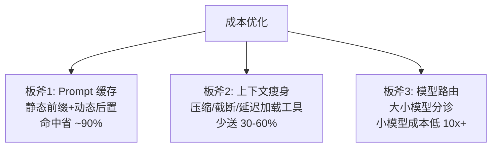

# 缓存与成本优化

> **一句话**：Agent 成本优化的三板斧：prompt 缓存（结构性省钱）、上下文瘦身（少送 token）、路由降级（按任务难度分配模型）——三板斧下来常见能省 50–80%。
> **难度**：进阶
> **标签**：`#engineering`

## 先看结论

- Prompt caching 是 Agent 场景的最大红利：system prompt + 工具定义每轮重复，前缀命中即按 ~1/10 计价——前提是**前缀字节级一致**
- 上下文成本大头通常是工具输出与历史，压缩与截断直接省钱（→ [记忆压缩](../06-memory-rag/memory-compression-forgetting.md)）
- 模型路由：简单步骤用小模型、关键决策用旗舰模型，混合成本大降
- 成本要「可归因」：按任务/用户/功能维度记账，才能找到优化点

## 三板斧



## 源码案例

- **Claude Code：把缓存当架构约束**（逆向分析，[架构深拆](https://gist.github.com/yanchuk/0c47dd351c2805236e44ec3935e9095d)）：system prompt 模块化注册 + 动静分离，静态 section 保证字节级稳定以命中缓存；工具 schema 延迟加载（50 token 名字 vs 5000 token schema）；agent listing 挪到 attachment——上下文预算意识渗透每个设计决策，这是「为缓存而架构」的最佳开源教材
- **DeepSeek Harness 的 preStep 组装**（[仓库](https://github.com/deepseek-ai/deepseek-harness)）：每步动态组装看起来与缓存冲突，实际通过「分区组装 + 稳定前缀」兼顾——动态上下文置于前缀之后，缓存仍可命中头部区块
- **统一模型网关实践**：OpenRouter/LiteLLM（[GitHub](https://github.com/BerriAI/litellm)）提供多模型路由 + 成本记账——「路由 + 记账」的开箱方案；Anthropic 工程博客的多 Agent 系统披露：其 token 消耗 15 倍于普通聊天，靠并行广度换质量的同时严格做成本归因

## 路由伪代码

```python
def route(step):
    if step.type in ("format", "extract", "classify"):
        return "small-model"          # 便宜 10 倍, 质量够用
    if step.risk == "high" or step.is_planning:
        return "flagship-model"       # 关键决策不省钱
    return "mid-model"
```

## 最佳实践

- 动态内容（时间戳、文件树）永远放 prompt 尾部，别污染缓存前缀
- 工具结果回填前先截断/摘要（30000 字符是常见上限）
- 成本看板按「任务类型 × 模型」聚合，每周找 Top3 烧钱点
- 预算熔断：单任务超预算自动降级或中止（→ [错误处理](error-handling-retry-fallback.md)）

## 常见误区

- ❌ 缓存命中是自动的：前缀差一个字符全失效，「看似相同的 prompt」常因时间戳/随机 ID 而 miss
- ❌ 一刀切用小模型：规划、复杂工具选择上小模型的失败重试反而更贵——按步骤风险路由
- ❌ 只算 token 账：重试、人工复核、沙箱算力都是成本，总账要含全链路

## 小练习

估算你的 Agent 单任务成本：列出每步的输入/输出 token、缓存命中率假设，找出最大的一个成本项并给出优化动作。

## 相关知识点

- [推理、量化、蒸馏与部署](../03-llm/inference-quantization-deployment.md)
- [记忆压缩、遗忘与摘要](../06-memory-rag/memory-compression-forgetting.md)
