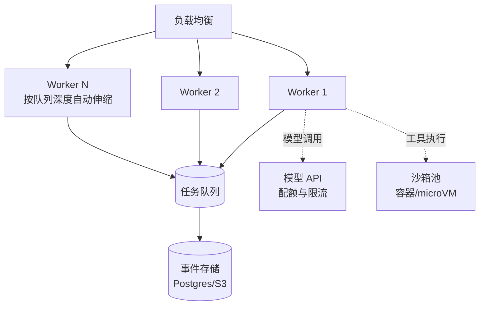

# 部署与扩缩容

> **一句话**：Agent 服务是无状态循环 + 有状态存储的组合：无状态部分水平扩，状态交给事件存储与队列——扩缩容的答案在架构分层里。
> **难度**：进阶
> **标签**：`#engineering`

## 先看结论

- Agent 运行时做成无状态 Worker：状态全在外部（事件存储/checkpoint/队列），任意实例可接任意任务
- 两个扩容维度：请求面（Worker 数量，随并发扩）与模型面（API 配额或自托管 GPU，随 token 吞吐扩）
- 慢是常态：Agent 任务秒级到分钟级，架构按异步任务系统设计（队列 + 回调/SSE），不是同步 API
- 隔离优先：多租户共享 Worker 时，工具沙箱与数据访问按租户硬隔离

## 扩缩容视图

## 源码案例

- **DeepSeek Harness 的多模式部署**（[仓库](https://github.com/deepseek-ai/deepseek-harness)）：`npx @deepseek-ai/dsh web` 一键起本地全栈；同一内核 Headless 模式服务端部署——开发态与生产态共享运行时，Surface 层按场景替换
- **Claude Code 的多实例并发**（[官方文档](https://docs.anthropic.com/en/docs/claude-code)）：git worktree 隔离支持同仓库多 Agent 并行——「扩容」不只是服务实例，还包括**工作区隔离**这种 Agent 特有维度
- **Serverless 注意点**：Agent 长任务（>15 分钟）不适合 FaaS 默认超时；要么拆步（每步一个 invocation + checkpoint 续跑），要么用常驻 Worker

## 生产清单

- [ ] Worker 无状态化，扩容只看队列深度（KEDA/HPA）
- [ ] 模型调用走统一网关：配额、限流、路由、降级集中管（→ [缓存与成本优化](caching-cost-optimization.md)）
- [ ] 沙箱池预热与回收：冷启动是延迟大头
- [ ] 按租户的 token/并发配额，超限排队而非拒绝
- [ ] 灾备：事件存储备份 + 任务可重放

## 常见误区

- ❌ Agent 状态存内存（单例/本地缓存）：无法水平扩，实例重启全丢——状态外置是第一铁律
- ❌ 只扩 Worker 不看模型配额：瓶颈常在 API 限流，Worker 加再多只会在 429 上排队
- ❌ 忽略数据面扩容：向量库/事件存储在 Agent 火爆后先倒下，容量规划要包含它们

## 小练习

你的 Agent 从 10 用户涨到 1000 用户：列出最先崩溃的三个组件、各自的扩容方案与触发阈值。

## 相关知识点

- [Agent 工作流编排](workflow-orchestration.md)
- [状态机与事件驱动](state-machine-event-driven.md)
