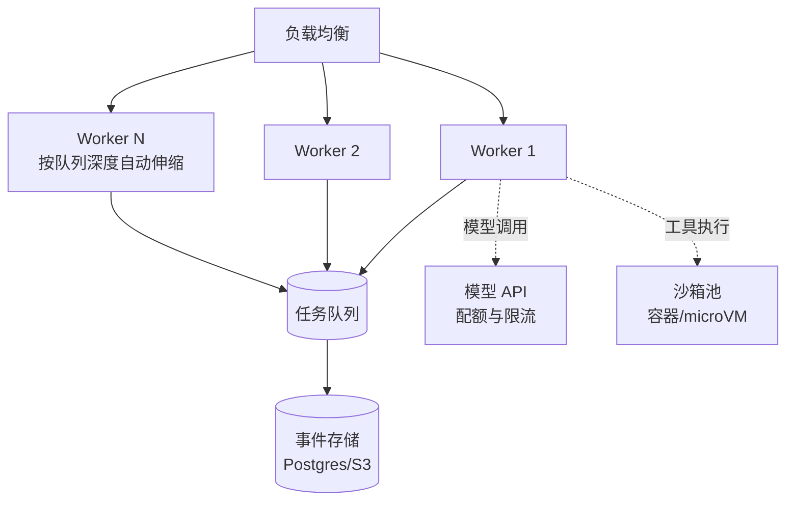

# 部署与扩缩容

> **一句话**：Agent 服务是「无状态循环 + 有状态存储」的组合：无状态部分水平扩，状态交给事件存储与队列——扩缩容的答案在架构分层里。

## 先看结论

- Agent 运行时做成无状态 Worker：状态全在外部（事件存储/checkpoint/队列），任意实例可接任意任务
- 两个扩容维度：请求面（Worker 数量，随并发扩）与模型面（API 配额或自托管 GPU，随 token 吞吐扩）
- 慢是常态：Agent 任务秒级到分钟级，架构按异步任务系统设计（队列 + 回调/SSE），不是同步 API
- **瓶颈几乎总在模型配额或数据面**，不在 Worker 数量
- 隔离优先：多租户共享 Worker 时，工具沙箱与数据访问按租户硬隔离

## 核心机制：算清楚需要几个 Worker

排队论里最实用的一条是 Little 定律——系统内平均任务数等于到达率乘以平均停留时间：

$$
L=\lambda W
$$

- $$\lambda$$：到达率（任务/秒）
- $$W$$：单个任务平均处理时长（秒）
- $$L$$：需要同时处理的任务数

于是并发 Worker 数的下界是：

$$
N\;\ge\;\frac{\lambda\,W}{u}
$$

$$u$$ 是目标利用率（留出余量，如 0.7）。举例：$$\lambda=2$$ 任务/秒、$$W=60$$ 秒（Agent 任务常见的分钟级）、$$u=0.7$$，则

$$
N\ge\frac{2\times 60}{0.7}\approx172
$$

**注意 $$W$$ 由模型延迟主导**：Agent 任务的 $$W$$ 里，绝大部分时间是等模型与工具，而不是本地 CPU。这带来两个结论：一是 Worker 可以很轻（几核跑几十并发，因为大部分时间在等待 I/O），二是**真正的瓶颈通常是模型侧的配额**。

## 两个扩容维度与瓶颈判定

| 维度 | 资源 | 扩容手段 | 典型瓶颈信号 |
|---|---|---|---|
| 请求面 | Worker/CPU | 按队列深度自动伸缩（KEDA/HPA） | 队列积压、任务排队时间上升 |
| 模型面 | API 配额 / GPU | 提配额、多 Key 路由、自托管扩 GPU | 429 限流、模型调用 P95 上升 |
| 工具面 | 沙箱池 | 预热池 + 回收 | 沙箱冷启动延迟 |
| 数据面 | 向量库/事件存储 | 只读副本、分区 | 检索延迟、写入积压 |

排查顺序应该是：**先看模型配额，再看数据面，最后看 Worker**。只加 Worker 而不看配额，结果是更多请求在 429 上排队。

## 扩缩容视图

## 为什么必须异步

Agent 任务耗时是秒到分钟级，而 HTTP 同步请求的超时通常在几十秒。同步等待会带来两个问题：连接被长期占用（连接数成为新瓶颈），以及**用户关页面 = 任务白跑**。正确形态是异步任务系统：

$$
\text{提交}\to\text{返回 task\_id}\;\;;\qquad
\text{进度}\to\text{轮询 / SSE}\;\;;\qquad
\text{完成}\to\text{webhook / 推送}
$$

这与 [工作流编排](workflow-orchestration.md) 的「持久化执行」是同一套基础设施。

## 源码案例

- **DeepSeek Harness 的多模式部署**（[仓库](https://github.com/deepseek-ai/deepseek-harness)）：一键起本地全栈；同一内核提供 Headless 模式做服务端部署——开发态与生产态共享运行时，接入面（Surface 层）按场景替换
- **Claude Code 的多实例并发**（[官方文档](https://docs.anthropic.com/en/docs/claude-code)）：git worktree 隔离支持同仓库多 Agent 并行——「扩容」不只是服务实例，还包括**工作区隔离**这种 Agent 特有维度
- **Serverless 注意点**：Agent 长任务（>15 分钟）不适合 FaaS 默认超时；要么拆步（每步一个 invocation + checkpoint 续跑），要么用常驻 Worker

## 生产清单

- [ ] Worker 无状态化，扩容只看队列深度（KEDA/HPA）
- [ ] 模型调用走统一网关：配额、限流、路由、降级集中管（→ [缓存与成本优化](caching-cost-optimization.md)）
- [ ] 沙箱池预热与回收：冷启动是延迟大头
- [ ] 按租户的 token/并发配额，超限排队而非拒绝
- [ ] 灾备：事件存储备份 + 任务可重放
- [ ] 容量规划包含数据面（向量库/事件存储往往先倒）

## 常见误区

- ❌ Agent 状态存内存（单例/本地缓存）：无法水平扩，实例重启全丢——状态外置是第一铁律
- ❌ 只扩 Worker 不看模型配额：瓶颈常在 API 限流，Worker 加再多只会在 429 上排队
- ❌ 忽略数据面扩容：向量库/事件存储在 Agent 火爆后先倒下，容量规划要包含它们
- ❌ 用同步 HTTP 承载长任务：用户关页面即任务死，必须队列化
- ❌ 不给沙箱池预热：冷启动延迟会直接体现在 P95 上

## 小练习

你的 Agent 从 10 用户涨到 1000 用户：用 Little 定律估算所需并发 Worker 数（假设每任务 90 秒、峰值 3 任务/秒），列出最先崩溃的三个组件、各自的扩容方案与触发阈值。

## 参考资料

- [Google SRE Book: Handling Overload](https://sre.google/sre-book/handling-overload/)（过载与降级）
- [KEDA 文档](https://keda.sh/docs/)（按队列深度自动伸缩）
- [DeepSeek Harness](https://github.com/deepseek-ai/deepseek-harness)

## 相关知识点

- [Agent 工作流编排](workflow-orchestration.md)
- [状态机与事件驱动](state-machine-event-driven.md)
- [缓存与成本优化](caching-cost-optimization.md)
