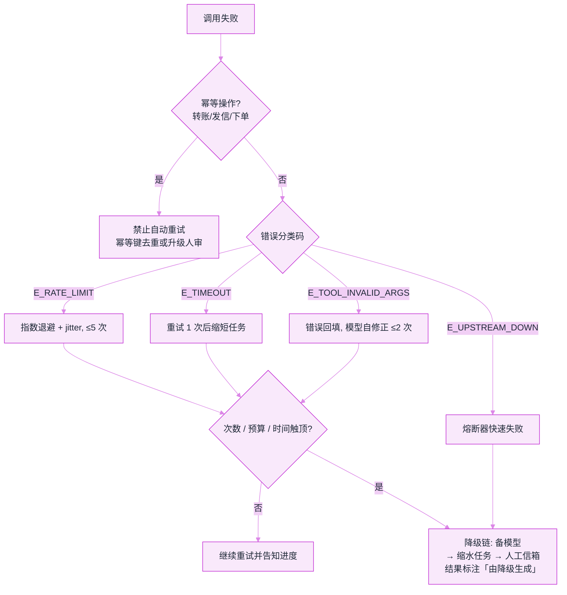
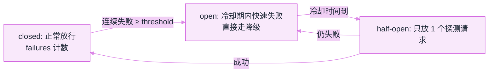

# 错误处理、重试与降级


**一句话**：策略层讲「为什么」（见规划章），工程层讲「怎么落地」：错误分类体系、重试参数表、降级链设计与兜底 UX。
  **难度**：进阶


> 错误类型学与恢复决策见 [错误恢复与重试](../07-planning/error-recovery-retry.md)。本页聚焦**工程实现**。

## 先看结论

- 错误要有分类码体系：`E_TIMEOUT` / `E_RATE_LIMIT` / `E_TOOL_INVALID_ARGS` / `E_MODEL_REFUSED`…按类路由处理策略
- 重试参数按类配置，不搞全局一刀切（见下表）
- 降级链：主模型 → 备模型 → 缩水任务（少步骤/少工具）→ 人工信箱——每一级都明确触发条件
- 对用户透明：「正在重试第 2/3 次」比静默卡死体验好一个数量级

## 错误分类与处理参数表

| 错误类 | 策略 | 重试 | 退避 | 兜底 |
|---|---|---|---|---|
| 限流 429 | 指数退避重试 | 5 次 | 2^n+jitter | 换模型/排队 |
| 超时 | 重试 1 次 → 降级 | 2 次 | 线性 | 缩短任务 |
| 参数校验失败 | 回填模型自修正 | 模型侧 2 次 | - | 人审 |
| 工具上游故障 | 熔断 + 降级工具 | 1 次 | - | 跳过该能力并说明 |
| 模型拒绝 | 换措辞 1 次 → 上报 | 1 次 | - | 人工处理 |
| 上下文溢出 | 压缩后重试 | 1 次 | - | 分段处理 |

把上表落成可执行的路由：**先判幂等，再判分类码，最后才决定重试还是降级**。



## 熔断器模式

一台熔断器只有一个状态机加三个数字：**连续失败阈值 `threshold=5`**、**冷却时长 `cooldown=60` 秒**、**半开态放行数 `half_open_probe=1`**。每次调用先读时钟：当前时间早于 `open_until` 就直接抛 `CircuitOpen`，连上游都不去碰——快速失败的全部意义就是把这段时间留给降级链，而不是让一堆请求在故障上游前排队送死。真的放出去的调用，成功就把 `failures` 归零、状态回到 closed；抛 `UpstreamError` 才计数，数到 5 就把 `open_until` 推到 `now + 60`。

哪些错误算「上游死了」，是这套机器里唯一需要人拍板的地方：

```json
{
  "circuit_breaker": {
    "threshold": 5,
    "cooldown_s": 60,
    "half_open_probe": 1,
    "counts_as_failure": ["E_UPSTREAM_DOWN"],
    "does_not_count": ["E_RATE_LIMIT", "E_TOOL_INVALID_ARGS", "E_MODEL_REFUSED", "E_CONTEXT_OVERFLOW"],
    "on_open": "抛 CircuitOpen，直接进降级链，不在本层排队",
    "state": "closed | open | half-open"
  },
  "retry_policy": {
    "E_RATE_LIMIT":        { "max_retries": 5, "backoff": "2^n + jitter",  "fallback": "换模型 / 排队" },
    "E_TIMEOUT":           { "max_retries": 2, "backoff": "linear",        "fallback": "缩短任务" },
    "E_TOOL_INVALID_ARGS": { "max_retries": 2, "retry_side": "model",      "backoff": "none", "fallback": "人审" },
    "E_UPSTREAM_DOWN":     { "max_retries": 1, "breaker": true,            "fallback": "跳过该能力并说明" },
    "E_MODEL_REFUSED":     { "max_retries": 1, "transform": "换措辞",       "fallback": "人工处理" },
    "E_CONTEXT_OVERFLOW":  { "max_retries": 1, "transform": "压缩上下文",    "fallback": "分段处理" }
  },
  "retry_budget": {
    "retry_ratio_max": 0.1,
    "accounting": "per-client token bucket",
    "ceilings": ["max_retries", "max_cost", "deadline"],
    "auto_retry_non_idempotent": false
  }
}
```

`does_not_count` 这一行最容易写错。**429 是上游在礼貌地让你慢下来，不是它死了**：把限流计入熔断失败，一次区域性配额打满就会误开整条链路的闸，把「等一会就好」升级成「这条路 60 秒内彻底不走」。参数校验失败与模型拒绝更是自家问题——连续五次「模型把日期写成字符串」不该让某个支付网关进入熔断态，那只会让你看不见它真的挂了。冷却 60 秒也不是随手取的整数：它的量级来自上游 SLA 里你能容忍的不可用时长，而且必须配 `half_open_probe=1` 才成立——半开时一次放进十个请求，等于在故障没痊愈时自己再造一次重试风暴。

三态迁移（上面那份配置只声明了阈值和时钟，恢复这件事全靠 half-open 撑起来）：



## 分步演示：一次 `E_RATE_LIMIT` 从报错走到降级落地




#### 第 1 步：先问这件事能不能重做

判序不能反过来：第一步只看**幂等性**。转账、发信、下单这类带外部副作用的动作，重复执行等于重复扣款，配置里那条 `auto_retry_non_idempotent: false` 就是为它准备的——要么带幂等键（`run_id + step_id`）让上游去重，要么直接升级人审。这一关没过，后面所有参数都只在放大事故。




#### 第 2 步：归类，拿到六个分类码之一

错误信号来自三处：HTTP 状态（429 / 5xx）、异常类型（超时、连接失败）、上游报文里自带的 `error.code`。把它们收敛成 `E_RATE_LIMIT` / `E_TIMEOUT` / `E_TOOL_INVALID_ARGS` / `E_UPSTREAM_DOWN` / `E_MODEL_REFUSED` / `E_CONTEXT_OVERFLOW` 中的一个，再按 `retry_policy` 查这张表。**分错类的代价不是慢，是走错分支**：把参数错误归到「瞬时」，就会拿着同一份脏参数重试五次。




#### 第 3 步：按类退避，等待时间交给抖动

`E_RATE_LIMIT` 走 `2^n + jitter`、上限 5 次；`E_TIMEOUT` 走线性等待、只给 2 次；`E_TOOL_INVALID_ARGS` **不等待**，直接把校验错误原文回填给模型，模型侧最多改 2 次。full jitter 的写法是 `t_n = rand(0, min(t_max, t_0 · 2^(n-1)))`——不加抖动，同一批失败的客户端会在同一时刻齐步回来，把刚喘过气的下游再打倒一次。




#### 第 4 步：撞预算闸，三条天花板任一触顶就停

次数之外还有成本与时间：`ceilings` 里的 `max_cost` 和 `deadline` 任一先到，重试立刻停止并转入降级链。全局再看一眼重试比：`retry_ratio_max = 0.1`，**按调用方各记一个令牌桶**——共享一个桶时，一个坏客户端能把所有人的重试预算烧光，这是局部故障放大成全局雪崩的标准路径。




#### 第 5 步：把进度说出来，并把自愈记进统计

对用户透明不是礼貌问题：「正在重试第 2/3 次」和静默转圈的区别，就是工单和事故的区别。内部记账同步做——自愈成功的重试**不告警但入统计**，只有真正影响任务完成的错误才升 P1。统计里最值得盯的是每类错误的重试率与最终成功率，它是下一轮调 `max_retries` 的唯一依据。




#### 第 6 步：进降级链，并在结果上留标记

顺序固定：主模型 → 备模型 → 缩水任务（少步骤、少工具）→ 人工信箱，每一级都要写清触发条件。落到哪一级都必须在结果里标注「本回答由降级模型生成」——降级不是异常，是一条**有痕迹的正常路径**，用户拿降级输出当正常结果做决策，才是事故放大的地方。



## 四种结局，四条分支（点标签切换）

同一份错误报文，判据不同就走成四条完全不同的路。四个标签对应四种收场。



`E_RATE_LIMIT` / `E_TIMEOUT`，幂等性已确认。按表执行：429 最多 5 次、退避 `2^n + jitter`；超时最多 2 次、线性等待，用完就转「缩短任务」。把 `max_retries` 从 5 调到 3 看着像省钱，实际是把恢复窗口内的请求更早推向降级——用户拿到的答案质量下降是隐形的，多花的 token 是显形的，两边要一起算。反过来给到 8 次也救不了真正的故障，只是让 P95 延迟翻倍。



非幂等动作（下单、退款、发信）在任何错误码下都**不进自动重试**。带幂等键时上游会去重，同一个 `run_id + step_id` 重发只结算一次，此时重试才安全；没带键就直接停手、升级人审。这条分支的判断成本极低（一次字符串比较），漏掉它的代价却是一笔真实的重复扣款——把幂等判断放在分类码之前，是本页唯一不许调换顺序的一步。



`E_TOOL_INVALID_ARGS` 走完模型侧 2 次自修正仍失败，或工具风险级是 `high`（退款、删数据、对外发信），闸门就不该再让模型自己拍。交给人看的是这次调用的 `name` + 完整 `input` + 已试过的两次错误原文，而不是「Agent 说它需要帮助」。人工批准即数据分支：批准继续执行，驳回就回填一条拒绝原因，模型能据此提别的方案。



次数 / 成本 / deadline 任一触顶，或熔断器处于 open（`threshold=5` 已把 `open_until` 推到 60 秒后）。此时继续重试只是把预算烧在同一条死路上：换备模型 → 仍不行就缩水任务（砍步骤、砍工具面）→ 最后进人工信箱，并给结果打「由降级生成」标记、上报 P1。`E_MODEL_REFUSED` 的措辞改写只有 1 次预算，1 次就归入这条分支，别把它当瞬时错误反复试探安全策略。




**三个数字要一起调**：`threshold=5` 与 `cooldown=60` 决定熔断灵敏度，`retry_ratio_max=0.1` 决定会不会引发重试风暴。它们互为代价——阈值调低（更快熔断）通常要把冷却时间也调短，否则一次抖动就把能力下线一整分钟；重试比一旦超过 10%，退避省下来的时间会被上游排队全数还回来。


## 源码案例

- **DeepSeek Harness 的超时与取消**（[仓库](https://github.com/deepseek-ai/deepseek-harness)）：工具执行流水线内置超时控制；取消语义贯穿事件流（取消中的 driver 收敛后再处理新输入）——「取消也是一种错误路径」的完整工程化
- **SWE-agent 的错误驱动修正**（[GitHub](https://github.com/SWE-agent/SWE-agent)）：其 ACI 设计证明「错误信息的呈现质量」直接决定自我修正成功率——工程层要把上游错误翻译成模型可读的行动建议
- **LangGraph 的边界与 fallback**：节点级 retry policy + 条件边路由到降级节点——图编排下「降级」是显式的一等路径而非 try/except 补丁

## 最佳实践

- 错误分级告警：影响任务完成的错误 P1 告警、自愈成功的不告警但入统计
- 每个降级动作留审计标记：结果里注明「本回答由降级模型生成」
- 混沌测试：定期人为注入 429/超时/工具故障，验证降级链真的工作

## 核心机制：退避与重试预算的量化

瞬时错误的标准处理是**指数退避 + 抖动**，等待时间按指数增长并加随机量，避免大量客户端同步重试：

$$
t_n=\operatorname{rand}\!\Big(0,\;\min\big(t_{\max},\;t_0\cdot 2^{\,n-1}\big)\Big)
$$

- $$t_0$$：基准延迟，$$t_{\max}$$：上限，$$\operatorname{rand}(0,\cdot)$$：full jitter
- 不加抖动时，失败的下游会在同一时刻被再次打满——这是「重试风暴」的成因

重试的**单次天花板**（次数 / 成本 / 时间三条件）属于 Agent 循环层的判据，正式写法与「重试次数是剩余时限的函数」这条推导见[错误恢复与重试策略](../07-planning/error-recovery-retry.md)。服务侧要在它之上再加一条自己的约束：**重试预算全局受限**，否则局部故障会被重试放大成全局雪崩。

设正常请求到达率 $$\lambda$$、每请求平均重试 $$r$$ 次，下游实际承受的是

$$
\lambda_{\text{eff}}=\lambda\,(1+r)
$$

故障期间若一成份额的请求各自打满 $$N_{\max}$$ 次重试，恢复瞬间的负载可达正常值的数倍——这才是「重试风暴」在容量层面的形态，也是工业实践把重试比压在 **10%**（$$r\le 0.1$$）的原因：超过这个数，退避省下的时间会被排队全数还回来。预算必须**按调用方记账**（每个 client 一个令牌桶），全局共享一个桶会让一个坏客户端饿死其余所有人。

最后一条容易被忽略的分类：**非幂等操作绝不能自动重试**。转账、发信、下单这类动作重复执行等于重复副作用，必须靠幂等键去重，或直接升级为人审。判断顺序是「先判是否幂等，再判是否瞬时错误，最后才决定重试」——把幂等判断放在最前面，能挡掉最危险的一类事故。

## 常见误区

- ❌ try/except 一把抓：所有错误一个处理路径 = 限流把重试预算烧光、参数错永远重试
- ❌ 降级不告知：用户拿着降级输出当正常结果做决策，事故放大
- ❌ 熔断阈值拍脑袋：基于上游 SLA 与流量算（如容忍 5 秒不可用），并有恢复探测

## 小练习

画出你的 Agent 的完整降级链（每级的触发条件与用户话术），找出「现在完全没有兜底」的一个环节并补上。

## 参考资料

- [AWS Builders Library：超时、重试与带抖动的退避](https://builder.aws.com/content/3EumjoZascWd1oZiEgL8ORlv3qE/timeouts-retries-and-backoff-with-jitter)
- [Google SRE Book：Handling Overload（过载与重试风暴的处置）](https://sre.google/sre-book/handling-overload)
- [tenacity（Python 重试策略的事实标准库）](https://github.com/jd/tenacity)
- [SWE-agent（把失败轨迹回灌进下一步的重试设计）](https://github.com/SWE-agent/SWE-agent)

## 相关知识点

- [错误恢复与重试](../07-planning/error-recovery-retry.md)
- [Agent 工作流编排](workflow-orchestration.md)

