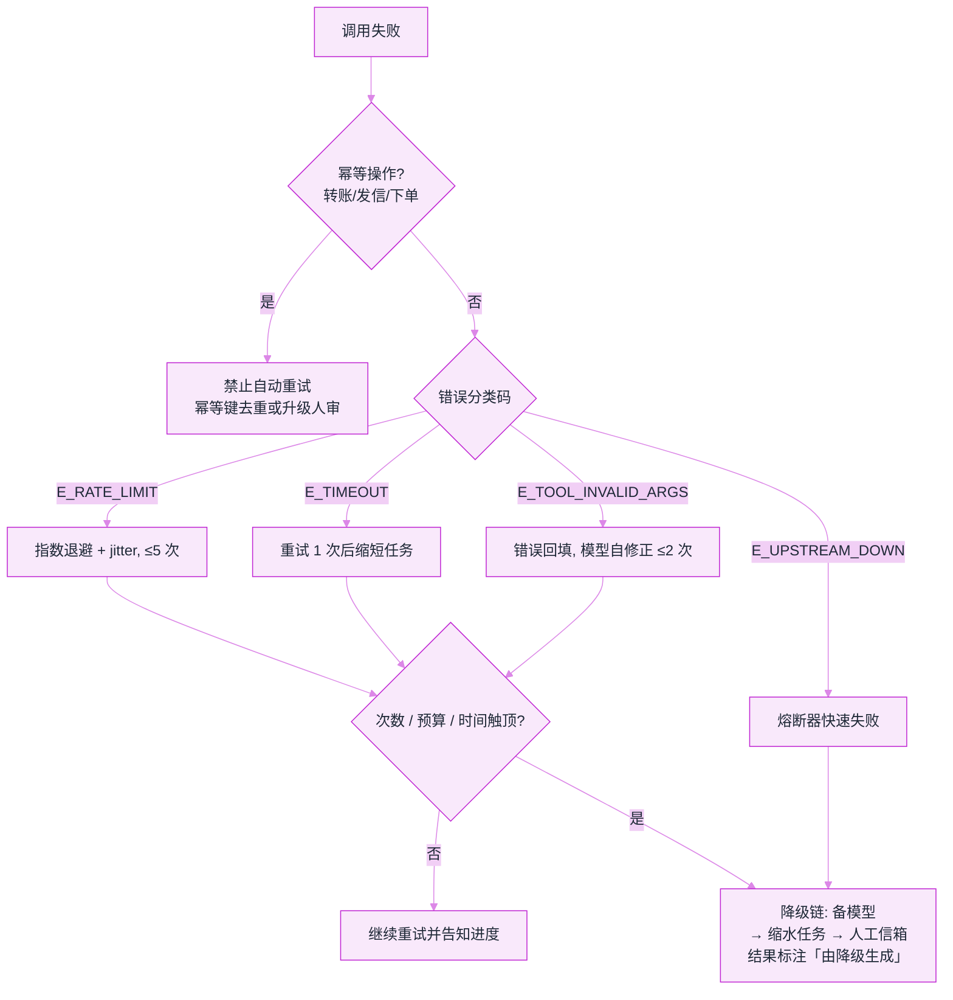
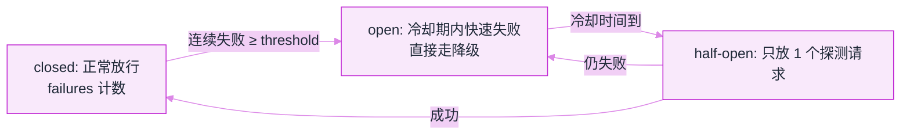

# 错误处理、重试与降级


**一句话**：策略层讲「为什么」（见规划章），工程层讲「怎么落地」：错误分类体系、重试参数表、降级链设计与兜底 UX。
  **难度**：进阶


> 错误类型学与恢复决策见 [错误恢复与重试](../07-planning/error-recovery-retry.md)。本页聚焦**工程实现**。

## 先看结论

- 错误要有分类码体系：`E_TIMEOUT` / `E_RATE_LIMIT` / `E_TOOL_INVALID_ARGS` / `E_MODEL_REFUSED`…按类路由处理策略
- 重试参数按类配置，不搞全局一刀切（见下表）
- 降级链：主模型 → 备模型 → 缩水任务（少步骤/少工具）→ 人工信箱——每一级都明确触发条件
- 对用户透明：「正在重试第 2/3 次」比静默卡死体验好一个数量级

## 错误分类与处理参数表

| 错误类 | 策略 | 重试 | 退避 | 兜底 |
|---|---|---|---|---|
| 限流 429 | 指数退避重试 | 5 次 | 2^n+jitter | 换模型/排队 |
| 超时 | 重试 1 次 → 降级 | 2 次 | 线性 | 缩短任务 |
| 参数校验失败 | 回填模型自修正 | 模型侧 2 次 | - | 人审 |
| 工具上游故障 | 熔断 + 降级工具 | 1 次 | - | 跳过该能力并说明 |
| 模型拒绝 | 换措辞 1 次 → 上报 | 1 次 | - | 人工处理 |
| 上下文溢出 | 压缩后重试 | 1 次 | - | 分段处理 |

把上表落成可执行的路由：**先判幂等，再判分类码，最后才决定重试还是降级**。



## 熔断器模式

```python
class CircuitBreaker:
    def __init__(self, threshold=5, cooldown=60):
        self.failures, self.open_until = 0, 0
    async def call(self, fn, *a, **kw):
        if time.time() < self.open_until:
            raise CircuitOpen()          # 快速失败, 触发降级
        try:
            r = await fn(*a, **kw)
            self.failures = 0
            return r
        except UpstreamError:
            self.failures += 1
            if self.failures >= self.threshold:
                self.open_until = time.time() + self.cooldown
            raise
```

三态迁移（上面的实现只写了 closed/open 两态，half-open 是恢复探测的关键补齐）：



## 源码案例

- **DeepSeek Harness 的超时与取消**（[仓库](https://github.com/deepseek-ai/deepseek-harness)）：工具执行流水线内置超时控制；取消语义贯穿事件流（取消中的 driver 收敛后再处理新输入）——「取消也是一种错误路径」的完整工程化
- **SWE-agent 的错误驱动修正**（[GitHub](https://github.com/SWE-agent/SWE-agent)）：其 ACI 设计证明「错误信息的呈现质量」直接决定自我修正成功率——工程层要把上游错误翻译成模型可读的行动建议
- **LangGraph 的边界与 fallback**：节点级 retry policy + 条件边路由到降级节点——图编排下「降级」是显式的一等路径而非 try/except 补丁

## 最佳实践

- 错误分级告警：影响任务完成的错误 P1 告警、自愈成功的不告警但入统计
- 每个降级动作留审计标记：结果里注明「本回答由降级模型生成」
- 混沌测试：定期人为注入 429/超时/工具故障，验证降级链真的工作

## 核心机制：退避与重试预算的量化

瞬时错误的标准处理是**指数退避 + 抖动**，等待时间按指数增长并加随机量，避免大量客户端同步重试：

$$
t_n=\operatorname{rand}\!\Big(0,\;\min\big(t_{\max},\;t_0\cdot 2^{\,n-1}\big)\Big)
$$

- $$t_0$$：基准延迟，$$t_{\max}$$：上限，$$\operatorname{rand}(0,\cdot)$$：full jitter
- 不加抖动时，失败的下游会在同一时刻被再次打满——这是「重试风暴」的成因

重试必须有**三重天花板**，缺一就会无限循环：

$$
\text{停止}\iff
\underbrace{n>N_{\max}}_{\text{次数}}\;\vee\;
\underbrace{\text{tokens}>\text{Budget}}_{\text{成本}}\;\vee\;
\underbrace{\text{elapsed}>T_{\max}}_{\text{时间}}
$$

此外推荐叠加**重试预算**：每个请求可用的重试次数全局受限（如「重试请求数 ≤ 正常请求数的 10%」），防止局部故障通过重试放大成全局雪崩。

最后一条容易被忽略的分类：**非幂等操作绝不能自动重试**。转账、发信、下单这类动作重复执行等于重复副作用，必须靠幂等键去重，或直接升级为人审。判断顺序是「先判是否幂等，再判是否瞬时错误，最后才决定重试」——把幂等判断放在最前面，能挡掉最危险的一类事故。

## 常见误区

- ❌ try/except 一把抓：所有错误一个处理路径 = 限流把重试预算烧光、参数错永远重试
- ❌ 降级不告知：用户拿着降级输出当正常结果做决策，事故放大
- ❌ 熔断阈值拍脑袋：基于上游 SLA 与流量算（如容忍 5 秒不可用），并有恢复探测

## 小练习

画出你的 Agent 的完整降级链（每级的触发条件与用户话术），找出「现在完全没有兜底」的一个环节并补上。

## 参考资料

- [AWS Builders Library：超时、重试与带抖动的退避](https://aws.amazon.com/builders-library/timeouts-retries-and-backoff-with-jitter/)
- [Google SRE Book：Handling Overload（过载与重试风暴的处置）](https://sre.google/sre-book/handling-overload)
- [tenacity（Python 重试策略的事实标准库）](https://github.com/jd/tenacity)
- [SWE-agent（把失败轨迹回灌进下一步的重试设计）](https://github.com/SWE-agent/SWE-agent)

## 相关知识点

- [错误恢复与重试](../07-planning/error-recovery-retry.md)
- [Agent 工作流编排](workflow-orchestration.md)

