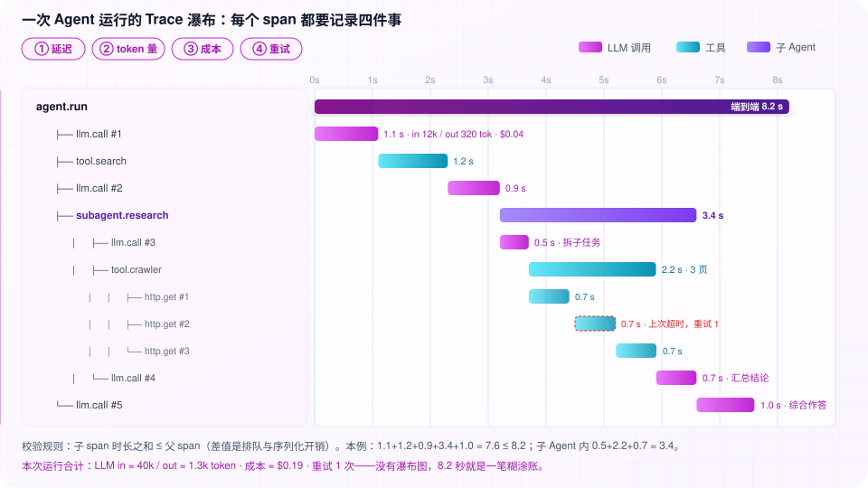
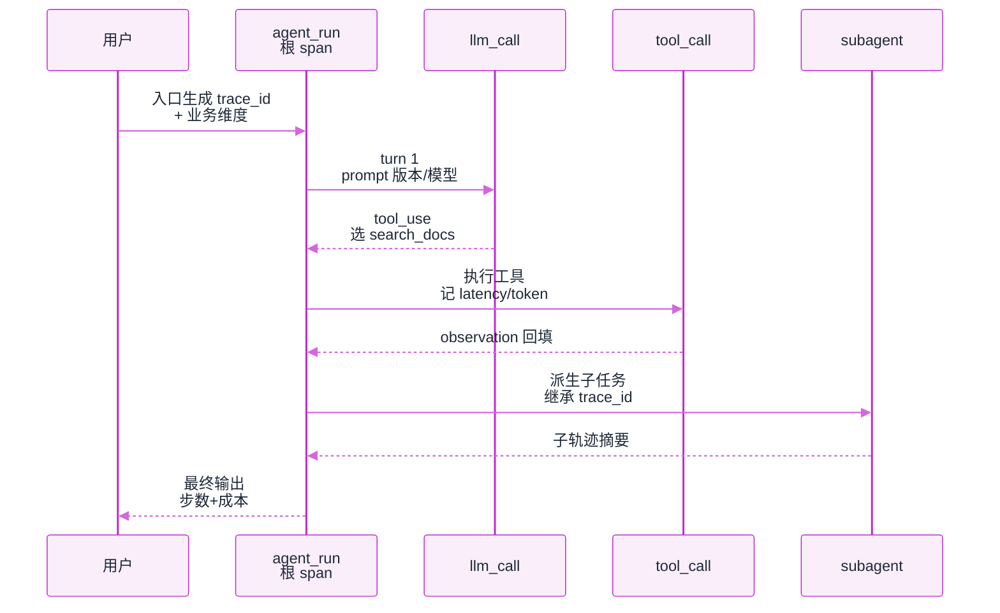
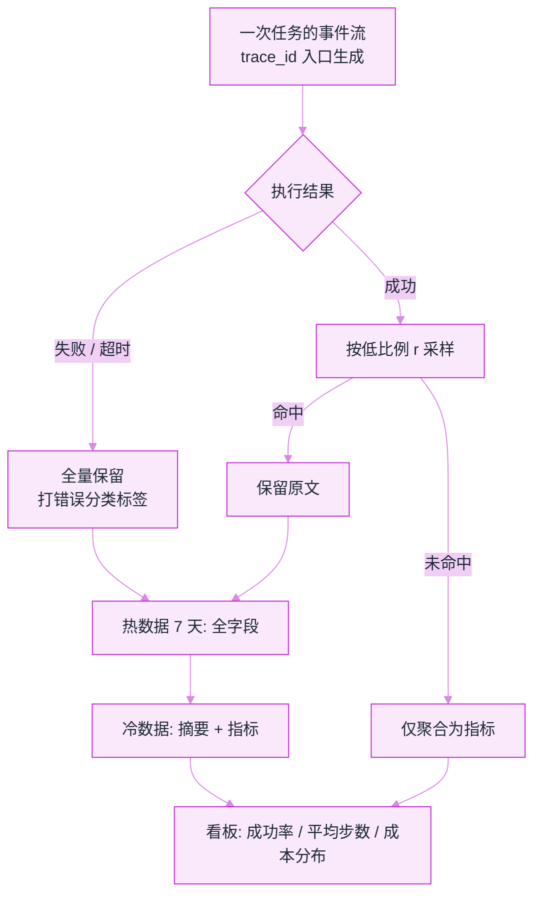
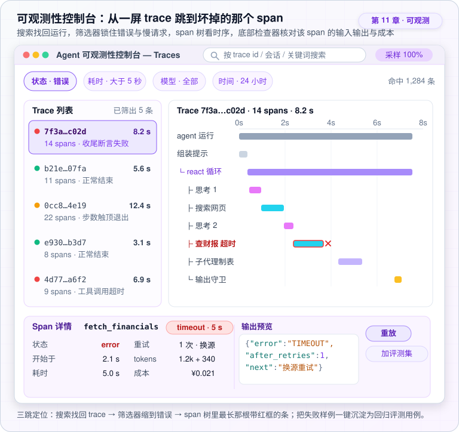
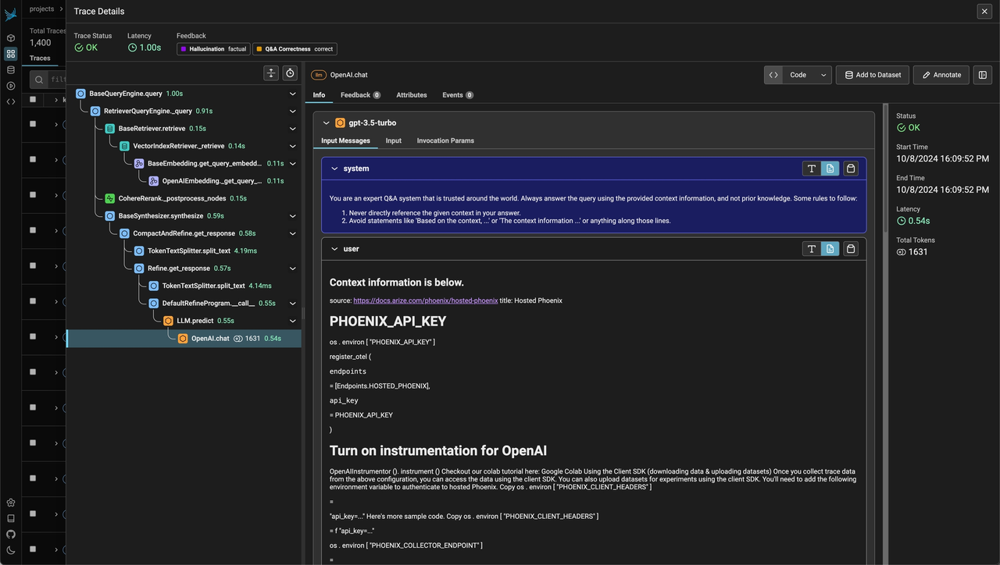

# 日志、追踪与监控


**一句话**：Agent 可观测三件套：结构化日志（发生了什么）、分布式追踪（一次任务的完整链路）、业务监控（成功率和成本曲线）——没有它们，线上问题等于盲猜。




*《图：瀑布上每个 span 都强制带同样四件事——延迟、token、成本、重试；缺任何一项，这次运行就无法与上次比较》*
## 先看结论

- Agent 的追踪单位是「一次任务运行」：从用户输入到最终输出的完整轨迹（含每步 prompt、工具调用、token 消耗）
- 事件流架构让日志与 trace 合二为一：会话事件日志本身就是可回放的 trace
- 监控要有 Agent 特有指标：任务成功率、平均步数、工具错误率、注入拦截数、单任务成本分布
- **告警要盯业务指标**，不是只盯 CPU 与延迟
- PII 进日志前脱敏；trace 保留期限与采样率要定义（全量存成本极高）

## 核心机制

### 1. 三件套的分工

$$
\underbrace{\text{日志}}_{\text{点：某一步}}\;
+\;
\underbrace{\text{追踪}}_{\text{线：一次任务}}\;
+\;
\underbrace{\text{指标}}_{\text{面：整体趋势}}
$$

| 组件 | 回答的问题 | 落地 |
|---|---|---|
| 日志 | 某一步发生了什么 | 结构化 JSON 事件流 |
| 追踪 | 一次任务全链路 | trace_id 贯穿 + span 层级 |
| 监控 | 系统整体健康 | 指标看板 + 告警 |

三者缺一不可：只有日志则无法还原链路；只有 trace 则无法做长期趋势；只有指标则无法定位单次故障根因。

一次任务在 span 层级上长这样（trace_id 贯穿，父子关系即嵌套）：



### 2. 用「四个黄金信号」组织指标

Google SRE 提出的四类信号，对 Agent 同样适用，只是含义需要改写：

| 信号 | 传统含义 | Agent 含义 |
|---|---|---|
| 延迟 Latency | 请求耗时 | 首 token 延迟 + 任务总时长（P50/P95） |
| 流量 Traffic | QPS | 任务数、模型调用数、工具调用数 |
| 错误 Errors | 5xx 比例 | 任务失败率、工具错误率、拒答率 |
| 饱和度 Saturation | 资源占用 | 模型配额占用、队列深度、沙箱池占用 |

**Agent 特有的补充指标**：平均步数（效率）、单任务 token 成本分布（成本）、注入拦截数（安全）。其中「平均步数上升」通常是最早的退化信号——任务还在成功，但开始绕路。

### 3. 采样与保留策略

trace 体量远大于普通服务（每次含完整 prompt 与工具输出），必须分层保留：

$$
\text{保留成本}\;\propto\;\text{总量}\times r\times\overline{|\text{trace}|}
$$

推荐策略：**失败与超时 trace 全量保留**（诊断价值最高），成功请求按低比例采样；并按时间分层——热数据（近 7 天）全字段，冷数据（更早）只留摘要与指标。



### 4. 告警分层

$$
\underbrace{\text{可用性}}_{\text{服务是否活着}}\;
\longrightarrow\;
\underbrace{\text{质量}}_{\text{成功率/引用忠实度}}\;
\longrightarrow\;
\underbrace{\text{成本}}_{\text{日 token 超预算}}
$$

**只监控技术指标是常见错误**：任务成功率下跌 5% 远比延迟抖动 200ms 重要，因为前者直接意味着业务受损。

## 结构化事件示例

```json
{
  "ts": "2026-09-10T09:30:21Z",
  "trace_id": "task-8f3a",
  "span": "tool_call",
  "agent": "worker-2",
  "tool": "search_docs",
  "args": {"q": "退款政策"},
  "latency_ms": 412,
  "tokens": {"in": 1830, "out": 240},
  "status": "ok"
}
```

## 源码案例

- **DeepSeek Harness：trace 即架构**（[仓库](https://github.com/deepseek-ai/deepseek-harness)）：每个事件带序号与来源（模型/工具/子 Agent/注入），可按来源过滤——「排查一次失败」= 在事件流上按时间轴重放，无需额外 trace 系统
- **Claude Code 的可观测细节**（逆向分析）：请求级 token 统计与预算提醒直接进上下文告知模型——「可观测」甚至喂给 Agent 自己做预算决策；同时支持导出到企业观测栈
- **LangFuse 的会话视图**（[GitHub](https://github.com/langfuse/langfuse)）：trace 按会话聚合、每步显示 prompt 版本与评分——把「评估」纳入观测闭环
- **OpenTelemetry GenAI 语义约定**（[OTel 文档](https://opentelemetry.io/docs/specs/semconv/gen-ai/)）：正在形成的 LLM 追踪标准，选工具时认准兼容性

## 最佳实践

落到日常排查，是一屏「三跳定位」控制台：搜索框回运行 → 筛选器锁错误与慢请求 → span 树里那根最长的红条点开侧板，核对输入输出与成本。



上面是示意，下面是真实产品长什么样——Arize Phoenix 的 Trace Details 页：



*来源：Arize Phoenix 官方文档 [arize.com/docs/phoenix/tracing/llm-traces](https://arize.com/docs/phoenix/tracing/llm-traces) 内嵌截图，访问日期 2026-09-22。*

这张图恰好是「三跳定位」的活教材：左树从 `BaseQueryEngine.query`（1.00s）一路缩到 `OpenAI.chat`（0.54s），**一半时间花在一个 LLM 调用上**这件事不用问人，看条子长度就知道；右侧选中 span 直接摊开 system/user 消息原文和 1631 tokens。注意 user 消息里那一大段是检索回来的文档正文——`os.environ["PHOENIX_API_KEY"]` 这类字符串原样进了 prompt。它不是攻击，只是官方文档内容，但这正是注入面长什么样：**外部文本会原封不动变成模型读到的指令上下文**，只有 trace 把它摊开你才会意识到自己有多依赖「检索回来的东西恰好无害」这个假设（→ [提示注入](../10-evaluation-safety/prompt-injection.md)）。

- trace_id 在入口生成，贯穿模型调用/工具/子 Agent 全链路
- 告警三层：可用性（服务挂）、质量（成功率跌破阈值）、成本（日 token 超预算）
- 每个失败 trace 一键转评估用例（→ [持续评估](continuous-evaluation.md)）——观测与评估闭环
- 给 span 打业务维度（tenant、task_type、prompt 版本），否则无法回答「哪类用户受影响」

## 常见误区

- ❌ print 调试上生产：非结构化日志无法检索聚合，出事后翻日志像考古
- ❌ 全量记录全量保存：采样 + 分级保留（失败 trace 全存、成功按比例）
- ❌ 只监控技术指标：任务成功率才是北极星
- ❌ 忘记脱敏：prompt 里常含 PII，进日志前要治理
- ❌ 只看单次 trace 不做聚合：价值在趋势与 Top 失败模式

## 小练习

给你的 Agent 加 trace：定义 span 层级（agent_turn → llm_call / tool_call），接入任一观测工具，按四个黄金信号建一版看板，并找出当前「token 成本 Top3 的步骤」。

## 实战手记

- **钱花在存储上**：一条 trace 带完整 prompt 和工具输出，动辄几十 KB。我们常见的项目里，日任务量几千到几万时全量保存的观测账单会大到吓一跳——成功侧从 5–10% 采样起步、失败全留，基本没有团队会后悔这个决定。
- **第一周最忙的不是模型**：上线后第一周排查的问题，大半出在工具侧——超时、限流、某个依赖接口悄悄改了返回格式。所以看板的第一批预算应给工具错误率和延迟分布，任务成功率反而要到第二周才显出波动。
- **告警要能落地再升级**：调告警是门手艺。质量与成本类告警先按日报级别慢烧一两周，确认阈值和真实波动对得上，再升到夜里叫醒人的级别。被无意义的告警叫醒三四次之后，团队对真告警的反应就开始麻木了。

## 参考资料

- [Google SRE Book: Monitoring Distributed Systems](https://sre.google/sre-book/monitoring-distributed-systems/)（四个黄金信号）
- [OpenTelemetry GenAI 语义约定](https://opentelemetry.io/docs/specs/semconv/gen-ai/)
- [LangFuse](https://github.com/langfuse/langfuse)

## 相关知识点

- [可观测性工具](observability-tools.md)
- [状态机与事件驱动](state-machine-event-driven.md)
- [持续评估](continuous-evaluation.md)

