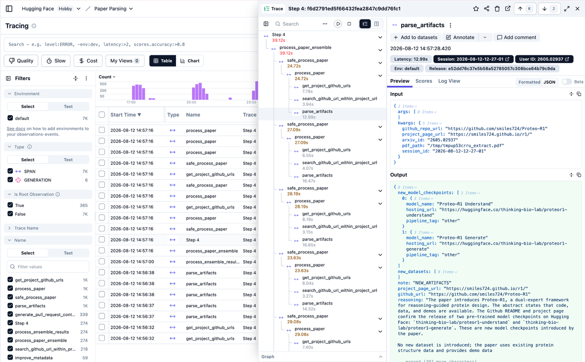
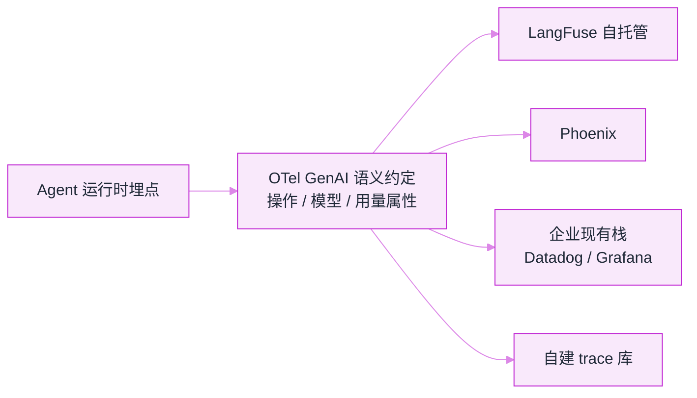
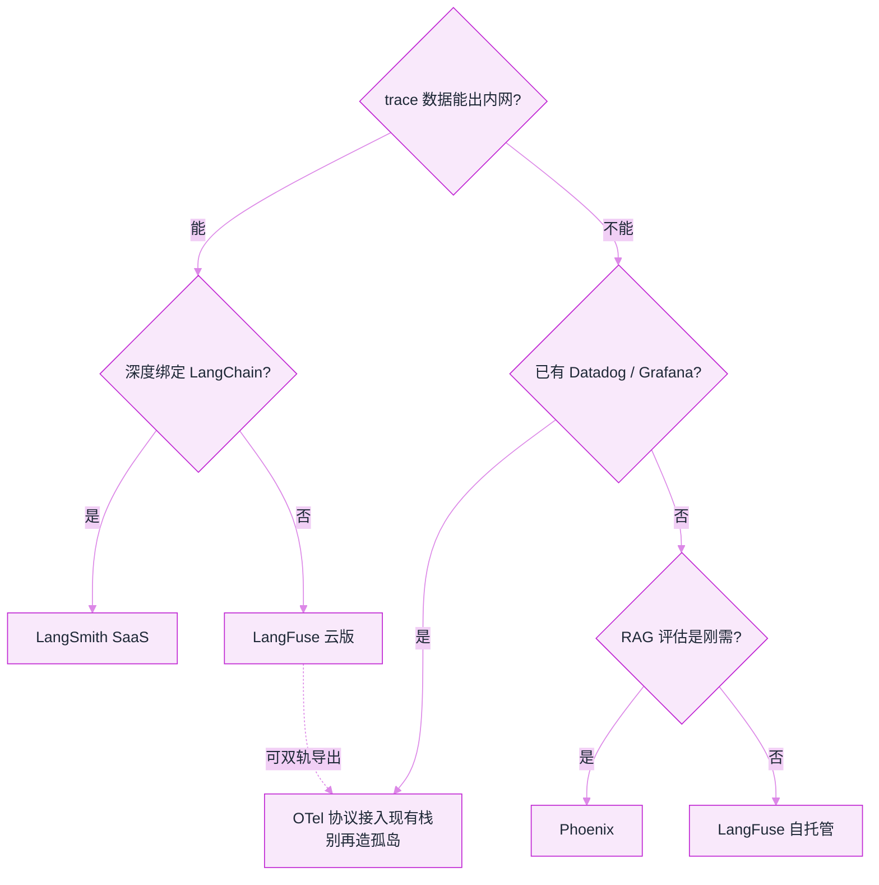

# LangSmith、LangFuse、Phoenix、OpenTelemetry


**一句话**：四大观测方案：LangSmith（LangChain 生态 SaaS）、LangFuse（开源可自托管）、Phoenix（Arize 开源、评估强）、OpenTelemetry（厂商中立协议）——按「生态绑定与数据主权」选。


## 先看结论

- 决策第一问：trace 数据能出内网吗？不能 → 自托管；能 → SaaS 省心
- 决策第二问：现有观测栈是什么？已有 Datadog/Grafana → 走 OTel 协议接入，别再造孤岛
- 决策第三问：评估是不是刚需？是 → 数据集-实验闭环的成熟度最重要
- 四者并不互斥：多个方案都兼容 OTel 导出，可双轨过渡

## 核心机制

### 1. 一张 trace 应该长什么样

观测 Agent 与观测普通服务最大的不同是：**一次用户请求对应一棵嵌套的调用树**，而不是一条平坦的时间线。

$$
\text{trace}=\underbrace{\text{agent run}}_{\text{一次任务}}
\to\underbrace{\text{llm call}}_{\text{模型调用}}
+\underbrace{\text{tool exec}}_{\text{工具执行}}
+\underbrace{\text{sub-agent}}_{\text{子 Agent}}
$$

每一层都是一个 **span**，带自己的起止时间、输入输出与元数据。于是「为什么这次答错了」可以逐层定位：是检索没召回、工具报错、还是模型自己跑偏。

Langfuse 的界面把这句话变成了三栏实物：



*《图：左侧 SPAN 与 GENERATION 分开计数（全项目 7K 对 6）——工具/中间步骤比模型调用高三个量级，钱却全花在那 6 次生成上，这就是按类型分面筛选存在的理由》*

*读图提示：左栏 SPAN 与 GENERATION 的计数、中间瀑布的标签，是 1280px 截图里 13px 的字，排在 608px 列里会缩到 0.475——要点开图片放大，才数得清那 7K 对 6 的差距。*

*来源：Langfuse 官方文档 [langfuse.com/docs/tracing](https://langfuse.com/docs/tracing) 内嵌截图，访问日期 2026-09-22。*

读这张图的顺序就是排查顺序：左侧 Filters 里 `SPAN` 与 `GENERATION` 分开计数（全项目 7K 对 6）——**工具/中间步骤的数量比模型调用高三个量级，钱却全花在那 6 次生成上**，这就是「按类型分面筛选」存在的理由；中间瀑布把 `process_paper_ensemble`（39.12s）拆成 `safe_process_paper` → `process_paper` → `get_project_github_urls` 的嵌套，慢在哪一层一眼可见；右侧选中 `parse_artifacts` 后 Input/Output 全量 JSON 摊开，连 `Session` 和 `User ID` 都钉在标题栏上。这三栏齐活的工具就是选型表里那一行的意思：**没有 span 级输入输出，「逐层定位」只是口号**。

### 2. 用 OTel 语义约定描述 GenAI

OpenTelemetry 为 GenAI 定义了**语义约定**（semantic conventions），规定 span 与属性的命名，使不同厂商的实现可互操作。核心属性覆盖三类信息：

| 类别 | 典型属性 | 用途 |
|---|---|---|
| 操作 | 操作类型（聊天/工具执行/Agent 调用） | 区分 span 种类 |
| 模型 | 供应商、模型名、请求参数 | 成本归因与对比 |
| 用量 | 输入 token、输出 token | 计费与优化 |

**为什么要用约定的属性名而不是自定义**：只有这样，换成另一套后端（或自建）时 trace 仍然可读，评估与成本分析工具也能直接复用。这是「协议优先于工具」在可观测性上的体现。



*《图：埋点只写一次、统一过 OTel 语义约定，就能分叉到自托管、Phoenix、企业栈或自建库——换后端不用改埋点》*

### 3. 采样：全量采集会破产

Agent 的 trace 又大又贵（每次都含完整 prompt 与工具输出）。全量保留不现实，需要采样：

$$
\text{保留 trace 数}\approx \text{总量}\times r\qquad(r=\text{采样率})
$$

两种策略各有取舍：

| 策略 | 做法 | 优点 | 缺点 |
|---|---|---|---|
| 头部采样 | 请求进入时按比例决定 | 实现简单、成本可控 | 会漏掉罕见错误 |
| 尾部采样 | 先收集，按结果决定留不留 | 能保住全部错误与慢请求 | 需要缓冲、实现复杂 |

**推荐组合**：错误与超时的 trace **全留**，成功请求按低比例采样。这样既控制成本，又不丢最有价值的诊断样本。

### 4. 成本归因

要让成本可优化，必须把 token 用量按维度聚合：

$$
\text{Cost}=\sum_{\text{模型}}\big(c_{\text{in}}T_{\text{in}}+c_{\text{out}}T_{\text{out}}\big)
$$

聚合维度至少要有：用户/租户、任务类型、prompt 版本、模型。有了这些维度才能回答「哪个功能最烧钱」「哪次 prompt 改动让成本翻倍」（见 [缓存与成本优化](caching-cost-optimization.md)）。

## 选型对比

三个决策问题跑一遍就是选型路径：



*《图：四个菱形按序收窄选型，第一刀砍在「trace 能否出内网」；私有又已用 Datadog 就走 OTel，LangFuse 云还能双轨导出》*

| 方案 | 类型 | 优势 | 适合 |
|---|---|---|---|
| [LangSmith](https://docs.smith.langchain.com/) | SaaS | 与 LangChain 无缝、评估/数据集/实验管理一体 | LangChain/LangGraph 深度用户 |
| [LangFuse](https://github.com/langfuse/langfuse) | 开源（MIT 核心） | 自托管、成本追踪细、多语言 SDK | 要数据主权 + 全框架 |
| [Phoenix](https://github.com/Arize-ai/phoenix) | 开源 | RAG 评估强、trace 可视化 | RAG 重度项目 |
| [OpenTelemetry](https://opentelemetry.io/docs/specs/semconv/gen-ai/) | 协议标准 | 厂商中立、接企业现有观测栈 | 大企业统一观测 |

## LangFuse 接入：换掉 import 之后线上流动的是什么

所谓「一行替换」，换的是 `openai` 这个包名：LangFuse 提供了一个同名包装模块，`chat.completions.create` 的调用形状、参数、返回结构全部保持原样，业务代码一行不用改。真正的改动发生在链路上——这次调用结束后，观测后端会收到一份报文。下面三段分别是**请求形状、落库的 span、语义约定的属性名**（数值是示意，字段名照两家文档的写法）：

```json
{
  "request": {
    "model": "gpt-4o-mini",
    "messages": [{ "role": "user", "content": "解释 MCP" }],
    "metadata": { "trace_id": "取业务侧的 task_id，不取 SDK 自动生成的 id" }
  },
  "exported_span": {
    "traceId": "同一个 task_id",
    "type": "generation",
    "name": "chat gpt-4o-mini",
    "startTime": "发起时刻",
    "endTime": "收到最后一个 token 的时刻",
    "input": "完整 messages，含 system prompt 与工具定义",
    "output": "完整回复文本",
    "usage": { "input": 1180, "output": 264, "total": 1444, "unit": "tokens" },
    "metadata": { "user_id": "u_72", "tenant": "acme", "task_type": "explain", "prompt_version": "v12" }
  },
  "otel_attributes": {
    "gen_ai.operation.name": "chat | execute_tool | invoke_agent",
    "gen_ai.provider.name": "openai | anthropic | ...",
    "gen_ai.request.model": "gpt-4o-mini",
    "gen_ai.response.model": "服务端实际用的模型",
    "gen_ai.usage.input_tokens": "成本归因的输入项",
    "gen_ai.usage.output_tokens": "成本归因的输出项",
    "gen_ai.conversation.id": "多轮串联的键",
    "gen_ai.tool.name": "仅 execute_tool 类型带"
  }
}
```

这份报文里有三处是**只有人能给、SDK 猜不出来**的，它们决定这条 trace 将来能不能被查到：

- `trace_id` 绑业务任务。SDK 自己的 id 只对模型调用有意义，出事时你手里是工单号、任务号、订单号；绑错了，「这个客户那次没答上来」就检索不到。这是 `metadata={"trace_id": task_id}` 那一行的全部动机。
- `metadata` 的四个业务维度：`user_id`、`tenant`、`task_type`、`prompt_version`。没有它们，trace 只能按时间浏览，回答不了「哪类用户受影响」「哪次 prompt 改动让成本翻倍」。**接个 SDK 就完事的观测，缺的正是这一格。**
- `usage` 三项分开记。`input` 与 `output` 单价不同，前缀缓存命中部分还要再打折（→ [缓存与成本优化](caching-cost-optimization.md)），混成一个 `total` 之后就无法归因。

`exported_span` 与 `otel_attributes` 是同一份数据的两种写法：前者是 LangFuse 的落库形状，后者是 OpenTelemetry GenAI 语义约定的属性命名。**用约定的名字不是为了好看，是为了换后端时不改埋点**——名字自定义一次，你就被锁死在一个厂商上，迁移成本从「改导出配置」变成「改每一处埋点代码」。

## 分步演示：一次「解释 MCP」从埋点到定位问题




#### 第 1 步：任务开始，先开一根 root span

Agent 运行时为这次任务建一个 `agent run`（OTel 里对应 `gen_ai.operation.name = invoke_agent`），根上挂 `trace_id = task_id` 与四个业务维度。整棵树的父子关系从这里开始挂——**根 span 的 id 一定要用业务 id**，后面所有检索都靠它。




#### 第 2 步：模型调用落成 generation，输入输出全量存

`gpt-4o-mini` 这次调用是根下的一个子 span，类型是 generation：带 `startTime`/`endTime`、`input`（含 system prompt 与工具定义）、`output`、`usage` 三项。之所以要全量而不是摘要：「为什么答错」这个问题只有原文能回答，摘要本身就是一次有损改写，你会在摘要之外找原因。




#### 第 3 步：工具执行与子 Agent 各自成节点

一次检索、一次代码执行、一次子 Agent 派发，各自是一个 span（`execute_tool` / `invoke_agent`），带自己的起止时间与输入输出。这一步决定了「逐层定位」能不能做：是检索没召回、工具报错、还是模型自己跑偏，三者的修法完全不同。注意本页截图里那组数量对比——`SPAN` 与 `GENERATION` 差了三个量级，**数量在工具节点上，钱在生成节点上**，两边都要能按类型筛。




#### 第 4 步：采样在这里做决定，不在上报之后

任务收尾时按结果决定留不留：错误与超时的 trace **全留**，成功请求按低比例采样。头部采样（请求进入时按比例定）实现简单但一定会漏掉罕见错误，尾部采样（先缓冲、按结果定）能保住错误与慢请求但要扛缓冲。全量保留不是稳妥，是破产——trace 里装着完整 prompt 与工具输出。




#### 第 5 步：按维度聚合，trace 的价值在群体里

单个 trace 只能讲故事，指标才给结论：按 `task_type × model × prompt_version` 聚合出任务成功率、P95 延迟、单任务成本、Top 失败模式。周报四项就取自这里。**只看单次 trace 的观测等于没有观测**——你修的是最响的那条，不是最贵或最高频的那条。




#### 第 6 步：失败 trace 回流成评估集

带错误分类标签的 trace 自动归档，挑代表性的进回归集（→ [持续评估](continuous-evaluation.md)）。这一步把「排障记录」变成「防回归资产」：下次 prompt 改动前先跑这批，历史故障才有不再复发的机会。



## 四条上报路线（点标签切换）

同一批 span，送法不同，锁死的东西也不同。



深度绑定 LangChain / LangGraph 时最省事：trace、数据集、实验管理是一条闭环，不用自己搭。代价是 trace 数据出内网——prompt 里可能带 PII，厂商数据处理协议要逐条看，或者本地脱敏后再上报。已有 LangSmith 授权的团队，切换成本几乎只体现在「换框架时要重做埋点」。



数据主权换来自持存储：核心 MIT、多语言 SDK、按模型/用户/会话聚合成本。要自己扛的是那棵树的体积——全量保留必然失控，所以第 4 步的采样策略是这次部署的一部分，不是后续优化项。云版还能双轨导出到 OTel，迁移期两条腿走路，不必赌一家。



RAG 重度项目优先：检索命中与生成质量放在同一张联合 trace 视图里，「答非所问」能直接判出是检索阶段就错了还是生成跑偏。这个区别决定了你下一步是修索引与召回，还是修 prompt——选错方向的成本比多花几天搭面板大得多。



已有 Datadog / Grafana 时不要再造孤岛：埋点写一次、统一走 GenAI 语义约定，后端订阅现成告警与 SLO 体系。代价是**协议不带评估闭环**——数据集、实验、回归仍要另找地方（通常是自托管 LangFuse 或自建库）。大企业统一观测的默认答案，前提是有专人守语义约定的属性命名。




**先定隐私，再定工具**：trace 的内容是完整 prompt 与工具输出，比业务数据库更容易含敏感文本。SaaS 方案要先回答三个问题——数据处理协议是否禁止用于训练、能不能按字段脱敏后再上报、保留期与删除请求怎么落地。这三问没答案就上生产，等于把第二条数据出口开在合规之外。


## 源码案例

- **Claude Code 的 OTel 支持**（[官方文档](https://docs.anthropic.com/en/docs/claude-code)）：企业可把使用指标、工具调用统计导出到自有 OTel 后端——「开发工具也要接企业观测」的行业信号
- **LangFuse 的成本追踪**（[GitHub](https://github.com/langfuse/langfuse)）：按模型/用户/会话聚合 token 与费用，读它的用量计算逻辑可理解成本归因设计
- **Phoenix 的 RAG 评估视图**（[GitHub](https://github.com/Arize-ai/phoenix)）：检索命中与生成质量的联合 trace 视图——调试「答非所问」时能直接看到是「检索就错了」还是「生成跑偏了」

## 落地清单

- [ ] 每条 trace 带业务维度：user_id、tenant、task_type、prompt/模型版本
- [ ] 错误与超时 trace 全留，成功请求采样
- [ ] 失败 trace 自动归档并附错误分类标签
- [ ] 周报指标：任务成功率、P95 延迟、单任务成本、Top 失败模式
- [ ] trace → 评估集的回流流水线（见 [持续评估](continuous-evaluation.md)）

## 常见误区

- ❌ 观测工具 = 接个 SDK 完事：没有业务维度标注的 trace 无法定位「哪类用户受影响」
- ❌ 全量采集：trace 里含完整 prompt 与工具输出，成本会失控
- ❌ SaaS 观测不计隐私成本：prompt 可能含 PII，要看厂商数据处理协议，或本地脱敏后再上报
- ❌ 只看单次 trace：价值在聚合——Top 失败模式、成本分布、慢步骤排名
- ❌ 自定义属性名：脱离 OTel 语义约定会锁死后端选择

## 小练习

为你的 Agent 选观测方案并说明决策链（数据主权？现有栈？评估需求？），设计 trace 的维度与采样策略，然后接入选型方案跑一周，输出一份「Top3 失败模式 + 成本 Top3 功能」报告。

## 参考资料

- [OpenTelemetry GenAI 语义约定](https://opentelemetry.io/docs/specs/semconv/gen-ai/)
- [LangFuse](https://github.com/langfuse/langfuse) / [Phoenix](https://github.com/Arize-ai/phoenix) / [LangSmith](https://docs.smith.langchain.com/)
- [Google SRE Book: Monitoring Distributed Systems](https://sre.google/sre-book/monitoring-distributed-systems/)

## 相关知识点

- [日志、追踪与监控](logging-tracing-monitoring.md)
- [持续评估](continuous-evaluation.md)
- [缓存与成本优化](caching-cost-optimization.md)

