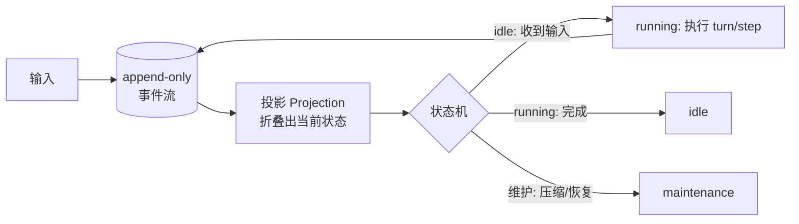

# 🚀 状态机与事件驱动

> **一句话**：把 Agent 的「循环」升格为显式状态机、把「历史」落成 append-only 事件流——这是 2026 年生产 harness 的主流架构取向，也是可恢复、可审计、可回放的根源。
> **难度**：⭐️⭐️⭐️ 高级
> **标签**：`#engineering`

## 📌 先看结论

- 状态机化：Agent 有明确相位（idle / maintenance / running），相位间转移显式定义——「取消中的 Agent 收到新输入」这类边角 case 才有确定行为
- 事件溯源（Event Sourcing）：一切历史 = 不可变事件序列；当前状态 = 事件折叠（reducer/projection）
- 两大收益：恢复 = 重放事件；审计/调试/回放/分叉全部免费获得
- 代价：事件 schema 要版本化、存储会膨胀、投影层要处理乱序

## 🖼️ 架构图

## 📦 源码案例（本页是全书的源码案例重镇）

**1. DeepSeek Harness：事件驱动状态机的完整开源实现**（[packages/core/agent-loop/src/agent.ts](https://github.com/deepseek-ai/deepseek-harness)，必读）

- 三相位状态机：`idle / maintenance / running`；`wakeDriver()` 根据相位决定「立即执行 / 挂起 / 等收敛后重启」——取消中的 driver 不会与新输入硬挤
- Turn/Step 两级生命周期：turn/start → step → preStep（组装上下文）→ assistant/chunk（流式）→ assistant/message → executeToolCalls → tool/result → turn/end，全部是事件
- 「每一步现场组装上下文」与「事件投影出上下文」的组合 = 模型上下文是事件流的纯函数，时间旅行与分叉是自然产物

**2. Pi：树形 JSONL 事件日志**（[badlogic/pi-mono](https://github.com/badlogic/pi-mono)）

- 消息追加写入 JSONL，支持分支（同一节点分叉多历史）——事件溯源的极简形态，几百行代码展示了核心思想

**3. LangGraph：checkpoint + reducer**（[langchain-ai/langgraph](https://github.com/langchain-ai/langgraph)）

- 状态显式声明、每超步持久化、reducer 定义并发更新的合并规则——把事件溯源思想做成框架原语

**4. AutoGen v0.4**（[microsoft/agent-framework](https://github.com/microsoft/agent-framework)）：actor 模型重构，Agent 间通信全部消息化——分布式版本的同一场演化

## ✅ 最佳实践

- 事件 schema 带 `version` 字段；投影层容忍未知事件类型（向前兼容）
- 事件流做分区与归档：热数据（当前会话）与冷数据（归档检索）分层
- 相位转移要可观测：状态迁移打点，卡死在 maintenance 可告警

## ⚠️ 常见误区

- ❌ 状态只存「当前消息数组」：无法回答「上周三那次失败发生了什么」，也无从分叉实验
- ❌ 事件流里放大对象：工具结果截断后存全文引用，否则存储爆炸
- ❌ 用可变状态冒充事件溯源：能被原地修改的「日志」失去审计意义，必须 append-only

## 🧪 小练习

把你的 Agent 改成事件溯源：定义 5 个核心事件类型（user_input / assistant_message / tool_call / tool_result / turn_end），实现「从事件重放出当前上下文」。做完你会真正理解 DSH。

## 📚 相关知识点

- [Agent 状态管理](../02-agent-basics/state-management.md)
- [Agent 工作流编排](workflow-orchestration.md)
