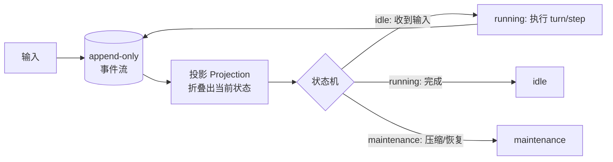

# 状态机与事件驱动

> **一句话**：把 Agent 的「循环」升格为显式状态机、把「历史」落成 append-only 事件流——这是生产 harness 的主流架构取向，也是可恢复、可审计、可回放的根源。

## 先看结论

- 状态机化：Agent 有明确相位（如 idle / maintenance / running），相位转移显式定义——「取消中的 Agent 收到新输入」这类边角情形才有确定行为
- 事件溯源（Event Sourcing）：一切历史 = 不可变事件序列；当前状态 = 事件折叠（reducer / projection）
- 两大收益：恢复 = 重放事件；审计、调试、回放、分叉全部顺带获得
- 代价：事件 schema 要版本化、存储会膨胀、投影层要处理乱序
- **可确定性重放**是所有收益的前提

## 核心机制

### 1. 状态机的形式化

一个状态机由四要素定义：

$$
M=(S,\;\Sigma,\;\delta,\;s_0)
$$

- $S$：状态集合（如 $\{\text{idle},\text{running},\text{maintenance}\}$）
- $\Sigma$：输入事件集合（用户输入、工具结果、超时、取消）
- $\delta: S\times\Sigma\to S$：转移函数
- $s_0$：初始状态

**显式化的价值在于边角情形**：例如「正在取消的 Agent 收到新输入」——如果不显式定义 $\delta(\text{running},\text{user\_input})$，实现里就会出现竞态。显式状态机强迫你在设计阶段回答这个转移该往哪走。

### 2. 事件溯源：状态是事件的折叠

事件溯源把「当前状态」定义为历史事件序列的**折叠**结果：

$$
\text{State}_t=\mathrm{fold}\big(e_1,e_2,\dots,e_t\big)
$$

其中 $\mathrm{fold}$ 是纯函数（reducer / projection）。这条式子是全部收益的来源：

| 需求 | 为什么免费获得 |
|---|---|
| 断点恢复 | 重放事件即可重建状态 |
| 审计 | 事件不可变，历史即证据 |
| 调试回放 | 按记录的事件序列重跑 |
| 分叉实验 | 从某一历史点接上不同输入 |

**关键要求是确定性**：若 fold 依赖随机数、当前时间或外部状态，重放就会得到不同结果。工程上要把这些「不确定输入」也写成事件（如 `time_observed`），保证 fold 纯函数。

### 3. 快照：把重放成本从 O(n) 降到 O(k)

全量重放随事件数线性增长，长会话会越来越慢：

$$
\text{重放成本}=O(n)\quad\longrightarrow\quad
\text{快照 + 尾部重放}=O(1)+O(k)
$$

做法是定期把折叠结果存成**快照**，恢复时从最近快照开始、只重放其后的 $k$ 个事件。这是把「事件溯源」用于生产必须补的一环（LangGraph 的 checkpoint 本质就是快照）。

### 4. 投影要幂等

事件可能被重复投递（至少一次语义），因此投影必须幂等：

$$
\mathrm{fold}(e,e)=\mathrm{fold}(e)
$$

实现手段：事件带唯一 ID 去重、状态迁移采用「设置成目标值」而非「自增」、或在投影层记录已处理的最大序号。否则重复投递会导致状态错乱（见 [Agent 工作流编排](workflow-orchestration.md) 的交付语义）。

## 架构图

## 源码案例

**1. DeepSeek Harness：事件驱动状态机的完整开源实现**（[仓库](https://github.com/deepseek-ai/deepseek-harness)，必读）

- 多相位状态机（`idle / maintenance / running`）；唤醒逻辑根据相位决定「立即执行 / 挂起 / 等收敛后重启」——取消中的执行不会与新输入硬挤
- Turn/Step 两级生命周期：turn 开始 → step → 组装上下文 → 流式输出 → 工具调用 → 工具结果 → turn 结束，全部以事件表达
- 「每步现场组装上下文」+「事件投影出上下文」的组合 = **模型上下文是事件流的纯函数**，时间旅行与分叉是自然产物

**2. Pi：树形 JSONL 事件日志**（[仓库](https://github.com/earendil-works/pi)）

- 消息追加写入 JSONL，支持分支（同一节点分叉出多条历史）——事件溯源的极简形态

**3. LangGraph：checkpoint + reducer**（[仓库](https://github.com/langchain-ai/langgraph)）

- 状态显式声明、每超步持久化（快照）、reducer 定义并发更新的合并规则——把事件溯源思想做成框架原语

**4. AutoGen / Agent Framework**（[仓库](https://github.com/microsoft/agent-framework)）：actor 模型重构，Agent 间通信全部消息化——分布式方向的同一场演化

## 最佳实践

- 事件 schema 带 `version` 字段；投影层容忍未知事件类型（向前兼容）
- 定期生成快照，避免重放成本线性增长
- 投影保持幂等：事件带唯一 ID，状态迁移用「置为目标值」
- 事件流分区与归档：热数据（当前会话）与冷数据（归档检索）分层
- 相位转移要可观测：状态迁移打点，卡在维护相位可告警

## 常见误区

- ❌ 状态只存「当前消息数组」：无法回答「上周三那次失败发生了什么」，也无从分叉实验
- ❌ 事件流里放大对象：工具结果截断后存引用，否则存储爆炸
- ❌ 用可变状态冒充事件溯源：能被原地修改的「日志」失去审计意义，必须 append-only
- ❌ 重放依赖随机数/当前时间：不确定输入必须也作为事件记录，否则无法确定性重放
- ❌ 不做快照：长会话重放会越来越慢，最终不可用

## 小练习

把你的 Agent 改成事件溯源：定义 5 个核心事件类型（`user_input` / `assistant_message` / `tool_call` / `tool_result` / `turn_end`），实现「从事件重放出当前上下文」，并补一个每 20 个事件生成快照的机制。

## 参考资料

- [Event Sourcing（Martin Fowler）](https://martinfowler.com/eaaDev/EventSourcing.html)
- [LangGraph 文档](https://langchain-ai.github.io/langgraph/)（checkpoint 与 reducer）
- [DeepSeek Harness](https://github.com/deepseek-ai/deepseek-harness) / [Pi](https://github.com/earendil-works/pi)

## 相关知识点

- [Agent 状态管理](../02-agent-basics/state-management.md)
- [Agent 工作流编排](workflow-orchestration.md)
- [日志、追踪与监控](logging-tracing-monitoring.md)
